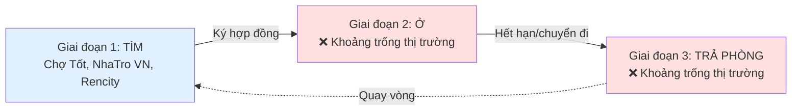
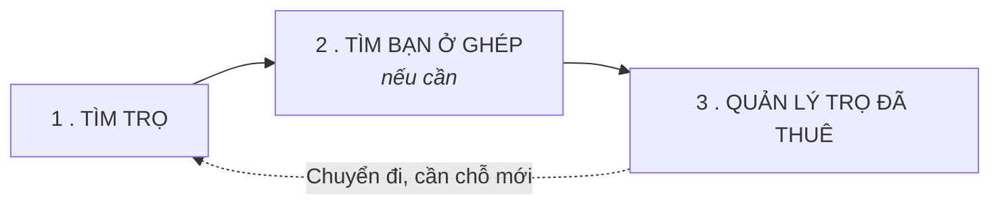
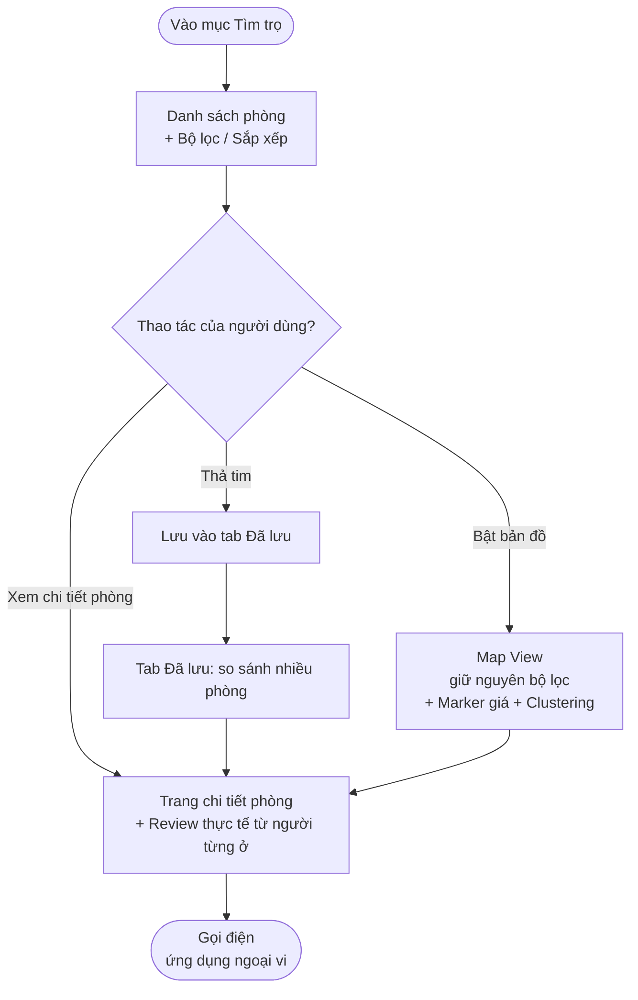
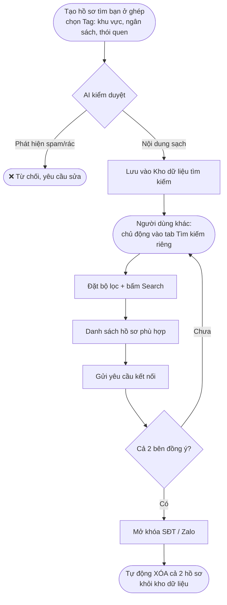
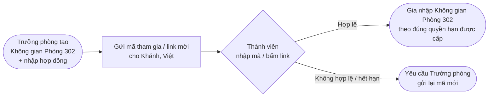
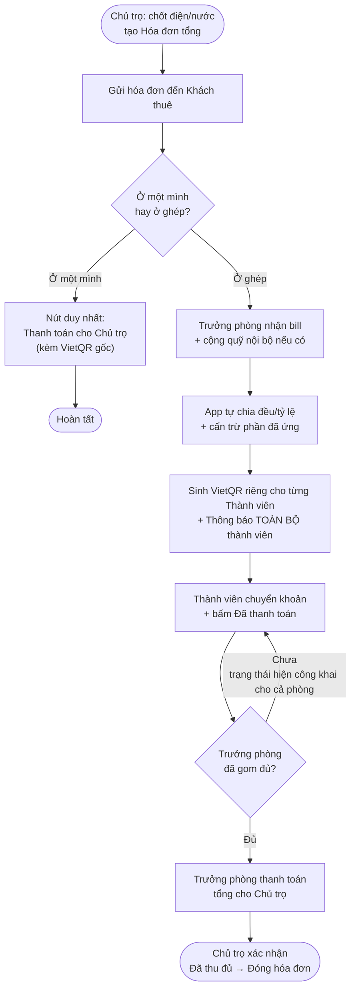
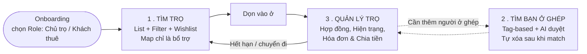

# TÀI LIỆU PHÂN TÍCH THỊ TRƯỜNG & ĐỊNH HƯỚNG SẢN PHẨM
### App quản lý căn hộ/phòng trọ cho thuê — Tenant-first

---

## PHẦN 1: PHÂN TÍCH ƯU – NHƯỢC ĐIỂM 3 ĐỐI THỦ

Ba nền tảng được phân tích đại diện cho 2 nhóm khác nhau trong hành trình thuê nhà:

- **Chợ Tốt Nhà** & **NhaTro VN**: nền tảng **rao vặt/tìm kiếm** (chỉ phục vụ Giai đoạn "TÌM").
- **Rencity**: nền tảng **PropTech end-to-end**, có cả tìm kiếm lẫn quản lý — mạnh nhất trong 3 đối thủ nhưng vẫn còn khoảng trống về độ phủ thị trường và tính minh bạch review.

### 1.1 Bảng so sánh tổng quan

| Tiêu chí | **Chợ Tốt Nhà** | **NhaTro VN** | **Rencity** |
|---|---|---|---|
| **Định vị** | Sàn rao vặt đa ngành (BĐS là 1 mảng) | App rao vặt chuyên biệt phòng trọ | Nền tảng PropTech end-to-end (B2B2C) |
| **Điểm mạnh** | Nguồn cung khổng lồ, đa dạng; bộ lọc tìm kiếm mạnh; chat/gọi điện trực tiếp trong app | Không bị loãng bởi tin ngành khác; tìm kiếm theo bản đồ (map-based search) trực quan; bộ lọc tiện ích sâu | Hệ sinh thái khép kín: Tìm phòng – Pass phòng – Tìm bạn ở ghép; có hợp đồng điện tử & quản lý hóa đơn trong app; growth hacking tốt (affiliate 500k); có thêm dịch vụ tiện ích (dọn dẹp, decor) |
| **Điểm yếu cốt lõi** | Tin giả, "cò mồi" tràn lan; thiếu kiểm duyệt nội dung rác; **kết thúc vai trò ngay sau khi ký hợp đồng** — không có công cụ cho giai đoạn "Ở" | Vòng đời sử dụng cực ngắn (Tải app → Tìm phòng → Xóa app); UI/UX còn cũ, dễ giật lag; kiểm duyệt tin đăng yếu vì nguồn lực mỏng | **Thiếu hệ thống đánh giá (review) minh bạch từ người thuê thực tế** — thông tin phòng chủ yếu dựa trên mô tả một chiều của chủ nhà/đội sale, người tìm phòng không có dữ liệu khách quan về chất lượng sống thực tế trước khi quyết định thuê |
| **Vấn đề đăng tin** | Không cho người thuê đăng tin hiệu quả (thuật toán ưu tiên người cho thuê trả phí); mục "Tìm bạn ở ghép" bị nhiễu vì thiết kế dạng News Feed tự do → cò mồi, quảng cáo trà trộn | Tương tự — thiên về listing cho chủ nhà | Có tính năng tìm bạn ở ghép nhưng **cũng bị nhiễu bởi bài đăng nội dung khác** do dùng dạng News Feed |
| **Thanh toán hóa đơn** | Không áp dụng (không có tính năng quản lý ở) | Không áp dụng | Semi-automated: chủ nhà tạo hóa đơn → gửi VietQR → người thuê chuyển khoản thủ công → tự bấm "Đã thanh toán" → chủ nhà xác nhận thủ công (không tích hợp cổng thanh toán trực tiếp vì phí giao dịch 1.5–2.5%/giao dịch quá cao so với giá trị tiền trọ) |
| **Cơ hội / Khoảng trống cho app của bạn** | Làm "mảnh ghép nối tiếp" sau khi chốt phòng — không cạnh tranh trực tiếp | Bổ sung bản đồ tiện ích nội khu, hồ sơ phòng sẵn sàng chia sẻ khi pass phòng | Xây dựng **hệ thống Review thực tế gắn với dữ liệu người từng ở** (lấy từ chính lịch sử quản lý trọ trong app — điện nước, thời gian ở, hiện trạng phòng) mà Rencity chưa có, giúp tăng độ tin cậy hơn hẳn mô tả một chiều từ chủ nhà; kết hợp thêm công cụ chia tiền ở ghép chi tiết hơn, thiết kế tìm bạn ở ghép theo dạng **matching có cấu trúc** thay vì feed tự do, có AI kiểm duyệt nội dung |

### 1.2 Kết luận rút ra

> **Cả 3 đối thủ đều mạnh ở giai đoạn "TÌM" nhưng gần như bỏ trống giai đoạn "Ở" và "TRẢ PHÒNG".** Đây chính là khoảng trống thị trường (market gap) mà app hướng tới lấp đầy — đóng vai trò "cuốn sổ tay thông minh" độc lập, đi cùng người thuê **trọn vòng đời**: Tìm phòng → Ở & quản lý chi phí → Trả phòng & lấy lại cọc → (quay lại) Tìm phòng mới.

---

## PHẦN 2: ĐỊNH HƯỚNG SẢN PHẨM

Ba trụ cột chính được trình bày theo đúng hành trình người dùng: **Tìm trọ → Tìm bạn ở ghép → Quản lý trọ đã thuê.**

---

### 2.1 Module: TÌM TRỌ (Room Finder)

**Mục tiêu:** Cung cấp nguồn phòng trọ **có sẵn từ phía Chủ trọ đã đăng**
#### Luồng trải nghiệm

1. **Màn hình danh sách (mặc định):** Hiển thị các phòng dạng thẻ (card) — ảnh, giá, vị trí, 2–3 tiện ích nổi bật.
2. **Bộ lọc & sắp xếp:** Lọc theo giá, khu vực/bán kính, loại phòng (trọ/ký túc/căn hộ), tiện ích (pet, giờ giấc tự do, chỗ để xe...); sắp xếp theo giá, khoảng cách, đánh giá.
3. **Lưu tin xem sau (Wishlist):** Chạm icon trái tim trên thẻ để lưu ngay, không cần vào xem chi tiết. Có tab riêng "Đã lưu" để so sánh nhiều phòng trước khi quyết định.
4. **Chuyển sang Bản đồ (tùy chọn):** Nút bật/tắt Map View — bộ lọc đang áp dụng được **giữ nguyên** khi chuyển. Bản đồ hiển thị custom marker báo giá trực tiếp (VD: "Từ 1.5tr"), tự động **gộp cụm (clustering)** khi zoom out để tránh rối mắt/giật lag.
5. **Đánh giá thực tế (Verified Review):** Vì dữ liệu phòng gắn với lịch sử người từng ở thật (lấy từ Module Quản lý trọ), review hiển thị đáng tin hơn hẳn đánh giá ảo trên các sàn rao vặt.
6. **Liên hệ:** Trao đổi qua nút "Gọi điện" mở thẳng ứng dụng gọi điện ngoại vi; liên hệ chỉ mở khóa khi hai bên đồng ý. *(Chat nghiệp vụ sau này chạy bằng Property Chat — D24′.)*

---

### 2.2 Module: TÌM BẠN Ở GHÉP (Roommate Matching)

**Mục tiêu:** Giải quyết nỗi đau "tìm người ở ghép" mà cả Chợ Tốt lẫn Rencity đều làm chưa tốt — do thiết kế dạng News Feed tự do khiến nội dung dễ bị nhiễu bởi quảng cáo, cò mồi.

**Nguyên tắc thiết kế:** Đây **không phải** một bảng tin (feed) hiển thị tự động. Đây là một **khu vực tìm kiếm chủ động, độc lập** — người dùng chỉ vào khi có nhu cầu thật, tự thiết lập tiêu chí và bấm Search.

#### Luồng trải nghiệm — 3 bước cốt lõi

1. **Tạo hồ sơ + AI gác cổng:**
   - Người dùng không được viết bài tự do — chỉ chọn các thẻ (tag) có sẵn: khu vực, ngân sách, thói quen sinh hoạt (nuôi pet, thức khuya, hút thuốc...), kèm 1 dòng ghi chú ngắn (giới hạn ký tự).
   - AI kiểm duyệt ngay khi đăng: quét văn bản (phát hiện từ khóa quảng cáo/rao vặt) và hình ảnh (OCR phát hiện số điện thoại, mã QR rác chèn vào ảnh). Hồ sơ "sạch" mới được đưa vào kho tìm kiếm.

2. **Khu vực tìm kiếm độc lập:**
   - Nằm ở tab/màn hình riêng biệt, **không tự động hiển thị** cho ai cả.
   - Khi có nhu cầu, người dùng vào đây, đặt bộ lọc (khu vực, ngân sách, thói quen mong muốn) và bấm **Search** để hệ thống trả về danh sách hồ sơ phù hợp trong kho.

3. **Kết nối & tự động dọn dữ liệu:**
   - Thấy hồ sơ ưng ý → gửi yêu cầu kết nối. Thông tin liên hệ (SĐT/Zalo) **chỉ mở khóa khi cả hai bên đồng ý**, đảm bảo an toàn.
   - Ngay khi hai bên xác nhận đã ghép đôi thành công, hệ thống **tự động xóa vĩnh viễn** hồ sơ của cả hai khỏi kho tìm kiếm — đảm bảo dữ liệu trong kho luôn là nhu cầu thật, không tồn đọng hồ sơ "chết".

> **Ghi chú:** Điểm khác biệt cốt lõi so với đối thủ nằm ở 2 chỗ: (1) **không có feed** — loại bỏ hoàn toàn khả năng cò mồi rải tin hàng loạt; (2) **tự dọn dữ liệu sau khi match** — giữ kho tìm kiếm luôn "sống", tránh tồn đọng hồ sơ cũ gây nhiễu.

---

### 2.3 Module: QUẢN LÝ TRỌ ĐÃ THUÊ (Room & Bill Management)

**Mục tiêu:** Đây là "linh hồn" giữ chân người dùng dùng app hàng tháng (thay vì xóa app sau khi tìm được phòng) — giải quyết đúng 4 nỗi đau đã xác định ở đầu buổi thảo luận: minh bạch chi phí, chia tiền ở ghép, bảo vệ tiền cọc, quản lý hợp đồng.

Module này có **3 khối nghiệp vụ**, vận hành khác nhau tùy vai trò và số lượng người ở:

#### 0. Tạo Không gian phòng & Mời thành viên (bước nền tảng)

Trước khi vào các khối nghiệp vụ bên dưới, đây là bước **thiết lập** để nhiều người có thể cùng quản lý chung một phòng:

1. **Tạo Không gian phòng:** Một người đứng ra làm **Trưởng phòng** — thường là người đứng tên hợp đồng thuê. Người này tải app, tạo "Phòng 302", nhập thông tin hợp đồng (giá thuê, giá điện/nước, ngày bắt đầu – kết thúc) vào Không gian phòng.
2. **Mời thành viên:** Trưởng phòng gửi **mã tham gia (hoặc link mời)** cho các bạn cùng phòng (VD: Khánh, Việt).
3. **Tham gia:** Khánh và Việt mở app, nhập mã hoặc bấm link → được thêm vào Không gian phòng 302. Từ lúc này, cả 3 người cùng thấy chung một "Phòng 302" trên app của mình, mỗi người theo đúng quyền hạn tương ứng (xem mục Phân quyền bên dưới).

> **Ghi chú:** Mã tham gia/link mời nên có **thời hạn sử dụng** và **giới hạn số lần dùng** (VD: chỉ dùng được 1 lần hoặc hết hạn sau 24h) để tránh bị lộ và người lạ tham gia nhầm vào phòng.

#### A. Két sắt Hợp đồng & Nhắc hẹn
- Chụp & lưu ảnh hợp đồng, biên nhận cọc — tránh mất giấy tờ gốc.
- Lưu thông tin giá điện/nước/phụ phí theo đúng thỏa thuận ban đầu.
- Tự động nhắc trước ngày đóng tiền (VD: 3 ngày) và trước hạn báo chuyển đi (VD: 30 ngày).
- **Dữ liệu dùng chung cho cả phòng:** Hợp đồng, thông tin cọc và lịch nhắc hẹn nằm trong "Không gian phòng" — mọi thành viên trong nhóm ở ghép đều **xem được** (không riêng gì Trưởng phòng), đảm bảo ai cũng nắm rõ điều khoản, ngày hết hạn, tránh trường hợp chỉ 1 người biết thông tin hợp đồng.

#### B. Nhật ký Hiện trạng & Sự cố (bảo vệ tiền cọc)
- Checklist chụp ảnh hiện trạng nội thất lúc nhận phòng, tự chèn timestamp không thể chỉnh sửa.
- Ghi log các lần báo hỏng hóc/sửa chữa — làm bằng chứng khi thanh lý hợp đồng, tránh bị trừ cọc oan.
- **Đóng góp chung:** Đây cũng là dữ liệu chung của cả phòng — **bất kỳ thành viên nào** cũng có thể tự chụp ảnh, báo sự cố (không chỉ riêng Trưởng phòng), toàn bộ đồng bộ vào một nhật ký duy nhất của phòng để làm bằng chứng chung khi trả phòng.

#### C. Luồng Hóa đơn & Chia tiền — **điểm khác biệt do có 2 role**

Vì app có role Chủ trọ, hóa đơn **do chủ trọ nhập và gửi xuống**, khách thuê nhận và xử lý tiếp. Giao diện tự thích ứng theo số người ở để tránh rườm rà:

**Trường hợp ở một mình:**
Nhận hóa đơn từ chủ trọ → màn hình chỉ có 1 nút duy nhất **"Thanh toán cho Chủ trọ"** kèm VietQR gốc. Không có bước chia tiền.

**Trường hợp ở ghép (có Trưởng phòng + Thành viên):**
1. Chủ trọ chốt số điện/nước, tạo hóa đơn tổng, gửi cho Trưởng phòng (người đại diện phòng trên app).
2. Trưởng phòng nhận bill, có thể cộng thêm quỹ nội bộ (VD: tiền đi chợ chung ai đó đã ứng trước).
3. App tự động **chia đều/theo tỷ lệ tùy chỉnh** (VD: ai về quê nửa tháng chỉ trả 50% tiền điện nước) và **cấn trừ** phần đã ứng trước.
4. App sinh mã **VietQR cá nhân hóa** cho từng thành viên, đồng thời **đẩy thông báo (push notification) đến toàn bộ thành viên trong phòng** ngay khi hóa đơn được chia xong — không ai bị bỏ sót hoặc phải hỏi lại "tháng này bao nhiêu".
5. Thành viên chuyển khoản, bấm "Tôi đã thanh toán" (tự xác nhận, không bắt buộc ảnh minh chứng).
6. Trưởng phòng gom đủ → bấm "Thanh toán cho Chủ trọ" → chuyển khoản → chủ trọ xác nhận "Đã thu đủ" → hóa đơn tháng đóng lại. **Trạng thái đóng tiền của từng người** (Đã thanh toán / Đang chờ) hiển thị công khai cho cả phòng, không chỉ riêng Trưởng phòng thấy.

> **Ghi chú:** Lưu ý kỹ 2 nhánh giao diện (ở 1 mình / ở ghép) phải **tách biệt hoàn toàn** ngay từ khi thiết kế wireframe — tránh việc người ở một mình bị bắt đi qua các bước chia tiền không cần thiết, gây rối trải nghiệm.

---

## Tổng kết bức tranh hành trình người dùng

---