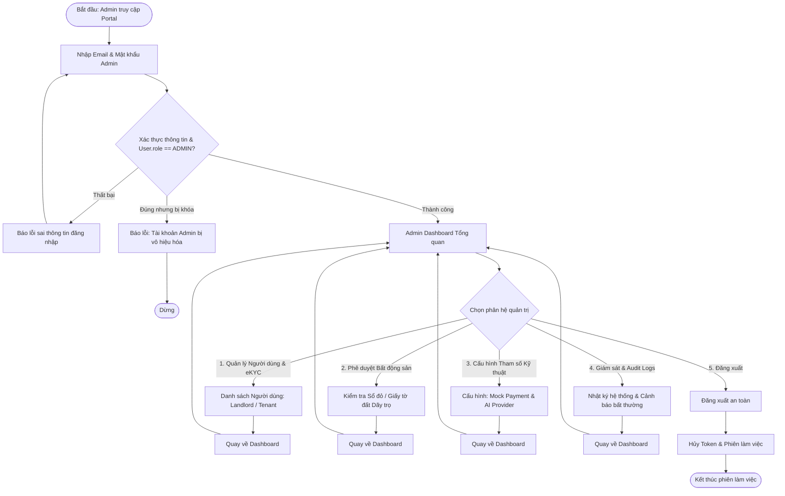
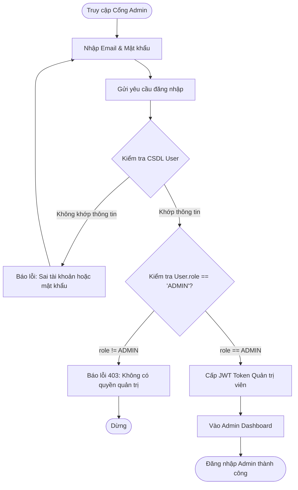
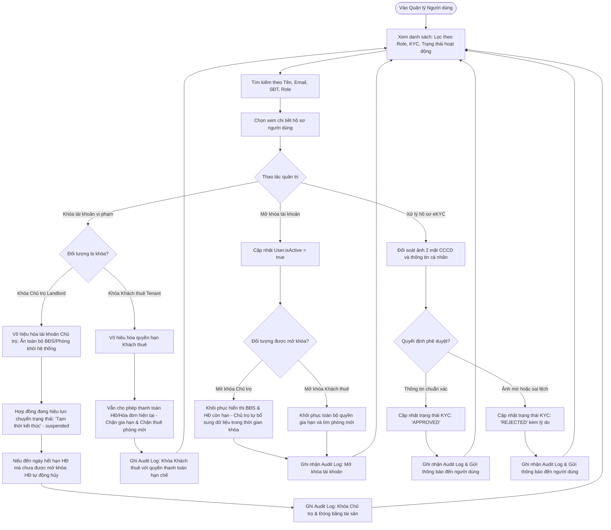
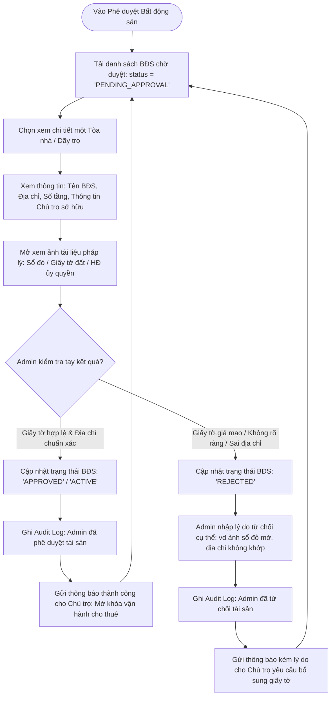
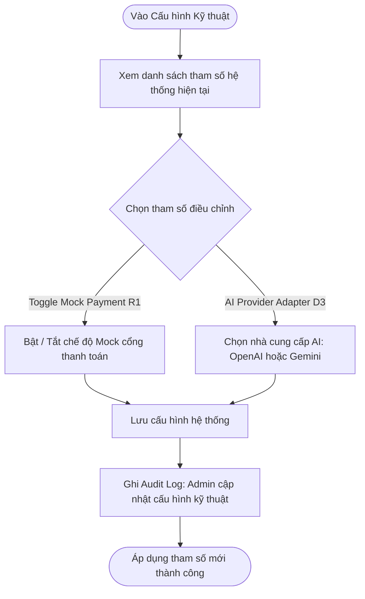
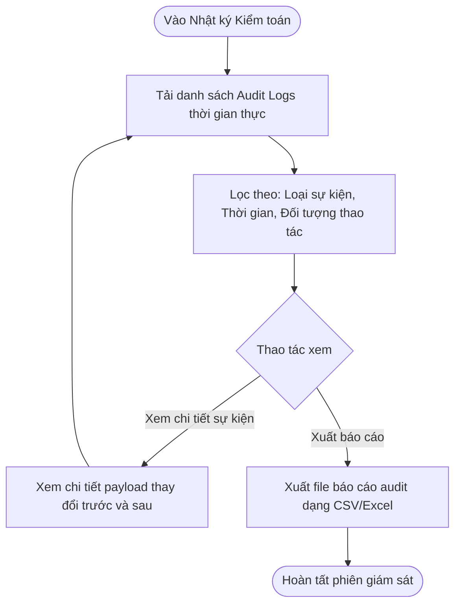

# User Flow — Admin

Tài liệu User Flow hoàn chỉnh cho vai trò **Quản trị viên (Admin)** trong hệ thống Rentify (PBL6). Hệ thống vận hành với **duy nhất 1 tài khoản Admin** chịu trách nhiệm giám sát toàn sàn, quản lý người dùng, kiểm tra tay và phê duyệt tài sản (Sổ đỏ / Giấy tờ đất), cấu hình kỹ thuật và theo dõi nhật ký kiểm toán.

---

## 1. Nguyên Tắc Quản Trị Cốt Lõi

1. **Một Admin Duy Nhất (Single Admin System):**
   * Hệ thống chỉ có **duy nhất 1 tài khoản Admin** quản trị toàn bộ nền tảng.
   * Hoàn toàn không có phân cấp Super Admin hay Sub-Admin, không có chức năng tạo thêm hoặc quản lý đội ngũ Admin khác.
2. **Vai Trò Bất Biến (Immutable Role) — KHÔNG CHO PHÉP ĐỔI ROLE:**
   * `User.role` là Enum đơn lẻ: `ADMIN` | `LANDLORD` | `TENANT`.
   * **Quy tắc bất biến:** Một tài khoản sau khi đăng ký hoặc khởi tạo **TUYỆT ĐỐI KHÔNG THỂ ĐỔI ROLE** dưới bất kỳ hình thức nào.
   * Admin không có chức năng đổi role cho người dùng. Nếu người dùng muốn tham gia vai trò khác (ví dụ: Khách thuê muốn làm Chủ trọ), bắt buộc phải đăng ký tài khoản mới riêng biệt.
3. **Kiểm Tra Tay & Phê Duyệt Tài Sản / Dãy Trọ (Sổ Đỏ / Giấy Tờ Đất):**
   * Khi Chủ trọ (Landlord) tạo mới một tài sản (Tòa nhà / Dãy trọ), hệ thống bắt buộc Chủ trọ phải tải lên ảnh bằng chứng sở hữu (Sổ đỏ, Giấy chứng nhận quyền sử dụng đất hoặc Hợp đồng ủy quyền hợp pháp).
   * Tài sản mới tạo sẽ ở trạng thái chờ duyệt (`PENDING_APPROVAL`).
   * **Admin trực tiếp kiểm tra tay (manual review)** đối soát tính xác thực của giấy tờ và thông tin địa chỉ trước khi ra quyết định Phê duyệt (`APPROVED`) để kích hoạt hoạt động cho thuê hoặc Từ chối (`REJECTED`) kèm lý do rõ ràng.
4. **Phạm Vi Cấu Hình Của Admin (Chỉ Cấp Hệ Thống):**
   * Admin chỉ cấu hình các tham số kỹ thuật tầng nền tảng:
     - **Mock Payment Gateway (R1):** Bật/tắt chế độ thanh toán giả lập phục vụ kiểm thử và demo.
     - **AI Provider Adapter (D3):** Lựa chọn nhà cung cấp AI (`OpenAI` hoặc `Gemini`) và hạn mức API.
   * *Lưu ý:* Cấu hình ngày chốt tiền, chu kỳ hóa đơn và **quét nợ tiền trọ thuộc toàn quyền của từng Chủ trọ (Landlord)**, Admin tuyệt đối không can thiệp.

---

## 2. Tổng Quan Điều Hướng (Admin Navigation Hub)

---

## 3. Các Luồng Nghiệp Vụ Chi Tiết (Sub-Flows)

### Sub-Flow 1: Xác Thực & Đăng Nhập Admin

Admin đăng nhập qua cổng quản trị Web bằng email và mật khẩu. Hệ thống xác thực danh tính duy nhất của tài khoản Admin và cấp quyền truy cập.

---

### Sub-Flow 2: Quản Lý Người Dùng & Phê Duyệt eKYC

Admin theo dõi danh sách toàn bộ người dùng trong hệ thống (đồng nhất vai trò Chủ trọ — Landlord, không phân tách chủ phòng hay chủ tòa nhà, và Khách thuê — Tenant). Admin có quyền xem chi tiết hồ sơ, duyệt CCCD (eKYC), hoặc khóa/mở khóa tài khoản vi phạm. **Tuyệt đối không có chức năng đổi role.**

* **Quy tắc khóa và mở khóa tài khoản:**
  - **Khóa tài khoản Chủ trọ (Landlord):** Toàn bộ thông tin dãy trọ và phòng trọ của chủ trọ sẽ bị vô hiệu hóa (ẩn hoàn toàn khỏi hệ thống tìm kiếm công khai). Các hợp đồng thuê đang có hiệu lực chuyển sang trạng thái tạm thời kết thúc (`suspended`). Đến ngày hết hạn hợp đồng mà chủ trọ chưa được mở khóa thì hợp đồng sẽ tự động bị hủy. Khi chủ trọ khắc phục vi phạm và được Admin mở khóa, bất động sản sẽ hiển thị lại trên hệ thống và các thông tin phát sinh trong thời gian bị khóa sẽ do chủ trọ tự bổ sung lại.
  - **Khóa tài khoản Khách thuê (Tenant):** Khách thuê vẫn được phép đăng nhập để xem và thanh toán tiền hợp đồng/hóa đơn hiện tại nhằm đảm bảo nghĩa vụ tài chính, nhưng tuyệt đối không thể gia hạn hợp đồng hiện tại và không thể thuê trọ mới hay tạo hợp đồng mới trên sàn.
  - **Đồng nhất vai trò:** Không phân biệt chủ phòng hay chủ tòa nhà, toàn bộ thống nhất thành một vai trò duy nhất là **Chủ trọ (Landlord)**.

---

### Sub-Flow 3: Phê Duyệt Bất Động Sản & Xác Minh Sổ Đỏ / Giấy Tờ Đất

Admin thực hiện kiểm tra tay hồ sơ pháp lý bất động sản (Tòa nhà / Dãy trọ) do Chủ trọ đăng ký để phòng tránh rủi ro gian lận, tranh chấp và bảo vệ quyền lợi người thuê.

* **Quy tắc kiểm tra bất động sản:**
  - Mọi bất động sản mới tạo bắt buộc phải có ít nhất 1 ảnh chụp giấy tờ pháp lý (Sổ đỏ / Sổ hồng / Giấy chứng nhận quyền sử dụng đất hoặc Giấy ủy quyền quản lý).
  - Khi chưa được Admin phê duyệt (`status != 'APPROVED'`), các phòng trong dãy trọ không thể phát hành hợp đồng chính thức và không được hiển thị công khai trên bản đồ tìm kiếm của khách thuê.

---

### Sub-Flow 4: Cấu Hình Tham Số Kỹ Thuật Hệ Thống

Quản lý các tham số vận hành tầng nền tảng dành riêng cho Quản trị viên (Toggle Mock Payment và AI Provider Adapter).

---

### Sub-Flow 5: Giám Sát Hoạt Động & Nhật Ký Kiểm Toán (Audit Logs)

Admin theo dõi mọi sự kiện quan trọng trong hệ thống nhằm bảo đảm tính minh bạch, truy vết trách nhiệm và an toàn thông tin.

* **Các sự kiện ghi nhận bắt buộc:**
  - Admin khóa hoặc mở khóa tài khoản người dùng.
  - Admin phê duyệt hoặc từ chối hồ sơ eKYC.
  - Admin phê duyệt hoặc từ chối tài sản / dãy trọ (Sổ đỏ / Giấy tờ đất).
  - Admin thay đổi tham số cấu hình hệ thống (Mock Payment, AI Adapter).
  - Lịch sử callback hoặc webhook giao dịch thanh toán từ cổng ngân hàng.
