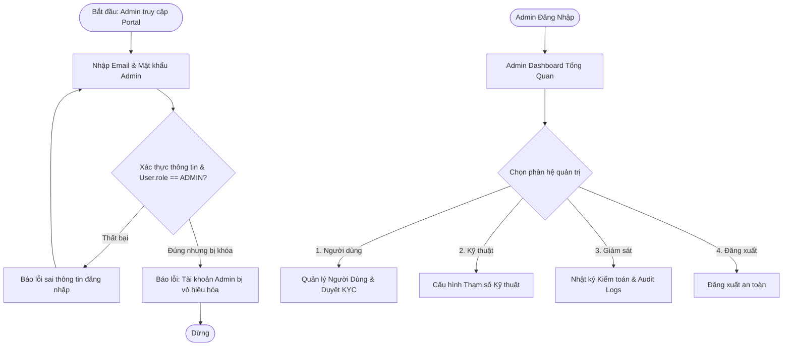
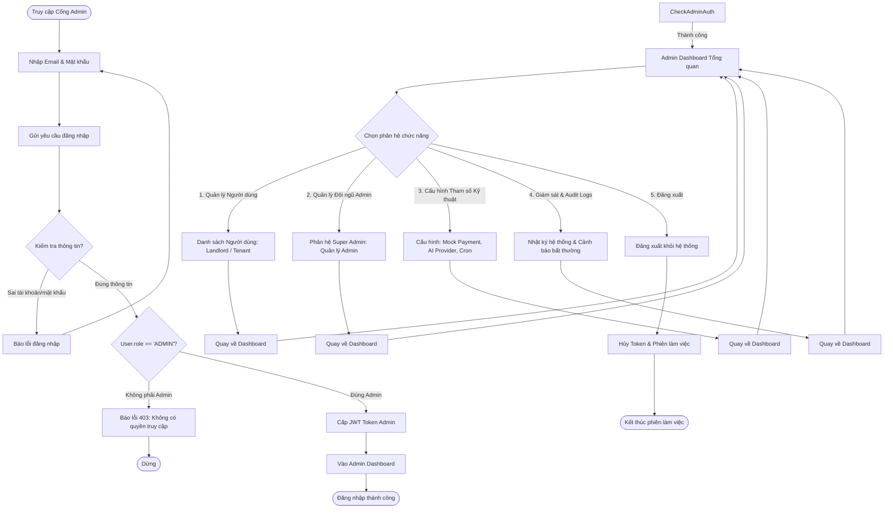
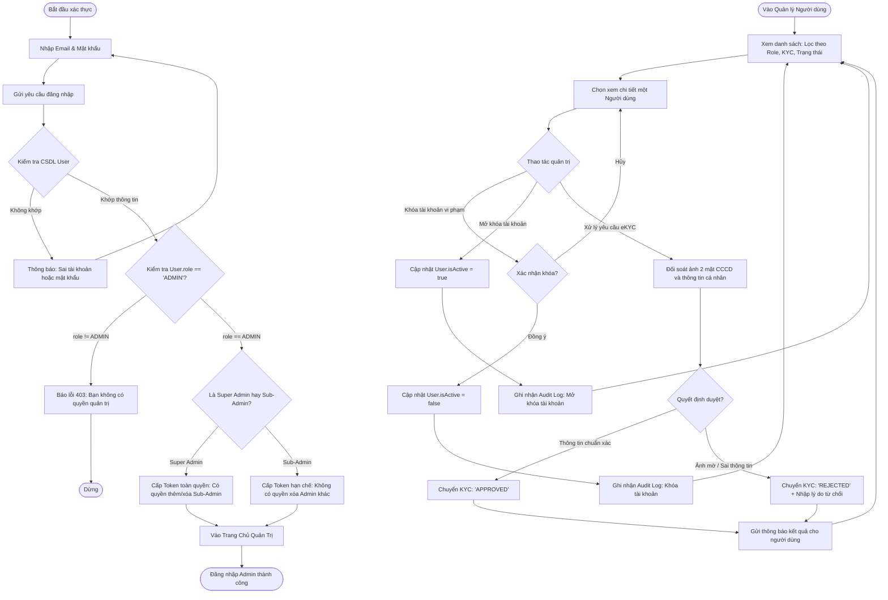
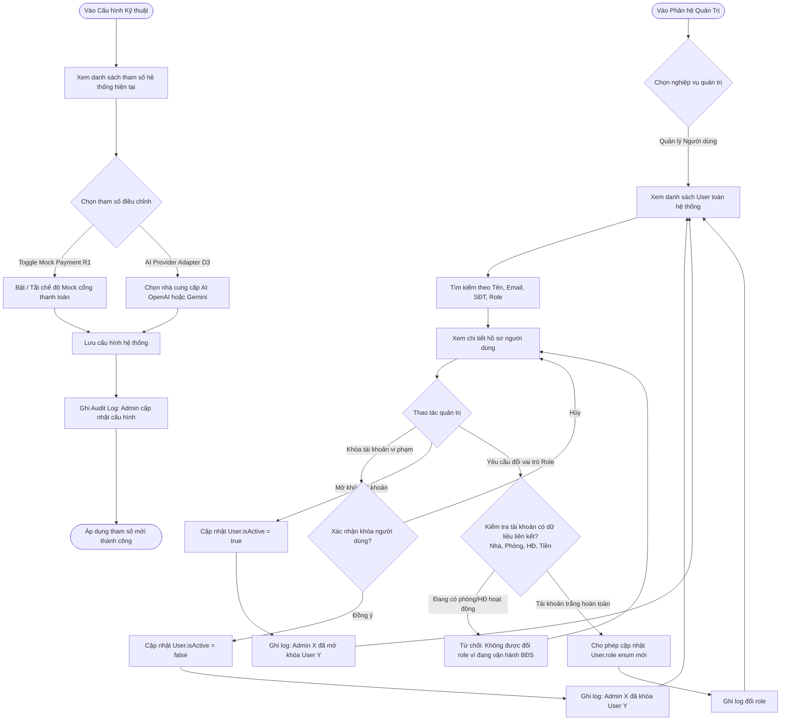
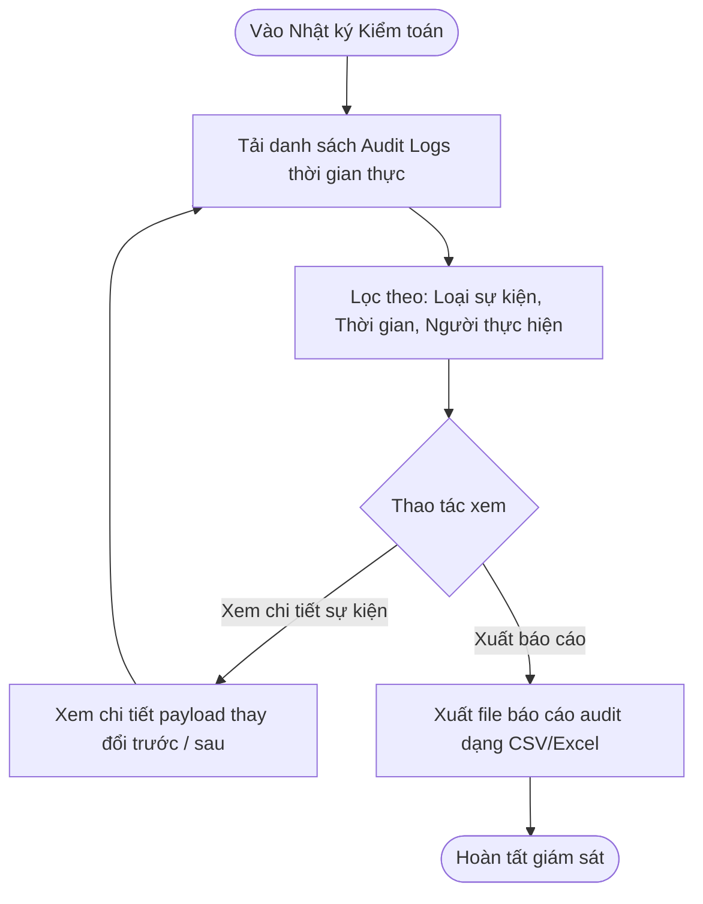

# User Flow — Admin

## 1. Nguyên Tắc Quản Trị Cốt Lõi

1. **Một Admin duy nhất (Single Admin):**
   * Hệ thống chỉ có **duy nhất 1 tài khoản Admin** quản trị toàn bộ nền tảng (không phân cấp Super Admin / Sub-Admin, không có chức năng tạo thêm hoặc phân quyền Admin khác).
2. **Vai trò Bất Biến (Immutable Role) — KHÔNG CHO PHÉP ĐỔI ROLE:**
   * `User.role` là Enum đơn lẻ: `ADMIN` | `LANDLORD` | `TENANT`.
   * **Quy tắc bất biến:** Một tài khoản sau khi đăng ký/khởi tạo **TUYỆT ĐỐI KHÔNG THỂ ĐỔI ROLE** dưới bất kỳ hình thức nào.
   * Admin **không có** chức năng đổi role cho người dùng, người dùng cũng không thể tự đổi vai trò của mình. Nếu một người muốn tham gia với vai trò khác (ví dụ: Khách thuê muốn đăng tin làm Chủ trọ), họ bắt buộc phải đăng ký tài khoản mới.
3. **Phạm vi Cấu hình của Admin (System-level Only):**
   * Admin chỉ cấu hình các tham số kỹ thuật cấp hệ thống:
     - **Mock Payment Gateway (R1):** Bật/tắt chế độ thanh toán giả lập phục vụ kiểm thử/demo.
     - **AI Provider Adapter (D3):** Lựa chọn adapter AI (`OpenAI` hoặc `Gemini`) và hạn mức API.
   * *Lưu ý:* Mọi cấu hình liên quan đến ngày chốt tiền, chu kỳ hóa đơn và **quét nợ tiền trọ thuộc toàn quyền của từng Chủ trọ (Landlord)**, Admin không can thiệp.

---

## 2. Tổng Quan Điều Hướng (Admin Navigation Hub)

---

## 3. Các Luồng Nghiệp Vụ Chi Tiết (Sub-Flows)

### Sub-Flow 1: Xác Thực & Đăng Nhập Admin

Admin đăng nhập qua cổng quản trị Web bằng email và mật khẩu. Hệ thống xác thực danh tính và kiểm tra quyền quản trị.

---

## 3. Admin Authentication & Role Delegation Flow
### Sub-Flow 2: Quản Lý Người Dùng & Phê Duyệt eKYC

Admin theo dõi danh sách toàn bộ người dùng (Landlord, Tenant). Admin có quyền xem chi tiết hồ sơ, duyệt CCCD (eKYC), hoặc khóa/mở khóa tài khoản khi có vi phạm. **Tuyệt đối không có chức năng đổi role.**

* **Quy tắc an toàn:**
  - Không có nút đổi role. Vai trò của tài khoản hiển thị dạng nhãn tĩnh (Static Tag: `LANDLORD` hoặc `TENANT`).
  - Khi tài khoản bị khóa (`isActive = false`), mọi phiên đăng nhập của người dùng đó bị hủy ngay lập tức và chặn truy cập API.

---

## 4. Admin Management Flow (User, Config & Audit Logs)
### Sub-Flow 3: Cấu Hình Tham Số Kỹ Thuật Hệ Thống

Quản lý các tham số vận hành tầng nền tảng (Toggle Mock Payment và AI Provider Adapter).

    %% Nhánh 2: Quản lý Admin Team (Chỉ Super Admin)
    SelectTab -->|Quản lý Admin Team| CheckSuperPerm{Người thực hiện là Super Admin?}
    CheckSuperPerm -->|Không| BlockSuper[Báo lỗi: Chỉ Super Admin mới được quản trị Admin] --> StartMgmt
    CheckSuperPerm -->|Phải| ManageAdminList[Xem danh sách các Admin]
    ManageAdminList --> CreateSubAdmin[Tạo tài khoản Sub-Admin mới]
    ManageAdminList --> RemoveSubAdmin{Xóa Sub-Admin cấp dưới?}
    RemoveSubAdmin -->|Xóa Sub-Admin| DeleteAdmin[Thu hồi quyền / Xóa tài khoản Sub-Admin] --> StartMgmt
    RemoveSubAdmin -->|Cố tình xóa Super Admin| ProtectSuper[Hệ thống từ chối: Không thể xóa tài khoản Root] --> StartMgmt
* **Lưu ý nghiệp vụ:**
  - Mock Payment: Dùng khi kiểm thử nghiệm thu hoặc chấm đồ án demo mà không cần quét tiền tài khoản thật.
  - Cấu hình này áp dụng chung cho toàn sàn, không can thiệp vào nghiệp vụ tiền tệ phòng trọ của Chủ trọ.

    %% Nhánh 3: Cấu hình Tham số Kỹ thuật
    SelectTab -->|Cấu hình Tham số| ShowConfigs[Hiển thị bảng thông số cấu hình]
    ShowConfigs --> ConfigItem{Chọn tham số thay đổi}
    ConfigItem -->|Toggle Mock Payment R1| SwitchMock[Bật / Tắt chế độ Mock cổng thanh toán]
    ConfigItem -->|Chọn AI Provider D3| SelectAI[Chuyển đổi Adapter: OpenAI <-> Gemini]
    ConfigItem -->|Cấu hình Lịch Bot Quét Nợ| EditCron[Cài đặt tần suất quét hóa đơn quá hạn]
    SwitchMock --> SaveConfig[Lưu cấu hình hệ thống & Ghi Audit Log]
    SelectAI --> SaveConfig
    EditCron --> SaveConfig
    SaveConfig --> StartMgmt
---

    %% Nhánh 4: Giám sát Hoạt động & Logs
    SelectTab -->|Giám sát & Logs| ViewAuditLog[Xem danh sách Audit Log thời gian thực]
    ViewAuditLog --> FilterAudit[Lọc theo: Lỗi thanh toán, Webhook ngân hàng, Hành vi Admin]
    FilterAudit --> ExportLog[Xuất báo cáo log kiểm toán khi cần] --> EndMgmt([Hoàn tất phiên quản trị])
### Sub-Flow 4: Giám Sát Hoạt Động & Nhật Ký Kiểm Toán (Audit Logs)

Admin theo dõi mọi sự kiện quan trọng trong hệ thống nhằm bảo đảm tính minh bạch và an toàn thông tin.

* **Các sự kiện ghi nhận bắt buộc:**
  - Admin khóa / mở khóa tài khoản người dùng.
  - Admin phê duyệt / từ chối hồ sơ eKYC.
  - Admin thay đổi tham số cấu hình hệ thống (Mock Payment, AI Adapter).
  - Lịch sử callback/webhook giao dịch thanh toán từ cổng ngân hàng.
