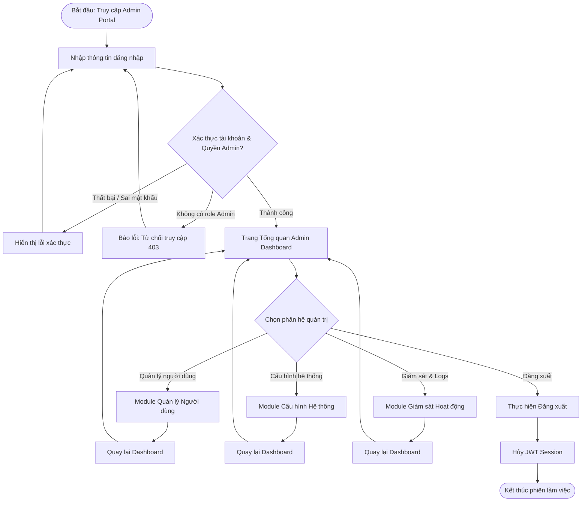
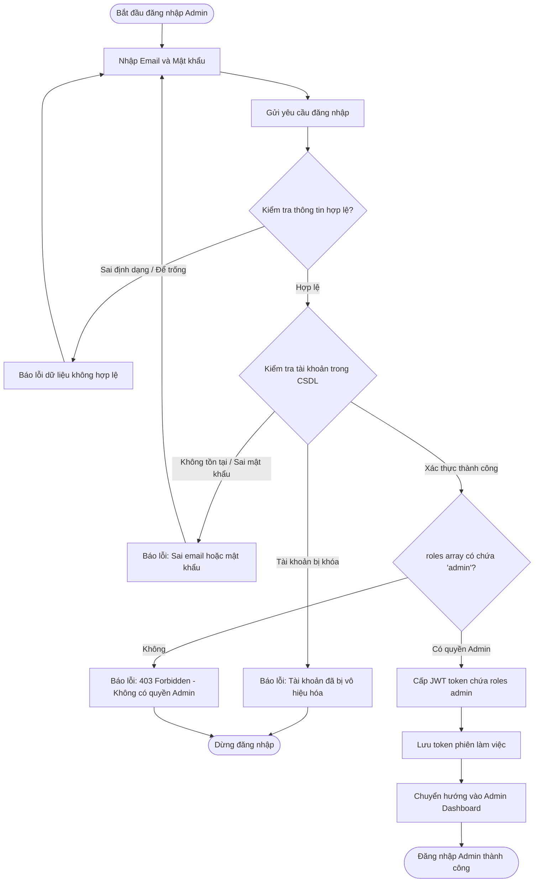
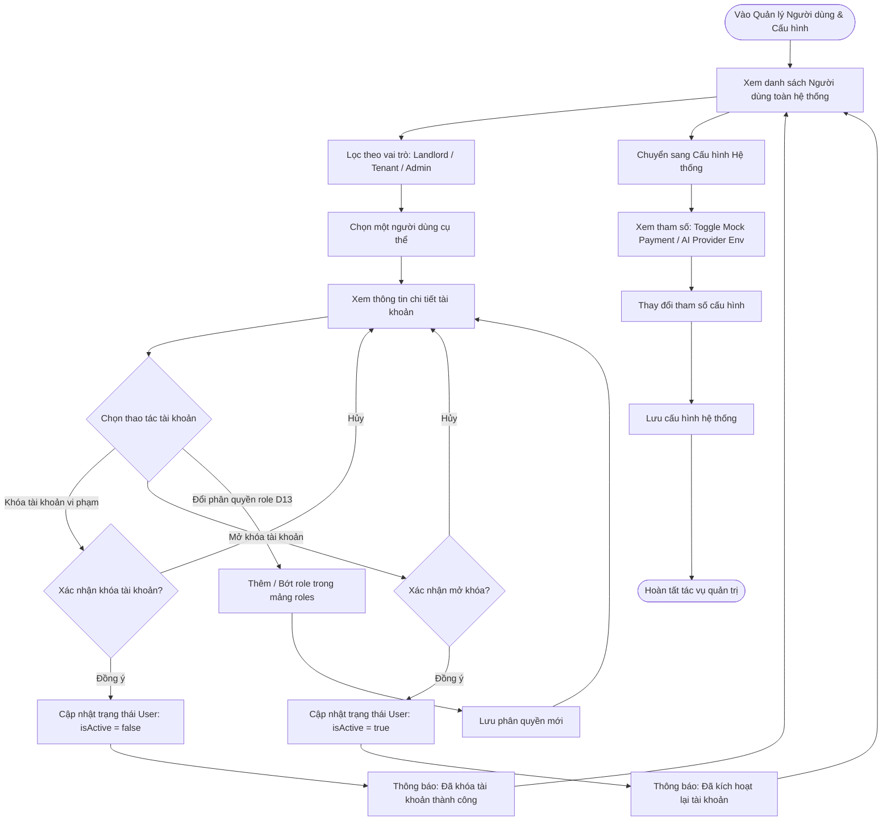

# User Flow — Admin

## 1. Admin Overview
Mục đích của Admin Flow là cung cấp quy trình quản trị người dùng tập trung đa vai trò (`roles` array theo D13), giám sát hoạt động hệ thống và cấu hình tham số vận hành chung (như mock payment gateway R1, provider AI adapter D3). Admin không can thiệp vào các nghiệp vụ riêng tư của chủ trọ/người thuê (không duyệt hợp đồng, không can thiệp đối soát tài chính hay duyệt từng người thuê).

---

## 2. Admin Main User Flow

---

## 3. Admin Authentication Flow

---

## 4. Admin Management Flow (User Management & System Config)

