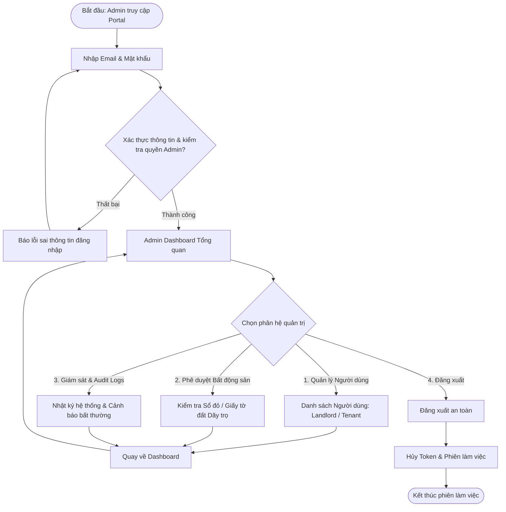
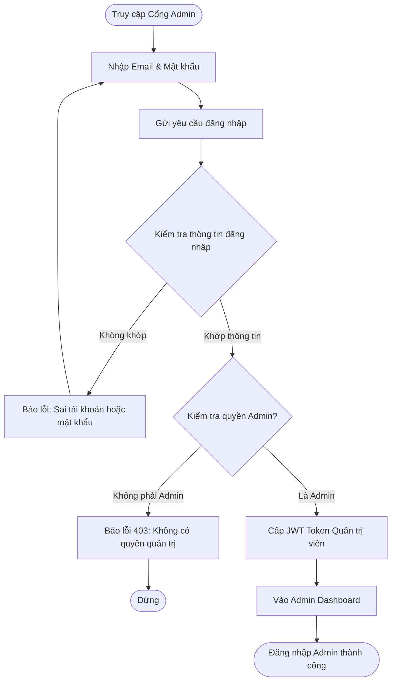
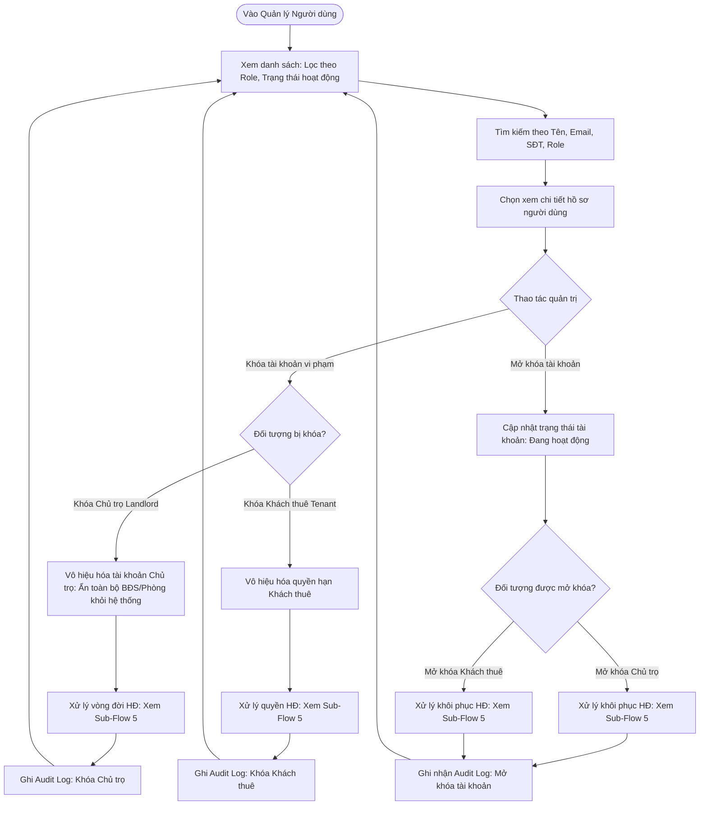
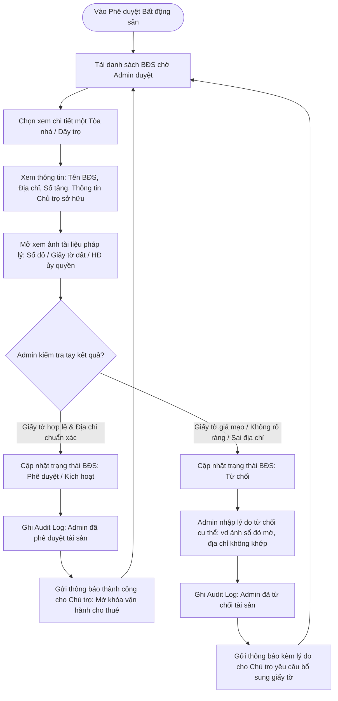
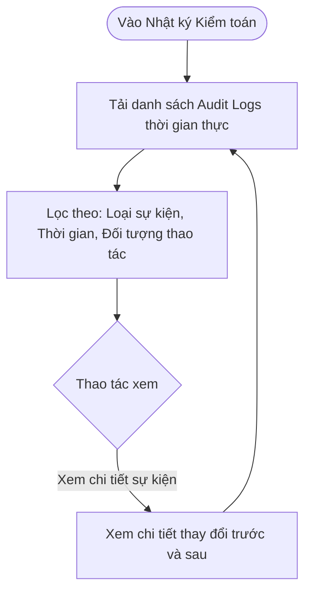
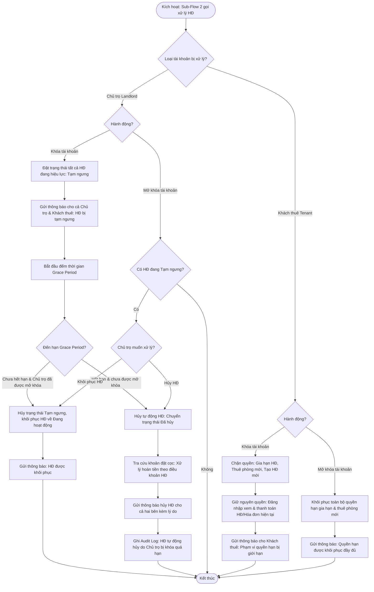

# User Flow — Admin

## 1. Nguyên Tắc Quản Trị Cốt Lõi

1. **Một Admin Duy Nhất (Single Admin System):**
   * Hệ thống chỉ có **duy nhất 1 tài khoản Admin** quản trị toàn bộ nền tảng.
   * Hoàn toàn không có phân cấp Super Admin hay Sub-Admin, không có chức năng tạo thêm hoặc quản lý đội ngũ Admin khác.
2. **Vai Trò Bất Biến (Immutable Role) — KHÔNG CHO PHÉP ĐỔI ROLE:**
   * Hệ thống có 3 vai trò: Admin, Chủ trọ, Khách thuê.
   * **Quy tắc bất biến:** Một tài khoản sau khi đăng ký hoặc khởi tạo **TUYỆT ĐỐI KHÔNG THỂ ĐỔI ROLE** dưới bất kỳ hình thức nào.
   * Admin không có chức năng đổi role cho người dùng. Nếu người dùng muốn tham gia vai trò khác (ví dụ: Khách thuê muốn làm Chủ trọ), bắt buộc phải đăng ký tài khoản mới riêng biệt.
3. **Kiểm Tra Tay & Phê Duyệt Tài Sản / Dãy Trọ (Sổ Đỏ / Giấy Tờ Đất):**
   * Khi Chủ trọ (Landlord) tạo mới một tài sản (Tòa nhà / Dãy trọ), hệ thống bắt buộc Chủ trọ phải tải lên ảnh bằng chứng sở hữu (Sổ đỏ, Giấy chứng nhận quyền sử dụng đất hoặc Hợp đồng ủy quyền hợp pháp).
   * Tài sản mới tạo sẽ ở trạng thái chờ Admin duyệt.
   * **Admin trực tiếp kiểm tra tay (manual review)** đối soát tính xác thực của giấy tờ và thông tin địa chỉ trước khi ra quyết định Phê duyệt để kích hoạt hoạt động cho thuê hoặc Từ chối kèm lý do rõ ràng.

---

## 2. Tổng Quan Điều Hướng (Admin Navigation Hub)

---

## 3. Các Luồng Nghiệp Vụ Chi Tiết (Sub-Flows)

### Sub-Flow 1: Xác Thực & Đăng Nhập Admin

Admin đăng nhập qua cổng quản trị Web bằng email và mật khẩu. Hệ thống xác thực danh tính duy nhất của tài khoản Admin và cấp quyền truy cập.

---

### Sub-Flow 2: Quản Lý Người Dùng

Admin có quyền xem chi tiết hồ sơ, hoặc khóa/mở khóa tài khoản vi phạm.

* **Quy tắc khóa và mở khóa tài khoản:**
  - **Khóa tài khoản Chủ trọ (Landlord):** Toàn bộ thông tin dãy trọ và phòng trọ của chủ trọ sẽ bị vô hiệu hóa (ẩn hoàn toàn khỏi hệ thống tìm kiếm công khai). Chi tiết xử lý hợp đồng đang hiệu lực khi khóa tài khoản Chủ trọ xem **Sub-Flow 5**.
  - **Khóa tài khoản Khách thuê (Tenant):** Khách thuê vẫn được phép đăng nhập để xem và thanh toán tiền hợp đồng/hóa đơn hiện tại nhằm đảm bảo nghĩa vụ tài chính. Chi tiết xử lý quyền hạn hợp đồng khi khóa tài khoản Khách thuê xem **Sub-Flow 5**.

---

### Sub-Flow 3: Phê Duyệt Bất Động Sản & Xác Minh Sổ Đỏ / Giấy Tờ Đất

Admin thực hiện kiểm tra tay hồ sơ pháp lý bất động sản (Tòa nhà / Dãy trọ) do Chủ trọ đăng ký để phòng tránh rủi ro gian lận, tranh chấp và bảo vệ quyền lợi người thuê.

* **Quy tắc kiểm tra bất động sản:**
  - Mọi bất động sản mới tạo bắt buộc phải có ít nhất 1 ảnh chụp giấy tờ pháp lý (Sổ đỏ / Sổ hồng / Giấy chứng nhận quyền sử dụng đất hoặc Giấy ủy quyền quản lý).
  - Khi chưa được Admin phê duyệt, các phòng trong dãy trọ không thể phát hành hợp đồng chính thức và không được hiển thị công khai trên bản đồ tìm kiếm của khách thuê.

---

### Sub-Flow 4: Giám Sát Hoạt Động & Nhật Ký Kiểm Toán (Audit Logs)

Admin theo dõi mọi sự kiện quan trọng trong hệ thống nhằm bảo đảm tính minh bạch, truy vết trách nhiệm và an toàn thông tin.

* **Các sự kiện ghi nhận bắt buộc:**
  - Admin khóa hoặc mở khóa tài khoản người dùng.
  - Admin phê duyệt hoặc từ chối tài sản / dãy trọ (Sổ đỏ / Giấy tờ đất).
  - Lịch sử callback hoặc webhook giao dịch thanh toán từ cổng ngân hàng.

---

### Sub-Flow 5: Xử Lý Vòng Đời Hợp Đồng Khi Tài Khoản Bị Khóa / Mở Khóa

Luồng xử lý tự động liên quan đến hợp đồng thuê khi Admin thực hiện khóa hoặc mở khóa tài khoản người dùng. Đảm bảo quyền lợi tài chính của cả Chủ trọ và Khách thuê trong quá trình xử lý vi phạm.

* **Quy tắc xử lý hợp đồng khi khóa/mở khóa:**
  - **Khóa Chủ trọ (Landlord):** Tất cả hợp đồng thuê đang hiệu lực chuyển sang trạng thái tạm ngưng. Khách thuê vẫn có thể đăng nhập để xem và thanh toán hóa đơn hiện tại nhằm đảm bảo nghĩa vụ tài chính. Nếu qua thời gian Grace Period mà chủ trọ chưa được mở khóa, hợp đồng tự động bị hủy và hệ thống thực hiện tra cứu khoản đặt cọc để xử lý hoàn tiền theo điều khoản hợp đồng.
  - **Khóa Khách thuê (Tenant):** Khách thuê bị chặn quyền gia hạn hợp đồng, thuê phòng mới và tạo hợp đồng mới. Vẫn được phép đăng nhập để xem và thanh toán hợp đồng/hóa đơn hiện tại.
  - **Mở khóa:** Khi tài khoản được khôi phục, quyền hạn hợp đồng liên quan cũng được khôi phục theo tương ứng. Chủ trọ tự bổ sung dữ liệu phát sinh trong thời gian bị khóa.
