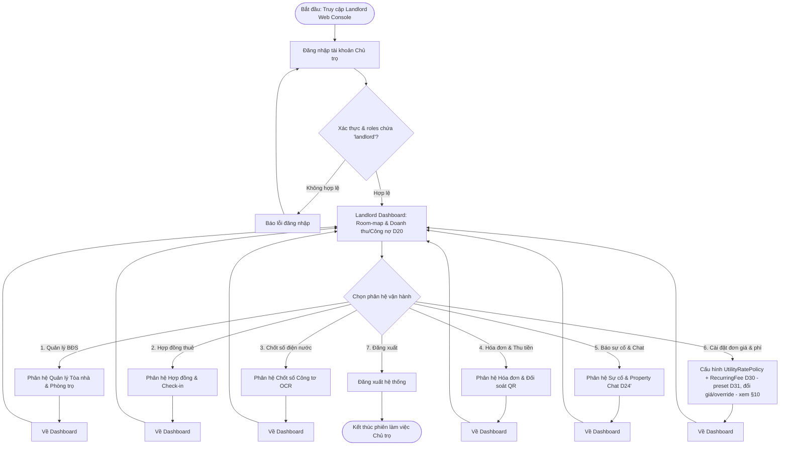
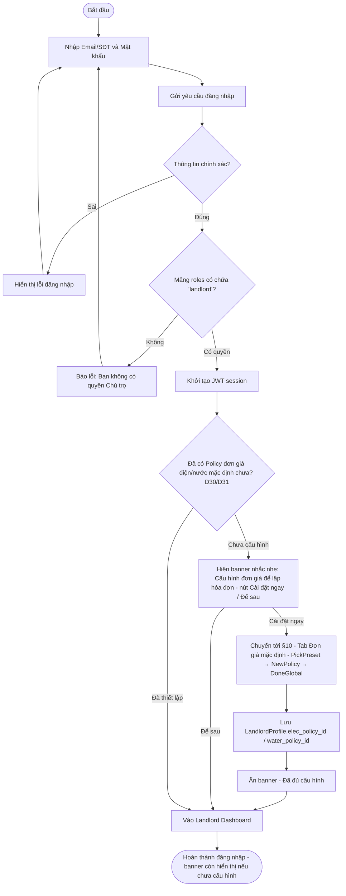
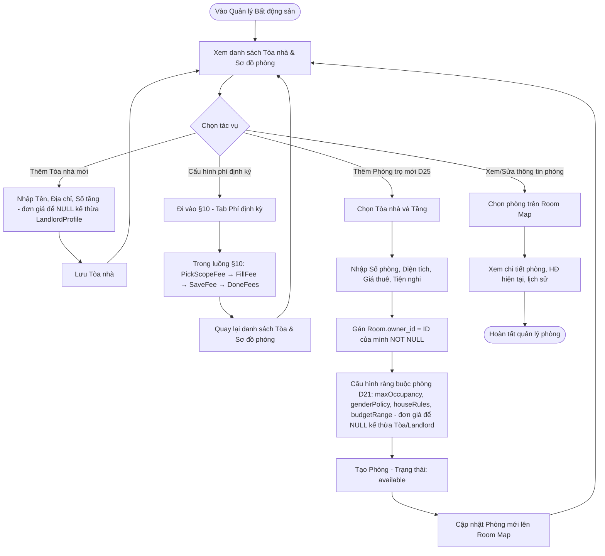
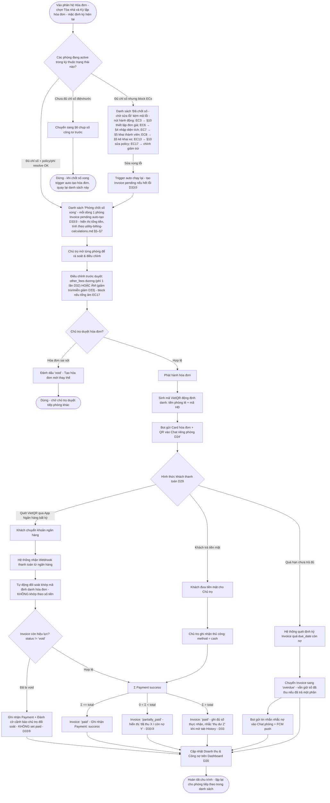
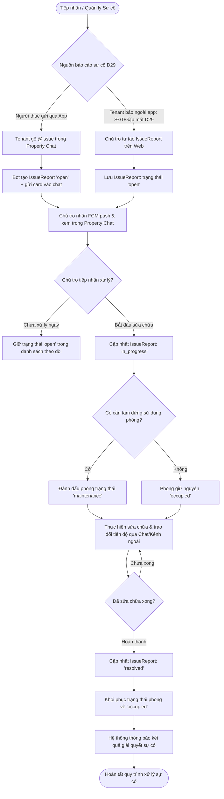
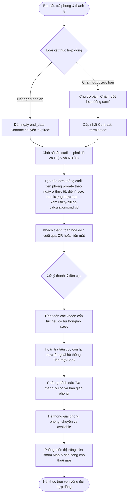
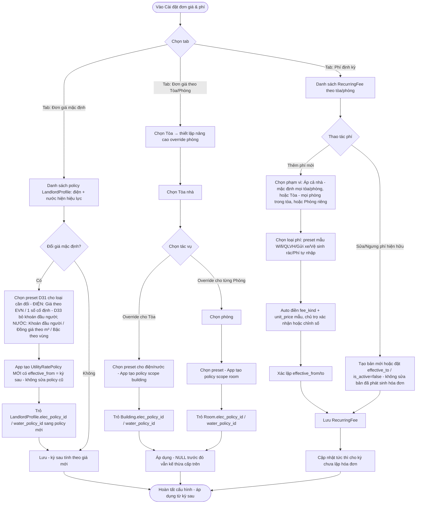

# User Flow — Landlord

## 1. Landlord Overview
Chủ trọ (Landlord) là vai trò vận hành trung tâm trên nền tảng Web console (có hỗ trợ Mobile-lite nhận thông báo). Dựa trên nguyên tắc **D29 (Landlord-can-operate-solo)**, Chủ trọ có thể vận hành trọn vẹn toàn bộ vòng đời cho thuê (từ thiết lập tòa/phòng, lập hợp đồng ký tay, chốt số công tơ OCR, xuất hóa đơn QR động đối soát tự động, đến xử lý sự cố và thanh lý) ngay cả khi **người thuê không bao giờ đăng nhập ứng dụng**.

---

## 2. Landlord Main User Flow

---

## 3. Landlord Authentication & Global Config Flow

---

## 4. Landlord Property Management Flow (Building, Room & Constraints)

---

## 5. Landlord Rental Contract & Check-in Flow (D18 Wet-Sign & D17 CCCD)

```mermaid
flowchart TD
    StartContract([Bắt đầu tạo Hợp đồng thuê]) --> SelectVacantRoom[Chọn phòng trạng thái 'available']
    SelectVacantRoom --> ClickNewContract[Bấm 'Tạo hợp đồng mới']
    
    ClickNewContract --> InputTenantInfo[Nhập thông tin Người thuê đại diện: Tên, SĐT]
    InputTenantInfo --> UploadCCCD[Chụp / Tải ảnh CCCD mặt trước D17]
    
    UploadCCCD --> AI_OCR_CCCD[AI OCR CCCD tự trích xuất thông tin F5.6]
    AI_OCR_CCCD --> ReviewCCCD{Thông tin OCR chính xác?}
    ReviewCCCD -->|Cần chỉnh sửa| EditTenantData[Chỉnh sửa thông tin tay]
    ReviewCCCD -->|Chính xác| FillContractTerms[Nhập tiền cọc, ngày bắt đầu, thời hạn]
    EditTenantData --> FillContractTerms
    
    FillContractTerms --> DeclareVehicles[Nhập số xe gửi tại nhà trọ vehicle_count - dùng cho phí per_vehicle D32]
    
    DeclareVehicles --> SharedConfigDecision{Phòng ở ghép nhiều người? D22}
    SharedConfigDecision -->|Một người thuê| SinglePayment[Cấu hình HĐ đơn lẻ]
    SharedConfigDecision -->|Nhiều người ở ghép| SelectD22Config{Chọn cấu hình thanh toán D22}
    
    SelectD22Config -->|Model a: Đại diện thanh toán| RepPayerConfig[1 HĐ đại diện - Lead trả, tự chia offline]
    SelectD22Config -->|Model b: Hóa đơn chia sẻ| SharedInvoiceConfig[1 HĐ đại diện - Hệ thống track phần tiền từng người]
    
    SinglePayment --> GenContractDraft[Khởi tạo Contract: trạng thái 'draft']
    RepPayerConfig --> GenContractDraft
    SharedInvoiceConfig --> GenContractDraft
    
    GenContractDraft --> ExportTemplate[Sinh file mẫu HĐ chuẩn Word/PDF điền sẵn D18]
    ExportTemplate --> PrintContract[In hợp đồng ra giấy]
    
    PrintContract --> PhysicalSign[Hai bên ký tay trên giấy thật wet-sign]
    
    PhysicalSign --> UploadSignedDoc[Chủ trọ chụp / scan tải file HĐ đã ký lên]
    
    UploadSignedDoc --> ValidateUpload{Đã có file ký tải lên?}
    ValidateUpload -->|Chưa tải file| KeepDraft[HĐ giữ nguyên trạng thái 'draft' - Phòng chưa bàn giao]
    KeepDraft --> EndContractIncomplete([Chờ tải file ký])
    
    ValidateUpload -->|Tải file thành công| ActivateContract[Lưu uploaded_file + signed_at - Contract chuyển 'active']
    ActivateContract --> CaptureMeterBaseline[Bàn giao phòng: chụp ảnh đồng hồ ĐIỆN và NƯỚC lúc dọn vào - OCR tự đọc; sai/mờ thì sửa tay số thực tế trước khi lưu D35 - MeterReading is_baseline=true previous=0 current=chỉ số OCR/đã sửa reading_date=ngày bàn giao - D34]
    CaptureMeterBaseline --> UpdateRoomOcc[Phòng chuyển trạng thái: occupied]
    UpdateRoomOcc --> DashboardSync[Cập nhật Room Map & ghi nhận tiền cọc]
    DashboardSync --> EndContractSuccess([Hoàn tất bàn giao phòng & HĐ có hiệu lực])
```

---

## 6. Landlord Utility Meter Closing Flow (OCR & Bot Remind)

```mermaid
flowchart TD
    StartMeter([Đến kỳ chốt số điện nước hàng tháng]) --> SelectBldAndPeriod[Chọn Tòa nhà và Kỳ chốt số period - mặc định kỳ hiện tại]
    SelectBldAndPeriod --> OpenRoomList[Hiển thị danh sách phòng cần chốt số - tiến độ X/Y]
    
    OpenRoomList --> SelectTargetRoom[Chọn phòng cần ghi số]
    SelectTargetRoom --> FetchPrevReading[Lấy chỉ số cũ theo từng loại: kỳ đầu = baseline OCR lúc bàn giao §5 is_baseline=true - hiệu chỉnh tay nếu OCR sai D35; kỳ sau = chỉ số kỳ trước; thay đồng hồ giữa kỳ = baseline mới qua OCR EC1]
    FetchPrevReading --> ConfirmOneType[Chốt lần lượt: ĐIỆN và NƯỚC - mỗi loại 1 bản ghi]

    ConfirmOneType --> SnapMeterPhoto[Chụp ảnh đồng hồ ĐIỆN hoặc NƯỚC tương ứng]
    SnapMeterPhoto --> AI_OCR_Meter[AI OCR tự động đọc chỉ số mới từ ảnh F3.3]
    AI_OCR_Meter --> DisplayReading[Hiển thị chỉ số cũ, số mới, lượng tiêu thụ]
    
    DisplayReading --> VerifyReading{Chủ trọ kiểm tra chỉ số đọc?}
    VerifyReading -->|Ảnh mờ / Sai số| FixMethod{Chọn cách xử lý}
    FixMethod -->|Chụp lại ảnh rõ hơn| RetakePhoto[Chụp lại ảnh đồng hồ]
    FixMethod -->|Sửa tay đúng số thực tế| ManualEditReading[Chỉnh sửa chỉ số đọc thủ công - lưu kèm ảnh evidence gốc - D35]
    RetakePhoto --> SnapMeterPhoto
    ManualEditReading --> OneTapConfirm
    VerifyReading -->|Chính xác| OneTapConfirm[Bấm 'Xác nhận' 1 chạm]
    
    OneTapConfirm --> SaveMeterReading[Tạo MeterReading room + utility_type + period - ảnh evidence riêng từng loại]
    SaveMeterReading --> BothTypesDone{Đã chốt xong cả ĐIỆN và NƯỚC cho phòng này?}
    BothTypesDone -->|Chưa| ConfirmOneType
    BothTypesDone -->|Xong| TriggerAutoInvoice[Auto-trigger D33②: thử tạo Invoice pending cho phòng này - chỉ tạo khi policy/phí resolve OK EC2-EC13 không lỗi]
    
    TriggerAutoInvoice --> BillableOk{Hệ thống tạo được hóa đơn?}
    BillableOk -->|Tạo được| AddToReadyList[Invoice pending được tạo - phòng vào bảng 'Phòng chốt số xong' của §7 để rà soát & phát hành]
    BillableOk -->|Không tạo được| BlockReason[Ghi lỗi block ECx cụ thể: EC3 thiếu đơn giá / EC6 thiếu diện tích / EC7 chưa khai thành viên / EC8 chưa kê khai xe / EC13 policy sai / EC17 tổng âm]
    BlockReason --> FlagFixList[Phòng vào danh sách 'Đã chốt số - chờ sửa lỗi' của §7 - bot nhắc chủ trọ 1 lần kèm lý do + nút hành động vào đúng màn sửa; sửa xong trigger chạy lại tự tạo hóa đơn]
    
    AddToReadyList --> BotCard[Bot gửi Card tổng kết cả 2 loại vào Chat phòng D24']
    FlagFixList --> BotCard
    BotCard --> NextRoomCheck{Còn phòng nào chưa chốt trong kỳ?}
    NextRoomCheck -->|Còn| OpenRoomList
    NextRoomCheck -->|Xong kỳ này| GotoBilling[Chuyển sang phân hệ Hóa đơn §7 - rà soát & phát hành]
    GotoBilling --> EndMeter([Hoàn tất chốt số điện nước])
```

---

## 7. Landlord Invoice Generation & Auto-Reconciliation Flow (VietQR Động) — D33② auto theo PHÒNG

---

## 8. Landlord Issue Handling & Property Chat Flow (D24')

---

## 9. Landlord Check-out & Contract Termination Flow

---

## 10. Landlord Utility & Fee Settings Flow (Module 6 — Cài đặt đơn giá & phí)

