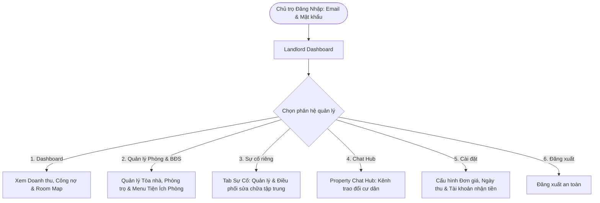
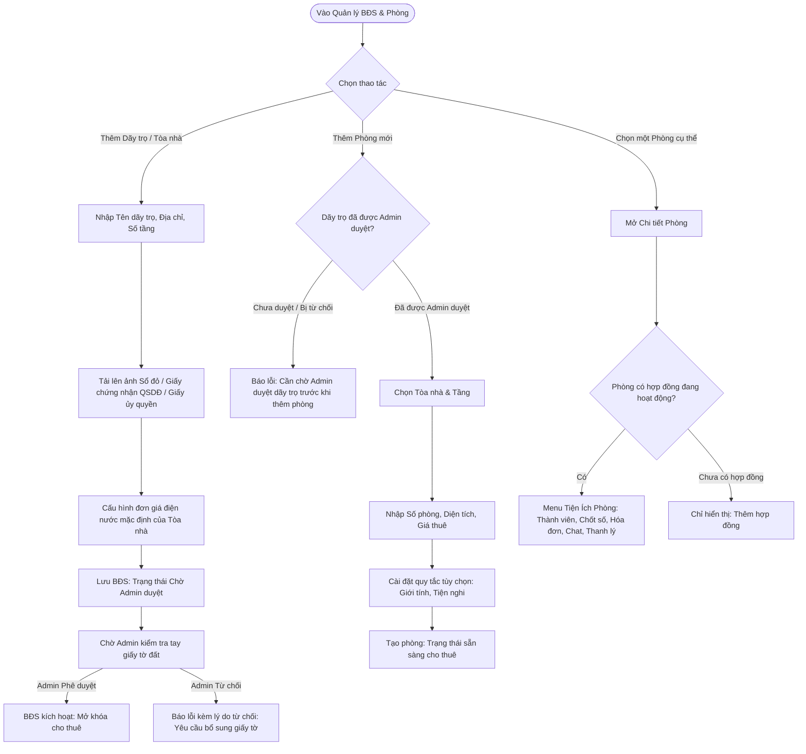
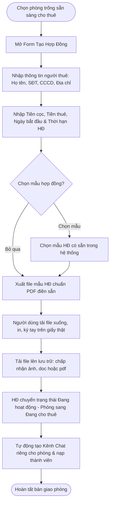
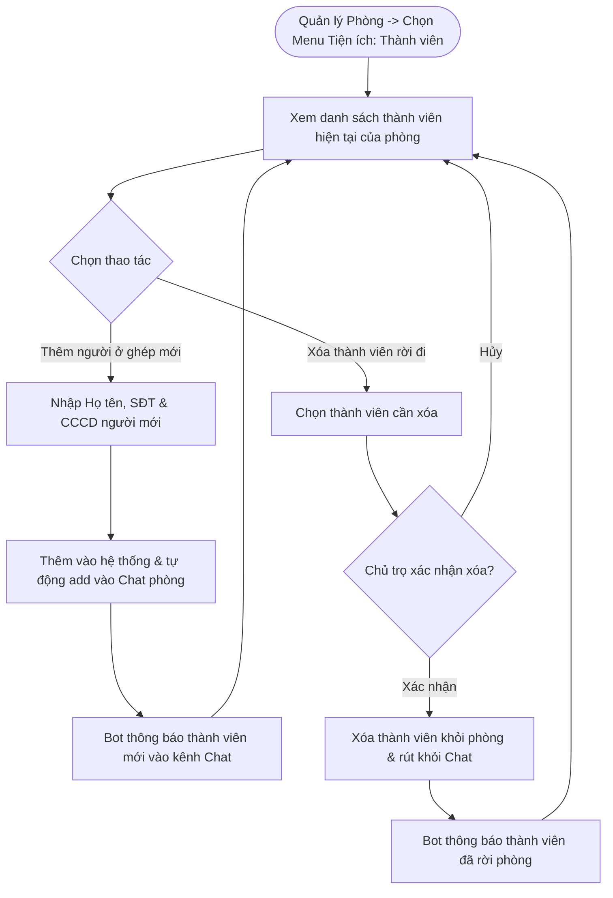
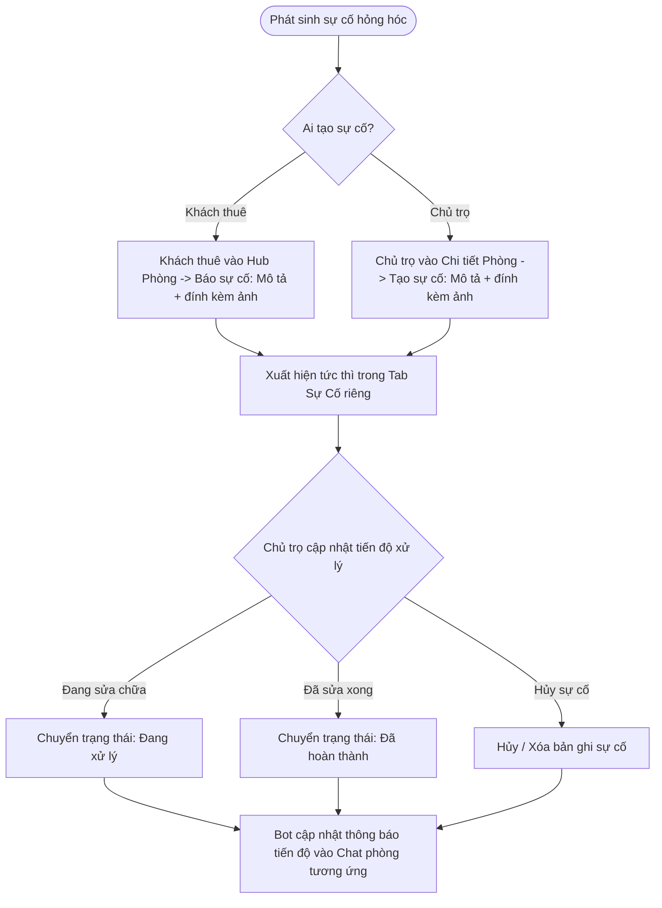
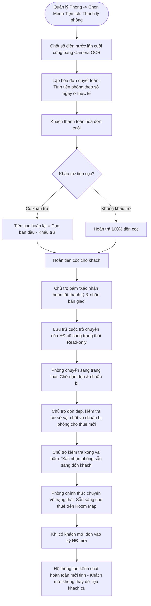
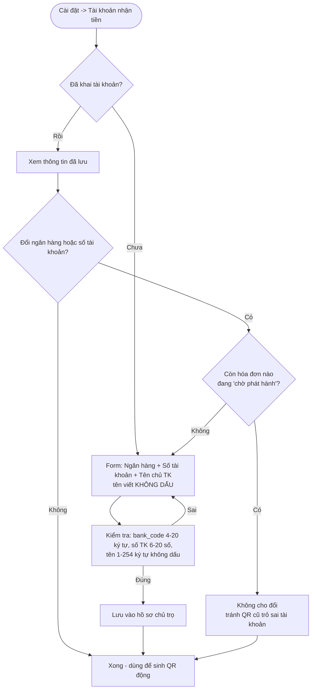

# Landlord User Flow — PBL6

Tài liệu User Flow hoàn chỉnh cho vai trò **Chủ trọ (Landlord)** trong hệ thống Rentify (PBL6). Luồng thiết kế phản ánh góc nhìn quản trị thực tế của Chủ trọ: phân hệ **Quản lý Phòng** là trung tâm chứa **Menu Tiện ích**, **Sự cố được tách thành Tab riêng**, quy trình thanh toán linh hoạt cho **mọi thành viên trong phòng**.

---

## 1. Nguyên Tắc Nghiệp Vụ Cốt Lõi

1. **Góc Nhìn Quản Trị Của Chủ Trọ (Landlord Viewpoint):**
   * **Tiện ích nằm ở Quản lý Phòng:** Toàn bộ các công cụ vận hành (Quản lý thành viên, Chốt số điện nước, Xuất hóa đơn, Thanh lý phòng) được đặt trực tiếp trong **Menu Tiện ích** của từng Phòng trọ.
   * **Tab Sự Cố Riêng:** Phân hệ Sự cố được tách thành một **Tab độc lập** trên thanh điều hướng chính giúp Chủ trọ theo dõi, lọc trạng thái và điều phối sửa chữa tập trung cho toàn bộ các tòa nhà.
2. **Ai Trong Phòng Cũng Có Thể Thanh Toán:**
   * Hóa đơn và mã VietQR động được tạo cho phòng. **Bất kỳ thành viên nào** trong phòng đều có thể quét QR thanh toán hoặc nộp tiền mặt. **D39 — chủ trọ xác nhận khoản đã thu**, hệ thống suy ra trạng thái (chưa thu / thu một phần / thu đủ / thu dư); app **không tự gạch nợ** và **không phạt quá hạn**.
3. **Linh Hoạt Thành Viên:**
   * Hệ thống không ép buộc giới hạn số người cứng. Chủ trọ có thể thêm bao nhiêu thành viên ở ghép tùy ý. Thành viên rời đi cần có sự phê duyệt của Chủ trọ (chủ trọ thực hiện thao tác xóa).
4. **Trao Đổi Tự Nhiên Trong Chat:**
   * Trong khung chat, cư dân và chủ trọ trao đổi tự nhiên bằng text, ảnh và file. Mọi báo cáo sự cố được đồng bộ và quản lý tập trung tại Tab Sự Cố riêng.
5. **Cấu Hình Quét Nợ & Chu Kỳ Quy Về Từng Tháng:**
   * Chủ trọ tự quyết định ngày chốt điện nước, hạn đóng tiền và bật/tắt lịch bot tự động quét nợ định kỳ để nhắc nhở phòng trọ. Cấu hình có thể设置 ở cấp profile, building hoặc room.
   * **Chu kỳ thanh toán chuẩn hóa theo từng tháng:** Mọi hóa đơn và khoản thu trên hệ thống đều được quy về từng tháng.
6. **Gộp Chi Phí Vào Danh Mục Dịch Vụ & Quy Định Chụp/Tải Ảnh Công Tơ:**
   * Gộp chung toàn bộ chi phí điện, nước, wifi, máy giặt chung, tiền rác... vào một danh mục duy nhất là **Dịch vụ**.
   * **Cả Chủ trọ và Khách thuê đều dùng được Camera trong hệ thống:** Hai bên đều có thể mở Camera trong app chụp trực tiếp tại chỗ ảnh đồng hồ điện nước.
   * **Chủ trọ có quyền chụp hoặc tải ảnh từ máy lên:** Chủ trọ có cả 2 quyền: chụp trực tiếp bằng Camera và tải ảnh có sẵn từ bộ nhớ thiết bị. Khách thuê chỉ được chụp trực tiếp qua Camera.
7. **Hợp Đồng Ký Tay Wet-Sign & Lưu Trữ (Archive):**
   * Hỗ trợ in mẫu hợp đồng giấy ký sống (wet-sign), sau đó tải file lên lưu trữ.
   * **Trạng thái chờ dọn dẹp sau Checkout:** Sau khi khách trả phòng, phòng trọ chuyển sang trạng thái chờ dọn dẹp. Chỉ khi chủ trọ hoàn tất và xác nhận sẵn sàng thì phòng mới chuyển sang sẵn sàng cho thuê.
   * Hội thoại cũ được lưu trữ (Archive) và khởi tạo kênh mới cho khách tiếp theo.
8. **Tải Lên Bằng Chứng Sở Hữu (Sổ Đỏ / Giấy Tờ Đất) Khi Tạo Dãy Trọ:**
   * Khi Chủ trọ tạo mới Tòa nhà / Dãy trọ, bắt buộc phải tải lên ảnh chụp giấy tờ pháp lý (Sổ đỏ, Giấy chứng nhận quyền sử dụng đất hoặc Hợp đồng ủy quyền hợp pháp).
   * Bất động sản mới tạo ở trạng thái chờ Admin duyệt và cần được Admin kiểm tra tay phê duyệt trước khi mở quyền đăng phòng cho thuê công khai.
9. **Đồng Nhất Vai Trò Quản Lý:**
   * Thống nhất toàn bộ thành một vai trò duy nhất là **Chủ trọ (Landlord)** sở hữu/quản lý Dãy trọ và các Phòng trọ bên trong, không phân tách phức tạp giữa chủ phòng hay chủ tòa nhà.

---

## 2. Tổng Quan Điều Hướng (Landlord Navigation Hub)



---

## 3. Các Luồng Nghiệp Vụ Chi Tiết (Sub-Flows)

### Sub-Flow 1: Quản Lý Bất Động Sản & Phòng Trọ (Kèm Menu Tiện Ích)

Chủ trọ tạo mới Tòa nhà / Dãy trọ, tải lên bằng chứng quyền sở hữu (Sổ đỏ / Giấy tờ đất) gửi Admin kiểm tra tay, và quản lý danh sách phòng. Trong mỗi phòng tích hợp sẵn **Menu Tiện ích**.



---

### Sub-Flow 2: Tạo Hợp Đồng Thuê & Check-in

Đón khách mới: nhập thông tin người thuê, chọn mẫu hợp đồng (tùy chọn), in hợp đồng giấy ký sống, tải file lên lưu trữ, kích hoạt phòng.



---

### Sub-Flow 3: Quản Lý Thành Viên Phòng & Biến Động Giữa Kỳ (Từ Tiện Ích Phòng)

Chủ trọ mở **Menu Tiện ích trong Quản lý Phòng** để thêm/bớt người ở ghép.



---

### Sub-Flow 4: Chốt Số Điện/Nước & Lập Hóa Đơn (Từ Tiện Ích Phòng)

Hệ thống tích hợp Camera chụp trực tiếp cho cả Chủ trọ và Khách thuê. Chủ trọ có quyền chụp hoặc tải ảnh từ máy lên. Sau khi chốt số, chủ trọ lập hóa đơn và phát hành cho phòng.

```mermaid
flowchart TD
    %% Chốt số điện nước
    StartMeter([Tiện ích Chốt số điện nước]) --> SelectCaptureMethod{Nguồn cung cấp ảnh công tơ}

    SelectCaptureMethod -->|Chụp trực tiếp bằng Camera trong app| LiveCamera[Camera chụp tại chỗ]
    SelectCaptureMethod -->|Tải ảnh có sẵn từ máy| UploadFromStorage[Upload từ bộ nhớ/thư viện ảnh]

    LiveCamera --> RunOCR[AI OCR tự động nhận diện chỉ số từ ảnh công tơ]
    UploadFromStorage --> RunOCR

    RunOCR --> ReviewIndex{Chủ trọ kiểm tra kết quả?}
    ReviewIndex -->|Chưa chuẩn| EditManual[Sửa lại số bằng tay]
    ReviewIndex -->|Chính xác| ConfirmIndex[Bấm Xác nhận 1 chạm]
    EditManual --> ConfirmIndex

    ConfirmIndex --> SaveMeterDB[Lưu bản ghi chốt số kỳ hiện tại]

    %% Lập hóa đơn
    SaveMeterDB --> CalcAmount[Tính toán chuẩn hóa theo tháng: Tiền phòng + Danh mục Dịch vụ]
    CalcAmount --> ReviewBill{Chủ trọ xem trước hóa đơn?}

    ReviewBill -->|Cần chỉnh sửa| EditBill[Điều chỉnh số liệu] --> CalcAmount
    ReviewBill -->|Hợp lệ| PublishBill[Bấm Phát hành Hóa đơn Tháng]

    PublishBill --> GenQR[Sinh mã VietQR động: Gắn Invoice.code & đúng số tiền lẻ<br/>(cần tài khoản nhận tiền đã khai - D39)]
    GenQR --> BotSendBill[Bot gửi Thẻ Hóa Đơn kèm mã VietQR vào Chat phòng]

    BotSendBill --> PayMethod{Ai thanh toán & Hình thức nào?}

    %% Bất kỳ ai quét VietQR
    PayMethod -->|Bất kỳ thành viên nào trong phòng quét VietQR| BankTransfer[Chuyển khoản qua App Ngân hàng]
    BankTransfer --> ReconcileByCode[Đối soát theo Invoice.code nhúng trong nội dung<br/>(KHÔNG theo amount - trả thiếu/dư vẫn khớp)]
    ReconcileByCode --> SandboxCb[["Sandbox: webhook/callback giả lập hoặc chủ trọ tự nhập<br/>Auto-reconciliation thật → STRETCH"]]

    %% Bất kỳ ai nộp tiền mặt
    PayMethod -->|Bất kỳ thành viên nào nộp Tiền mặt| CashPay[Chủ trọ nhận tiền mặt trực tiếp]
    CashPay --> ConfirmCashBtn[Chủ trọ bấm 'Đã thu tiền' + nhập số tiền thực nhận]

    SandboxCb --> DeriveState
    ConfirmCashBtn --> DeriveState[Suy ra trạng thái từ Σ Payment success vs total_amount<br/>D39: KHÔNG ghi status, KHÔNG hoàn/bù trừ tự động]
    DeriveState --> OverpayCheck{Σ success khác total?}
    OverpayCheck -->|Khác| RemindOnly[Tab History hiện nhắc 'thu dư X / còn thiếu Y'<br/>Người dùng tự đối soát ngoài app]
    OverpayCheck -->|Bằng| UpdateFinDash
    RemindOnly --> UpdateFinDash[Cập nhật Doanh thu & Công nợ trên Dashboard]
    UpdateFinDash --> NeedsReview{Vừa có Payment success<br/>trỏ tới hóa đơn đã void?}
    NeedsReview -->|Có| FlagReview[Đánh cờ needs_review cho chủ trọ xử lý]
```

* **Quy định bảo mật chỉ số:** 
  * Cả Chủ trọ và Khách thuê đều có thể dùng Camera trong app để chụp trực tiếp đồng hồ điện nước.
  * Khách thuê **không có quyền tải ảnh từ bộ nhớ máy lên**, chỉ Chủ trọ mới có tính năng này.

* **Nguyên tắc tài chính:**
  * Gộp chung toàn bộ điện, nước, internet/wifi, máy giặt, vệ sinh/rác vào một nhóm duy nhất là **Dịch vụ**.
  * Hóa đơn luôn chốt theo chu kỳ hàng tháng trên hệ thống.

---

### Sub-Flow 5: Cấu Hình Chu Kỳ Hóa Đơn & Nhắc Thu Theo Lịch

> **D39 — cấu hình này chỉ là GỢI Ý hiển thị, không phải hạn chót.** Không có `due_date` trên hóa đơn, không có trạng thái `overdue`, không chặn thao tác nào. `BillingSetting` chỉ có scope **building | room** (bỏ cấp profile/landlord — giống `RatePolicy`), và resolve `room → building`.

```mermaid
flowchart TD
    StartDebtConfig([Vào Cài đặt]) --> ChooseLevel{Chọn cấp cấu hình?}

    ChooseLevel -->|Building| BuildingConfig[Chọn tòa nhà cần cấu hình]
    ChooseLevel -->|Room| RoomConfig[Chọn phòng cụ thể cần cấu hình]

    BuildingConfig --> SetDueDay[Đặt ngày thu dự kiến trong tháng]
    RoomConfig --> SetDueDay
    SetDueDay --> SetReminder[Đặt ngày nhắc: nhắc trước ngày thu vài ngày]
    SetReminder --> SaveSettings[Lưu cấu hình]

    SaveSettings --> RunCron[Hệ thống nền quét mỗi ngày]

    RunCron --> CheckUnpaid{Hóa đơn đã phát hành<br/>mà Σ Payment success < total?}
    CheckUnpaid -->|Không| SleepCron[Kết thúc lượt quét]
    CheckUnpaid -->|Có| CheckRemindDay{Đã tới remind_day?}
    CheckRemindDay -->|Chưa| SleepCron
    CheckRemindDay -->|Rồi| TriggerReminder[Bot nhắc nhở vào Chat phòng + Push Noti<br/>(nhắc một lần, không phạt, không khóa gì cả)]
```

* **Cấu hình chỉ ở 2 cấp:** tòa nhà và phòng. Không có cấp profile/landlord — chủ trọ có nhiều tòa thì cấu hình từng tòa (UI hỗ trợ nhân bản). Thiếu ở cấp phòng → kế thừa cấp tòa.
* **`payment_due_day` / `remind_day`** = số ngày trong tháng (1–31), chỉ dùng để nhắc. Không sinh `overdue`, không chặn phát hành/đối soát.
* **Không có "quét nợ tự động":** bot chỉ nhắc, không đánh dấu trạng thái. Trạng thái thu luôn suy ra từ Σ `Payment` success.

---

### Sub-Flow 6: Quản Lý Sự Cố (Tab Sự Cố Riêng)

Sự cố được quản lý tập trung tại **Tab Sự Cố độc lập** trên thanh điều hướng chính. Cả Khách thuê và Chủ trọ đều có thể tạo sự cố từ Hub Phòng.



---

### Sub-Flow 7: Check-out, Thanh Lý Cọc & Lưu Trữ Hội Thoại (Từ Tiện Ích Phòng)

Quy trình trả phòng khởi động từ **Menu Tiện ích trong Quản lý Phòng**: chốt số cuối, quyết toán cọc, lưu trữ hội thoại cũ (Archive) và chuyển trạng thái phòng sẵn sàng đón khách mới.



---

### Sub-Flow 8: Khai Tài Khoản Nhận Tiền (D39)

Chủ trọ khai **1 lần** 3 trường để hệ thống sinh được mã VietQR động nhúng đúng số tiền + mã hóa đơn. Không khai → hóa đơn vẫn lập/phát hành được (đóng ứ dụng `mock`/`cash`), chỉ không có nút QR.



* **3 trường lưu ở hồ sơ chủ trọ:** mã ngân hàng, số tài khoản, tên chủ tài khoản (viết không dấu theo yêu cầu VietQR).
* **Chỉ dùng để vẽ QR — app KHÔNG làm cổng thu tiền**, không tự xác thực ngân hàng, không giữ tiền. Dữ liệu MVP là **sandbox/mock**.
* **Đổi ngân hàng/số tài khoản khi còn hóa đơn `pending` → chặn**, vì QR đã đẩy vào chat sẽ trỏ tài khoản cũ. Ràng buộc ở `database-design.md` §2.9 được viết trên `bank_code` vì đổi ngân hàng chắc chắn phải đổi `bank_code`; hệ quả là cả bộ ba trường bị đóng băng. Hóa đơn `issued` giữ nguyên `code` nên vẫn đối soát được sau khi đổi.
* Ở **mock mode** có thể nhập số tài khoản giả để demo (ví dụ `970436` / `1900 2026 2026` VietQR test).
