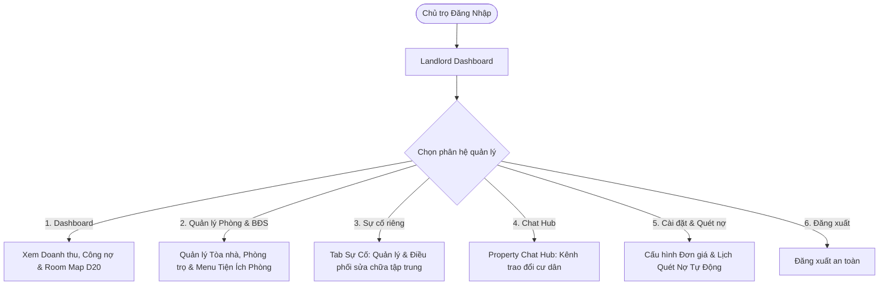
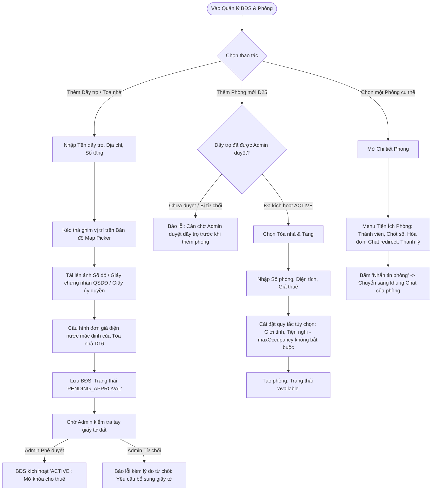
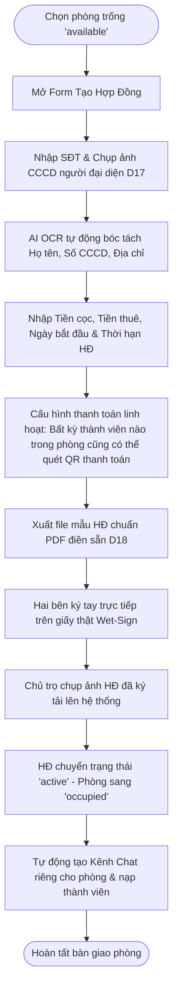
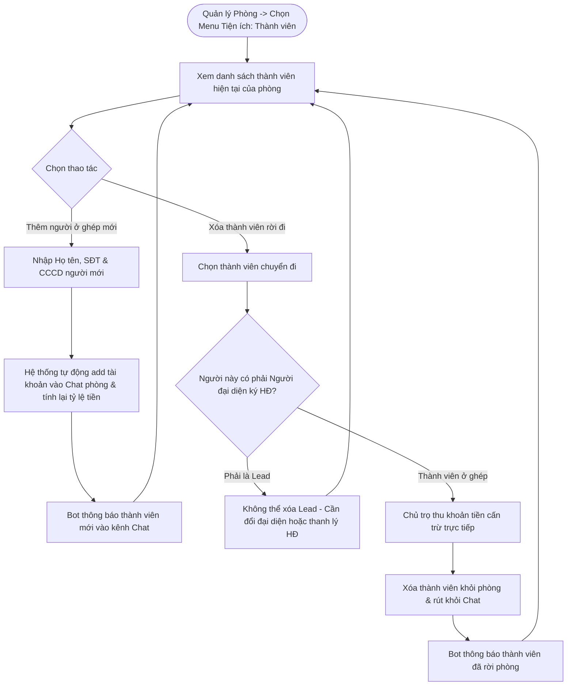
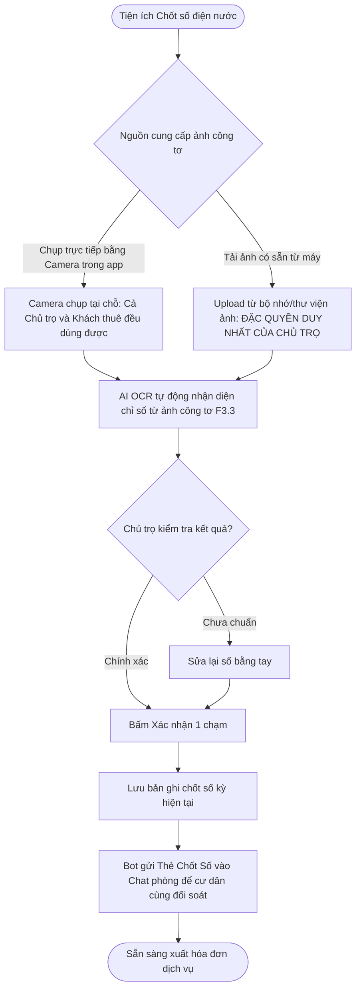
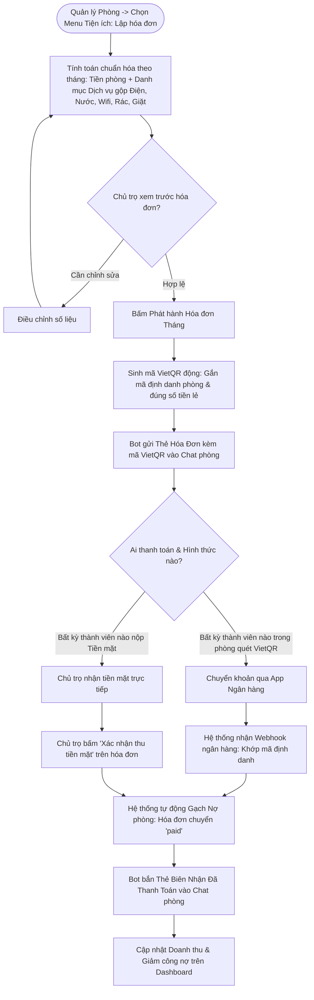
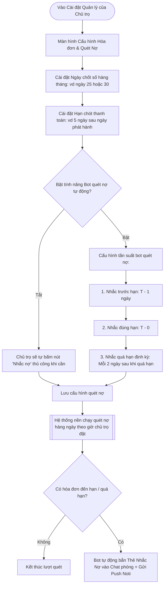
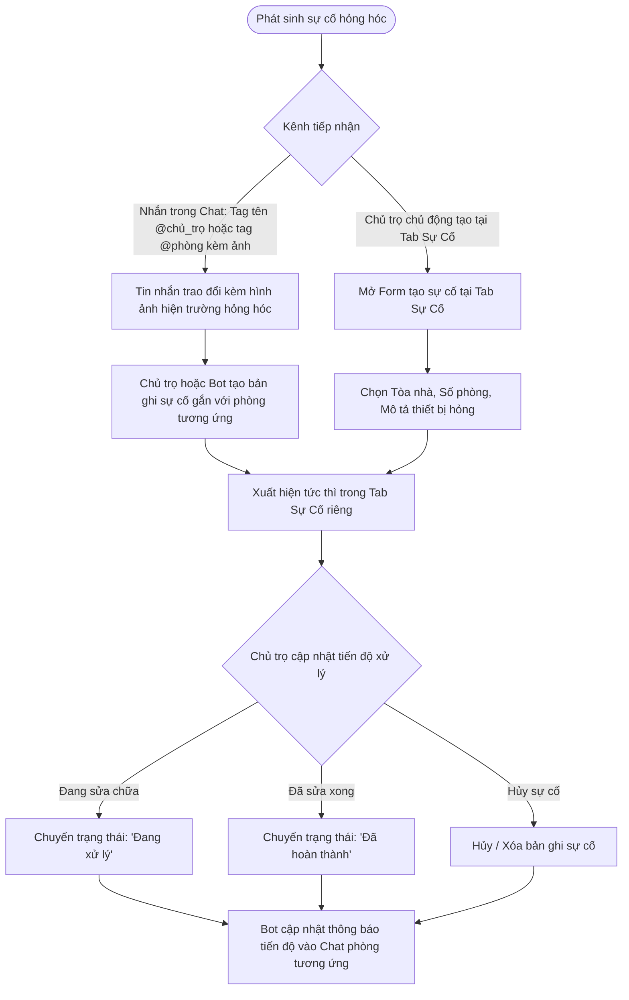
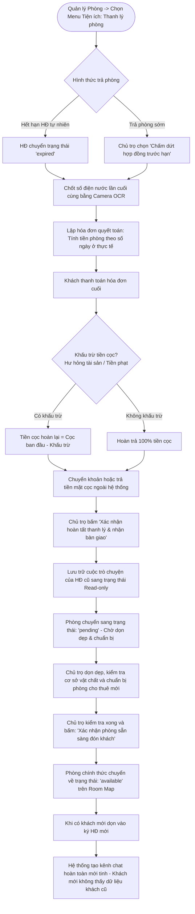

# Landlord User Flow — PBL6

Tài liệu User Flow hoàn chỉnh cho vai trò **Chủ trọ (Landlord)** trong hệ thống Rentify (PBL6). Luồng thiết kế phản ánh góc nhìn quản trị thực tế của Chủ trọ: phân hệ **Quản lý Phòng** là trung tâm chứa **Menu Tiện ích**, hỗ trợ **Chat redirect**, **Sự cố được tách thành Tab riêng**, quy trình thanh toán linh hoạt cho **mọi thành viên trong phòng**, và cơ chế **tag tên/tag phòng** trong hội thoại.

---

## 1. Nguyên Tắc Nghiệp Vụ Cốt Lõi

1. **Góc Nhìn Quản Trị Của Chủ Trọ (Landlord Viewpoint):**
   * **Tiện ích nằm ở Quản lý Phòng:** Toàn bộ các công cụ vận hành (Quản lý thành viên, Chốt số điện nước, Xuất hóa đơn, Thanh lý phòng) được đặt trực tiếp trong **Menu Tiện ích** của từng Phòng trọ.
   * **Chat độc lập & Chat redirect:** Kênh Chat là phân hệ liên lạc riêng. Trong Menu Tiện ích của mỗi phòng có nút **"Nhắn tin phòng" (Chat redirect)** để chuyển nhanh đến đúng luồng chat của phòng đó.
   * **Tab Sự Cố Riêng:** Phân hệ Sự cố được tách thành một **Tab độc lập** trên thanh điều hướng chính giúp Chủ trọ theo dõi, lọc trạng thái và điều phối sửa chữa tập trung cho toàn bộ các tòa nhà.
2. **Ai Trong Phòng Cũng Có Thể Thanh Toán (Không Chỉ Lead):**
   * Hóa đơn và mã VietQR động được tạo cho phòng. **Bất kỳ thành viên nào** trong phòng (người đại diện ký hợp đồng hoặc thành viên ở ghép) đều có thể quét QR thanh toán hoặc nộp tiền mặt. Khi có khoản nộp được xác nhận, hệ thống tự động gạch nợ cho phòng.
3. **Linh Hoạt Thành Viên & Bỏ Giới Hạn Max Occupancy Mặc Định:**
   * Hệ thống không ép buộc giới hạn số người cứng. Nếu Chủ trọ không chủ động cài đặt giới hạn số lượng người ở (`maxOccupancy` để trống/không giới hạn), phòng đó có thể thêm bao nhiêu người ở ghép tùy ý.
4. **Trao Đổi Tự Nhiên (Tag Tên, Tag Phòng — Bỏ Cú Pháp `@issue`):**
   * Bỏ cú pháp lệnh `@issue`. Trong khung chat, cư dân và chủ trọ trao đổi tự nhiên bằng cách **tag tên thành viên (`@tên`) hoặc tag phòng (`@phòng` / `#phòng`)** kèm ảnh hiện trường. Mọi báo cáo sự cố được đồng bộ và quản lý tập trung tại Tab Sự Cố riêng.
5. **Cấu Hình Quét Nợ Tiền Thuộc Về Chủ Trọ & Chu Kỳ Quy Về Từng Tháng:**
   * Chủ trọ tự quyết định ngày chốt điện nước, hạn đóng tiền (Due date) và bật/tắt lịch bot tự động quét nợ định kỳ để nhắc nhở phòng trọ.
   * **Chu kỳ thanh toán chuẩn hóa theo từng tháng:** Mọi hóa đơn và khoản thu trên hệ thống đều được quy về từng tháng. Việc chủ trọ và khách thuê thỏa thuận thu tiền theo chu kỳ nhiều tháng ngoài đời thực là thỏa thuận riêng của hai bên.
6. **Gộp Chi Phí Vào Danh Mục Dịch Vụ & Quy Định Chụp/Tải Ảnh Công Tơ:**
   * Gộp chung toàn bộ chi phí điện, nước, wifi, máy giặt chung, tiền rác... vào một danh mục duy nhất là **Dịch vụ**.
   * **Cả Chủ trọ và Khách thuê đều dùng được Camera trong hệ thống:** Hai bên đều có thể mở Camera trong app chụp trực tiếp tại chỗ ảnh đồng hồ điện nước (hỗ trợ khách thuê chụp gửi chủ trọ).
   * **Chỉ Chủ trọ mới được phép tải ảnh từ máy lên:** Quyền tải ảnh có sẵn từ bộ nhớ thiết bị/thư viện ảnh là đặc quyền duy nhất của Chủ trọ. Khách thuê không được tải ảnh từ máy lên nhằm ngăn chặn gian lận ảnh cũ.
7. **Hợp Đồng Ký Tay Wet-Sign (D18), Trạng Thái Pending Dọn Dẹp Sau Checkout & Lưu Trữ (Archive):**
   * Hỗ trợ in mẫu hợp đồng giấy ký sống (wet-sign), chụp ảnh tải lên kích hoạt phòng.
   * **Trạng thái Pending sau Checkout:** Sau khi khách trả phòng, phòng trọ sẽ chuyển sang trạng thái chờ dọn dẹp (`pending`) để chủ trọ làm vệ sinh và chuẩn bị phòng. Chỉ khi chủ trọ hoàn tất và xác nhận sẵn sàng thì phòng mới chuyển sang `available`.
   * Hội thoại cũ được lưu trữ (Archive) và khởi tạo kênh mới cho khách tiếp theo.
8. **Tải Lên Bằng Chứng Sở Hữu (Sổ Đỏ / Giấy Tờ Đất) Khi Tạo Dãy Trọ:**
   * Khi Chủ trọ tạo mới Tòa nhà / Dãy trọ, bắt buộc phải tải lên ảnh chụp giấy tờ pháp lý (Sổ đỏ, Giấy chứng nhận quyền sử dụng đất hoặc Hợp đồng ủy quyền hợp pháp).
   * Bất động sản mới tạo ở trạng thái 'Chờ Admin duyệt' (`PENDING_APPROVAL`) và cần được Admin kiểm tra tay phê duyệt (`ACTIVE`) trước khi mở quyền đăng phòng cho thuê công khai.
9. **Đồng Nhất Vai Trò Quản Lý:**
   * Thống nhất toàn bộ thành một vai trò duy nhất là **Chủ trọ (Landlord)** sở hữu/quản lý Dãy trọ và các Phòng trọ bên trong, không phân tách phức tạp giữa chủ phòng hay chủ tòa nhà.

---

## 2. Tổng Quan Điều Hướng (Landlord Navigation Hub)

---

## 3. Các Luồng Nghiệp Vụ Chi Tiết (Sub-Flows)

### Sub-Flow 1: Quản Lý Bất Động Sản & Phòng Trọ (Kèm Menu Tiện Ích)

Chủ trọ tạo mới Tòa nhà / Dãy trọ bằng bản đồ định vị kéo thả pin (Map Picker), tải lên bằng chứng quyền sở hữu (Sổ đỏ / Giấy tờ đất) gửi Admin kiểm tra tay, và quản lý danh sách phòng. Trong mỗi phòng tích hợp sẵn **Menu Tiện ích**.

---

### Sub-Flow 2: Tạo Hợp Đồng Thuê & Check-in (Mẫu HĐ & Wet-Sign D18)

Đón khách mới: nhập thông tin người ký, quét CCCD bằng AI OCR, in hợp đồng giấy ký sống, kích hoạt phòng và thiết lập để **bất kỳ ai trong phòng cũng có thể thanh toán**.

---

### Sub-Flow 3: Quản Lý Thành Viên Phòng & Biến Động Giữa Kỳ (Từ Tiện Ích Phòng)

Chủ trọ mở **Menu Tiện ích trong Quản lý Phòng** để thêm/bớt người ở ghép. Nếu không cấu hình giới hạn, phòng có thể thêm thành viên thoải mái.

* **Ghi chú về số lượng người ở:** Bỏ ràng buộc chặn cứng `maxOccupancy`. Nếu chủ trọ không thiết lập số người tối đa thì phòng có thể thêm bao nhiêu thành viên ở ghép tùy theo nhu cầu thực tế.

---

### Sub-Flow 4: Chốt Số Điện/Nước (Từ Tiện Ích Phòng & Kênh Tiếp Nhận Camera)

Hệ thống tích hợp Camera chụp trực tiếp cho cả Chủ trọ và Khách thuê. Riêng tính năng tải ảnh từ máy lên là đặc quyền duy nhất của Chủ trọ.

* **Quy định bảo mật chỉ số:** 
  - Cả Chủ trọ và Khách thuê đều có thể dùng Camera trong app để chụp trực tiếp đồng hồ điện nước (hỗ trợ trường hợp chủ trọ nhờ người thuê chụp hộ tại phòng).
  - Khách thuê **không có quyền tải ảnh từ bộ nhớ máy lên**, chỉ Chủ trọ mới có tính năng này để tránh rủi ro gian lận ảnh cũ.

---

### Sub-Flow 5: Lập Hóa Đơn & Thanh Toán Linh Hoạt (Quy Về Từng Tháng, Gộp Dịch Vụ)

Mọi hóa đơn trên hệ thống được **chuẩn hóa quy về từng tháng** (gồm Tiền phòng + Danh mục Dịch vụ gộp điện, nước, wifi, rác, máy giặt...). Bất kỳ ai trong phòng đều có thể quét mã VietQR động thanh toán hoặc nộp tiền mặt.

* **Nguyên tắc tài chính:**
  - Gộp chung toàn bộ điện, nước, internet/wifi, máy giặt, vệ sinh/rác vào một nhóm duy nhất là **Dịch vụ**.
  - Hóa đơn luôn chốt theo chu kỳ hàng tháng trên hệ thống. Việc chủ trọ thu tiền gộp nhiều tháng ngoài đời thực là thỏa thuận riêng ngoài hệ thống.

---

### Sub-Flow 6: Cấu Hình Chu Kỳ Hóa Đơn & Quét Nợ Tự Động (Landlord Debt Automation)

Chủ trọ toàn quyền cài đặt ngày chốt tiền, hạn thanh toán và cấu hình lịch trình tự động quét nợ cho các phòng trọ của mình.

---

### Sub-Flow 7: Quản Lý Sự Cố (Tab Sự Cố Riêng & Trao Đổi Tag Tên, Tag Phòng)

Sự cố được quản lý tại **Tab Sự Cố độc lập**. Trong khung Chat, cư dân và chủ trọ trao đổi thông tin tự nhiên bằng cách **tag tên (`@tên`) hoặc tag phòng (`@phòng` / `#phòng`)** thay vì dùng cú pháp lệnh `@issue`.

---

### Sub-Flow 8: Check-out, Thanh Lý Cọc & Lưu Trữ Hội Thoại (Từ Tiện Ích Phòng)

Quy trình trả phòng khởi động từ **Menu Tiện ích trong Quản lý Phòng**: chốt số cuối, quyết toán cọc, lưu trữ hội thoại cũ (Archive) và chuyển trạng thái phòng sẵn sàng đón khách mới.

