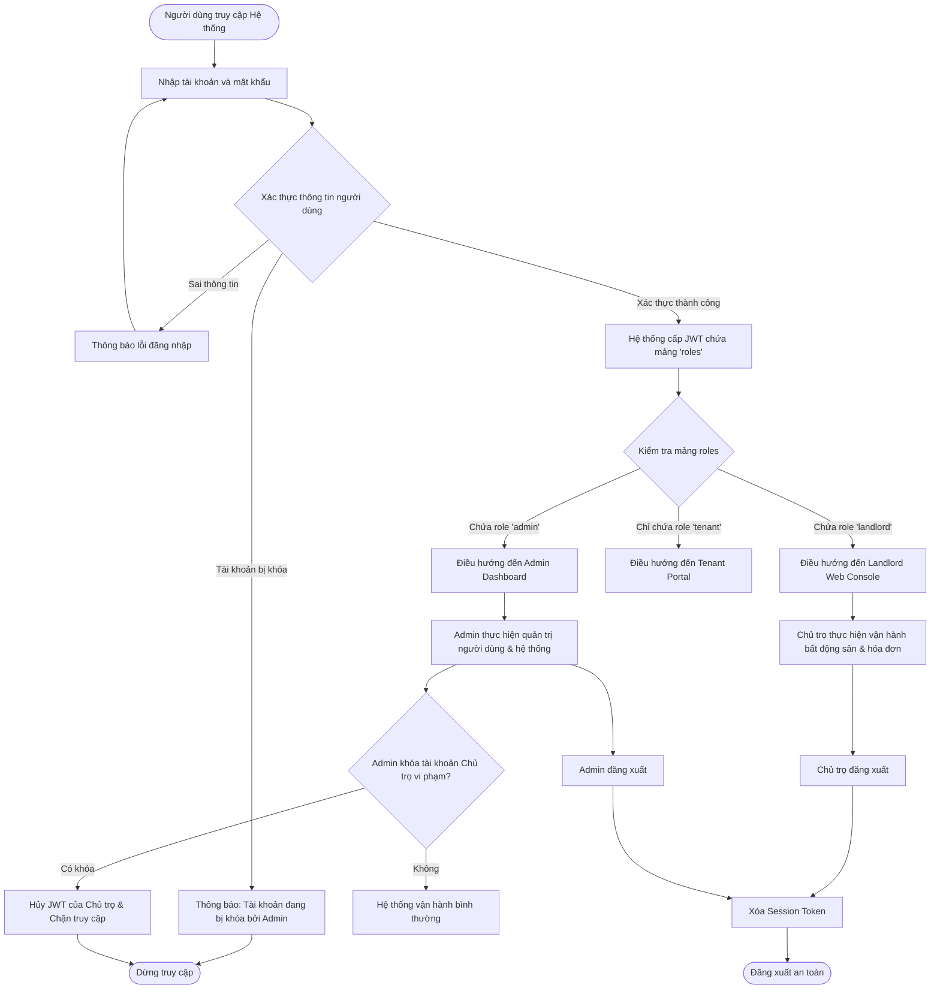

# Shared / Cross-Role User Flow

## Cross-Role Authentication & Navigation Flow
Diagram dưới đây thể hiện luồng điều hướng dùng chung khi một tài khoản đăng nhập vào hệ thống, minh họa cách cơ chế mảng vai trò `roles` (D13) phân định quyền truy cập giữa **Admin** và **Landlord**.

