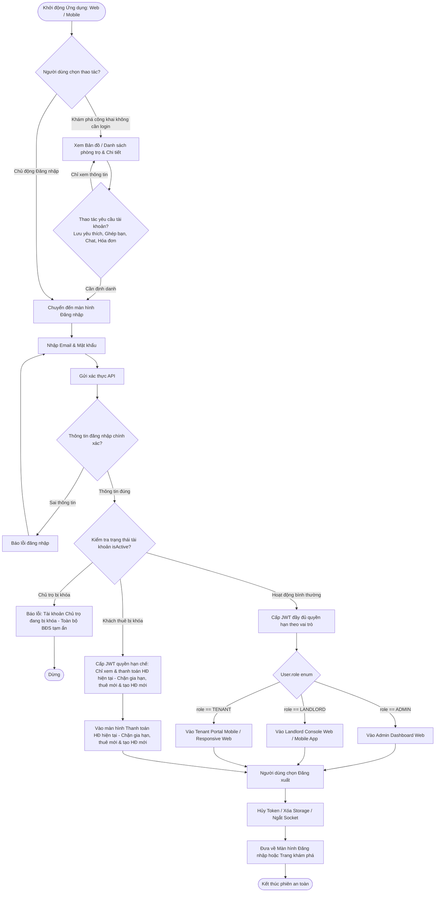

# Shared / Cross-Role User Flow

Tài liệu này mô tả luồng điều hướng dùng chung, cơ chế phân quyền vai trò bất biến (`User.role`), luồng trải nghiệm công khai không cần đăng nhập (Guest Access), và luồng đăng xuất chuẩn hóa cho mọi đối tượng trong hệ thống Rentify (PBL6).

---

## 1. Nguyên Tắc Thiết Kế (Shared Business Rules)

1. **Mô hình Role Đơn lẻ & Bất Biến (Immutable Role) — KHÔNG CHO PHÉP ĐỔI ROLE:**
   * `User.role` là **Enum đơn lẻ**: `ADMIN` | `LANDLORD` | `TENANT`. Một tài khoản tại một thời điểm chỉ mang đúng một vai trò duy nhất.
   * **Quy tắc bất biến:** Một tài khoản sau khi được đăng ký/khởi tạo **TUYỆT ĐỐI KHÔNG THỂ ĐỔI ROLE** dưới bất kỳ hình thức nào.
   * Không có tính năng đổi vai trò trong ứng dụng hay hệ thống quản trị. Người dùng muốn chuyển đổi mục đích sử dụng (ví dụ: Khách thuê muốn chuyển sang làm Chủ trọ) bắt buộc phải đăng ký tài khoản mới bằng thông tin định danh riêng.
2. **Đồng Nhất Vai Trò Quản Trị & Quản Lý:**
   * Hệ thống chỉ có **DUY NHẤT 1 tài khoản Admin** quản trị toàn bộ nền tảng (không phân cấp Super Admin / Sub-Admin).
   * Thống nhất thành **Chủ trọ (Landlord)** quản lý bất động sản và phòng trọ (không phân tách chủ phòng hay chủ tòa nhà).
3. **Cơ Chế Khi Tài Khoản Bị Khóa (Account Lock Rules):**
   * **Khách thuê (Tenant) bị khóa:** Vẫn được phép đăng nhập để xem và thanh toán hóa đơn hợp đồng hiện tại nhằm đảm bảo trách nhiệm tài chính, nhưng bị khóa tính năng gia hạn hợp đồng, không thể tìm thuê phòng mới và không thể tạo hợp đồng mới.
   * **Chủ trọ (Landlord) bị khóa:** Bị chặn truy cập cổng quản lý, toàn bộ thông tin dãy trọ/phòng bị ẩn khỏi tìm kiếm công khai, các hợp đồng hiện hành chuyển sang trạng thái tạm ngưng. Nếu qua thời gian Grace Period mà chủ trọ chưa được mở khóa, hợp đồng tự động bị hủy và hệ thống xử lý hoàn tiền cọc theo điều khoản. Khi mở khóa, chủ trọ tự bổ sung lại thông tin phát sinh.
4. **Quy Tắc Thuê Ngắn Hạn & Bỏ Khai Báo Tạm Trú:**
   * Thuê ngắn hạn tính theo ngày với mốc chuyển ngày 00:00 (trước 0h tính là 1 ngày, qua 0h tính sang ngày kế tiếp), không hỗ trợ tính theo giờ.
   * Ứng dụng không xử lý nghiệp vụ khai báo lưu trú/tạm trú của người dùng.
5. **Trải nghiệm Không cần đăng nhập (Public / Guest-First Access):**
   * Người dùng chưa đăng nhập (khách vãng lai, sinh viên tìm trọ) được tự do truy cập các tính năng khám phá: **Bản đồ phòng trọ**, **Bộ lọc tìm kiếm**, **Xem chi tiết phòng**, **Xem feed tìm bạn ở ghép**.
   * Chỉ khi thực hiện các thao tác định danh (Lưu tin yêu thích, Gửi yêu cầu ghép bạn, Chat, Xem hóa đơn), hệ thống mới yêu cầu đăng nhập.
6. **Đăng xuất Đồng bộ (Logout Flow):**
   * Mọi vai trò đều có nút Đăng xuất rõ ràng để hủy JWT token, xóa local storage, ngắt kết nối WebSocket và đưa ứng dụng về trạng thái Khách vãng lai.

---

## 2. Cross-Role Authentication, Guest Access & Navigation Flow

