# Tenant User Flow — PBL6
---
## 1. Tổng quan Tenant trong hệ thống

### 1.1 Tenant là ai trong vòng đời sản phẩm

Tenant là 1 trong 2 phía chính của nền tảng, nhưng khác với landlord, **tenant không bắt buộc phải dùng app** — landlord vẫn có thể vận hành toàn bộ vòng đời thuê phòng một mình nếu tenant không tham gia. Vì vậy toàn bộ user flow tenant phải được thiết kế với tinh thần:

> **App tenant là lớp trải nghiệm CỘNG THÊM, không phải điều kiện bắt buộc để vòng đời thuê phòng vận hành.**

Mỗi tenant thực tế rơi vào 1 hoặc nhiều trong các trạng thái sau tại bất kỳ thời điểm nào:

| Trạng thái | Mô tả | Có tài khoản? |
| -- | -- | -- |
| **Khách vãng lai (Guest)** | Chưa từng thuê, đang tìm phòng/tìm bạn ở ghép | Không |
| **Đang tìm bạn ở ghép** | Đã có hồ sơ, đang match, chưa chốt phòng nào | Có |
| **Tenant chính thức (Active)** | Đã là thành viên chính thức của ≥1 hợp đồng đang hiệu lực, dùng app | Có |
| **Tenant thụ động (Passive)** | Đã là thành viên hợp đồng nhưng không dùng app — mọi thứ landlord xử lý thay qua kênh ngoài | Có thể không |
| **Cựu tenant** | Hợp đồng đã kết thúc, còn lịch sử trong app | Có |

Một tài khoản có thể **đi qua nhiều trạng thái cùng lúc hoặc nối tiếp nhau** (ví dụ: vừa là cựu tenant ở phòng A, vừa đang match tìm bạn cho phòng B).

### 1.2 Nguyên tắc thiết kế bắt buộc (áp dụng cho MỌI flow bên dưới)

1. **Guest-first cho phần khám phá:** xem phòng, xem chi tiết, xem feed ghép bạn — không cần login. Chỉ hành động (lưu, gửi match, chat, thanh toán, đăng bài, quản lý) mới gate bằng popup đăng nhập tại chỗ — không có giao diện riêng cho guest/đã login.
2. **Tenant không tự tạo hoặc tự sửa hợp đồng/thành viên** — mọi thao tác pháp lý/hợp đồng đều do landlord thực hiện. App tenant ở các màn liên quan chỉ **hiển thị (read-only)**.
3. **Ghép bạn tách biệt hoàn toàn khỏi việc chọn phòng** — không áp ràng buộc landlord (giới tính, số người, ngân sách) trong giai đoạn tìm bạn; ràng buộc đó chỉ có tác dụng ở bước landlord tạo hợp đồng sau này.
4. **Property Chat chỉ tồn tại sau khi có hợp đồng active** — trước đó, mọi liên hệ với landlord là qua thông tin liên hệ tĩnh (SĐT).
5. **Mọi hóa đơn/thanh toán đều có song song 2 kênh:** online (QR/VNPay/MoMo) và tiền mặt (landlord xác nhận thủ công) — không có màn hình nào chỉ có 1 lựa chọn duy nhất.
6. **Thuê ngắn hạn tính theo ngày:** Hệ thống chỉ tính thời gian thuê theo ngày (mốc 00:00 nửa đêm làm chuẩn chuyển ngày, trước 0h tính là 1 ngày, qua sau 0h tính sang ngày kế tiếp), tuyệt đối không tính theo giờ.
7. **Bỏ qua khai báo lưu trú/tạm trú:** Ứng dụng không xử lý thủ tục khai báo tạm trú của người dùng.
8. **Quy tắc khi tài khoản Khách thuê bị khóa:** Khách thuê vẫn được phép đăng nhập để xem và thanh toán hợp đồng/hóa đơn hiện tại nhằm đảm bảo nghĩa vụ tài chính, nhưng bị khóa hoàn toàn chức năng gia hạn hợp đồng, không thể tìm thuê phòng mới hay tạo hợp đồng mới.
9. **Quy định Camera và tải ảnh công tơ điện nước:** Hệ thống tích hợp Camera chụp trực tiếp tại chỗ cho phép cả Chủ trọ và Khách thuê đều có thể dùng để chụp ảnh đồng hồ điện nước. Tuy nhiên, **Khách thuê KHÔNG ĐƯỢC PHÉP tải ảnh có sẵn từ bộ nhớ thiết bị (thư viện ảnh) lên**, quyền tải ảnh từ máy lên chỉ dành riêng cho Chủ trọ.
10. **Gộp chi phí vào danh mục Dịch vụ & Quy về từng tháng:** Hóa đơn trên hệ thống gồm Tiền phòng và Dịch vụ (gộp điện, nước, wifi, máy giặt, rác...). Toàn bộ hóa đơn được chuẩn hóa quy về theo từng tháng.
11. **Mọi thành viên trong phòng đều có quyền thanh toán:** Bất kỳ ai trong phòng đều có thể quét mã VietQR động hoặc nộp tiền mặt để hoàn tất thanh toán hóa đơn của phòng.
12. **Trạng thái phòng sau Checkout:** Sau khi thanh lý hợp đồng và bàn giao phòng, phòng trọ chuyển sang trạng thái chờ dọn dẹp, chỉ khi chủ trọ hoàn tất vệ sinh và bấm xác nhận thì phòng mới hiển thị lại sẵn sàng cho thuê.

### 1.3 Kiến trúc điều hướng tổng thể

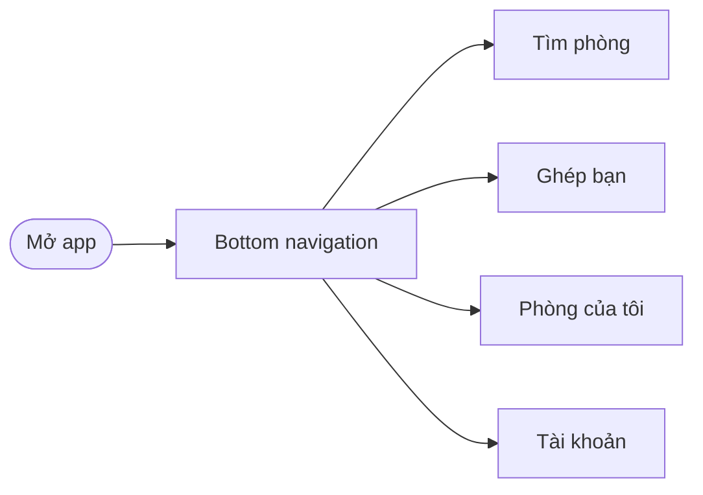

| Tab | Nội dung chính | Cần login? |
| -- | -- | -- |
| **Tìm phòng** | Bộ lọc, danh sách phòng, chi tiết phòng | Xem: không · Lưu/liên hệ: có |
| **Ghép bạn** | Feed hồ sơ roommate, quản lý match | Xem feed: không · Gửi match: có |
| **Phòng của tôi** | Hub hợp đồng / thành viên / hóa đơn / chat / sự cố — ẩn nếu chưa có hợp đồng nào | Có |
| **Tài khoản** | Hồ sơ, lịch sử uy tín + consent, cài đặt | Có |

---

## 2. BATCH 1 — Khám phá (Guest-first)

### Sub-Flow 1: Tìm phòng & xem chi tiết (Guest)

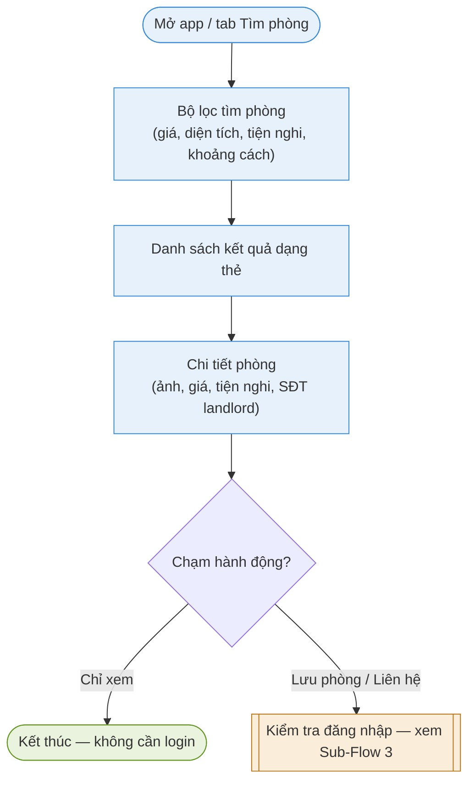

| Màn hình | Nội dung | Ghi chú thiết kế |
| -- | -- | -- |
| Bộ lọc + Danh sách | Filter giá/diện tích/tiện nghi/khoảng cách; kết quả dạng card: ảnh, giá, khu vực, số phòng trống | Có thể thêm sort (gần nhất/giá thấp-cao) |
| Chi tiết phòng | Gallery ảnh, mô tả, tiện nghi, giá, ràng buộc phòng (nếu có, hiện dạng badge — ví dụ "Chỉ nhận nữ"), SĐT/liên hệ landlord tĩnh | Ràng buộc hiện ở đây chỉ mang tính **thông tin**, chưa liên quan matching |

### Sub-Flow 2: Lưu phòng (hành động cần login)

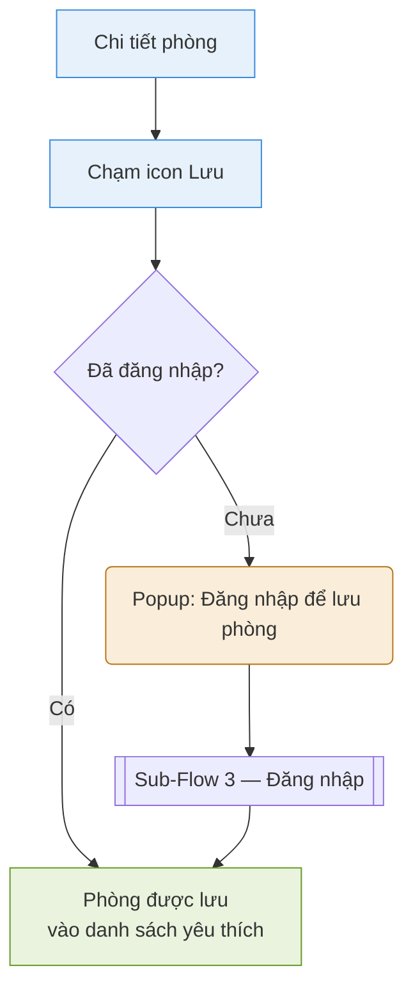

### Sub-Flow 3: Đăng ký & Scan danh sách thành viên hợp đồng (Tenant)

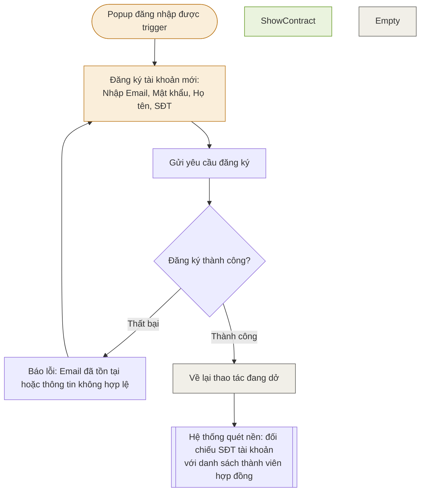

**Lưu ý thiết kế quan trọng:** bước scan **không chỉ chạy 1 lần lúc đăng ký** — chạy lại mỗi khi landlord thêm/sửa thông tin thành viên. Tab "Phòng của tôi" **luôn hiển thị** dù có hay không hợp đồng; khi chưa có thì hiện trống, khi có thì hiện danh sách hợp đồng đã liên kết.

---

## 3. BATCH 2 — Ghép bạn (Roommate matching)

> Nguyên tắc cốt lõi: đây là **feed độc lập, xảy ra TRƯỚC khi chọn phòng**. Không áp ràng buộc landlord ở giai đoạn này.

### Sub-Flow 4: Xem feed & tạo hồ sơ

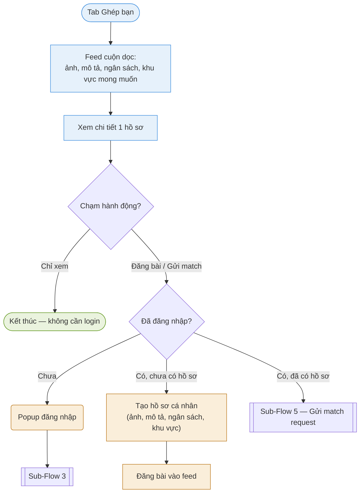

| Màn hình | Nội dung | Ghi chú |
| -- | -- | -- |
| Feed | Card cuộn dọc: ảnh, tên hiển thị, mô tả ngắn, ngân sách, khu vực mong muốn, badge tuổi/giới tính | Không có like/share/comment, không thuật toán ranking — chỉ list theo mới nhất/gần khu vực |
| Tạo hồ sơ | Ảnh đại diện, mô tả lối sống, ngân sách, khu vực mong muốn, thời điểm cần dọn vào | 1 tài khoản = 1 hồ sơ; có thể ẩn/hiện bài đăng bất kỳ lúc nào |

### Sub-Flow 5: Gửi/nhận match request (2 chiều)

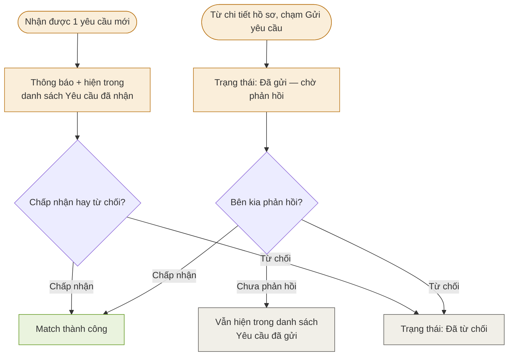

| Màn hình | Nội dung |
| -- | -- |
| Danh sách match | 2 tab: "Đã gửi" (chờ/từ chối) và "Đã nhận" (chờ mình phản hồi) |
| Match thành công | Card chúc mừng + nút "Xem thông tin liên hệ" |

### Sub-Flow 6: Sau match: lộ liên hệ → thành thành viên chính thức

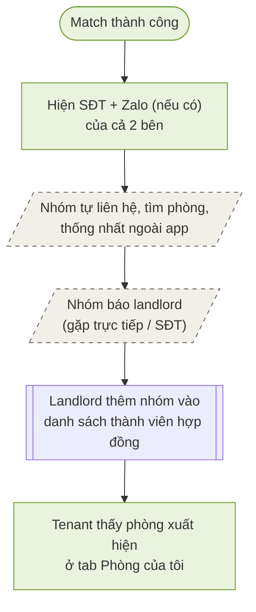

**Không có màn hình app nào cho bước "Outside" và "Report"** — đây là hành động ngoài hệ thống theo thiết kế. App chỉ cần đảm bảo bước cuối "Appear" hoạt động đúng (dựa vào Sub-Flow 3 — auto liên kết theo SĐT).

---

## 4. BATCH 3 — "Phòng của tôi" (Hub sau khi có hợp đồng active)

### Sub-Flow 7: Xem danh sách hợp đồng

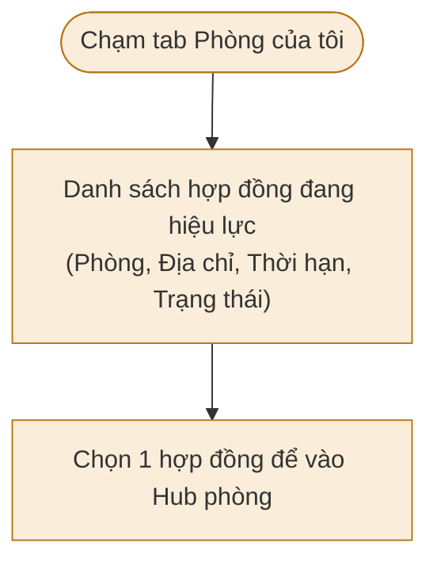

### Sub-Flow 8: Cấu trúc Hub (tổng quan các mục con)

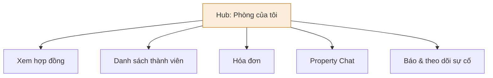

### Sub-Flow 9: Xem hợp đồng (read-only)

**Không có nút ký nào ở đây** — hệ thống không có cơ chế ký điện tử, toàn bộ màn hình này chỉ để tenant tra cứu thông tin.

### Sub-Flow 10: Danh sách thành viên

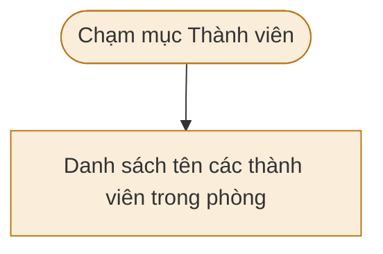

**Read-only tuyệt đối** — không có nút thêm/xóa thành viên ở đây.

### Sub-Flow 11: Hóa đơn (Thanh toán linh hoạt cho mọi thành viên)

Mọi hóa đơn trên hệ thống được **chuẩn hóa quy về từng tháng**. Mọi thành viên trong phòng đều có quyền xem chi tiết và trực tiếp thực hiện thanh toán.

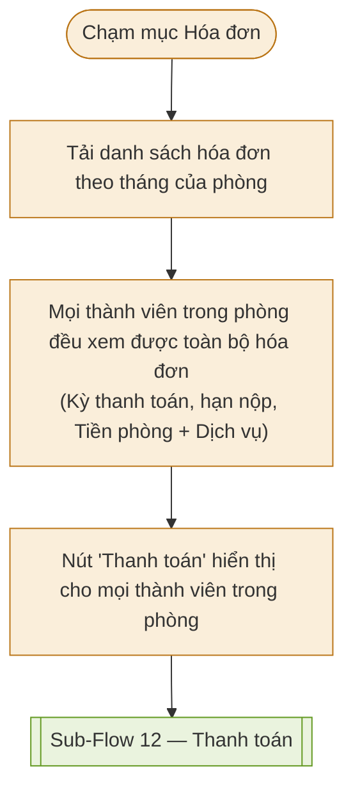

**Lưu ý quan trọng:** **Bất kỳ thành viên nào trong phòng** cũng có thể thanh toán hóa đơn bằng cách quét mã VietQR động hoặc nộp tiền mặt cho chủ trọ.

### Sub-Flow 12: Thanh toán hóa đơn (online / tiền mặt)

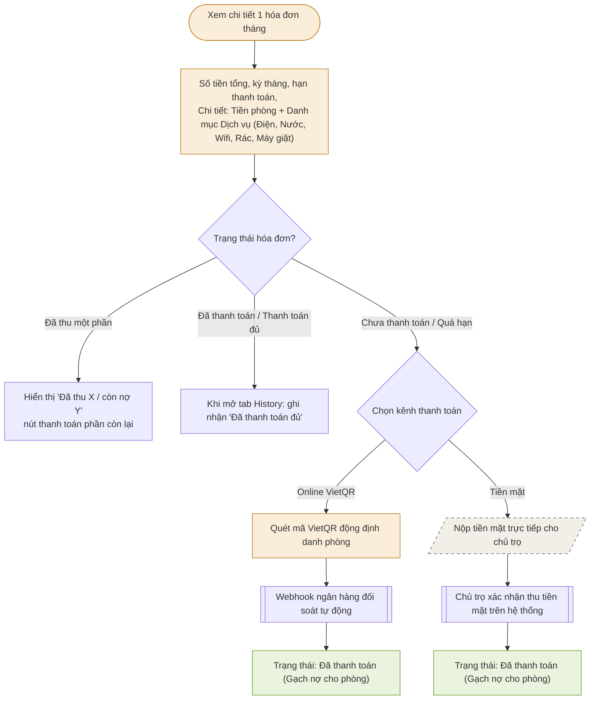

**Lưu ý minh bạch phí:** Màn chi tiết hóa đơn quy về theo từng tháng, hiển thị rõ ràng Tiền phòng và nhóm **Dịch vụ** (trong đó bóc tách chi tiết lượng điện, nước theo chỉ số công tơ do chủ trọ chốt hoặc khách thuê hỗ trợ chụp bằng Camera trong app, cùng các chi phí dịch vụ cố định như Wifi, rác, máy giặt...). Khách thuê chỉ được chụp trực tiếp qua Camera hệ thống, không được tải ảnh có sẵn từ máy lên.

**Nhắc quá hạn:** nếu hóa đơn quá hạn, bot tự động post card nhắc vào Property Chat riêng phòng (xem Sub-Flow 13) — không có màn hình riêng cho việc này, chỉ là 1 loại card trong chat.

### Sub-Flow 13: Property Chat riêng phòng

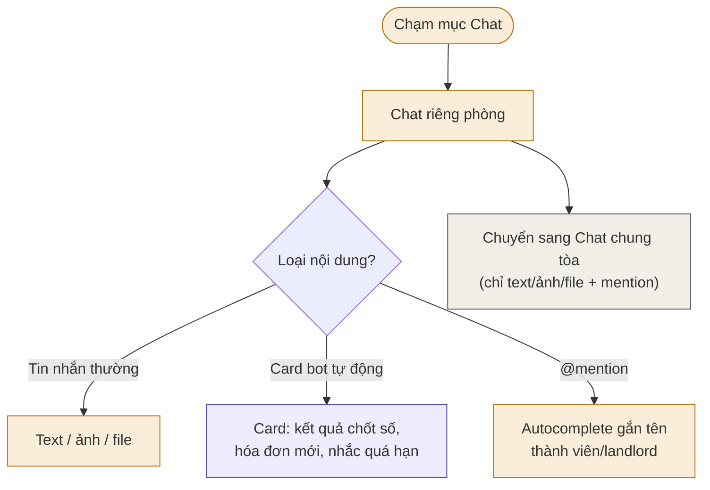

### Sub-Flow 14: Báo & theo dõi sự cố

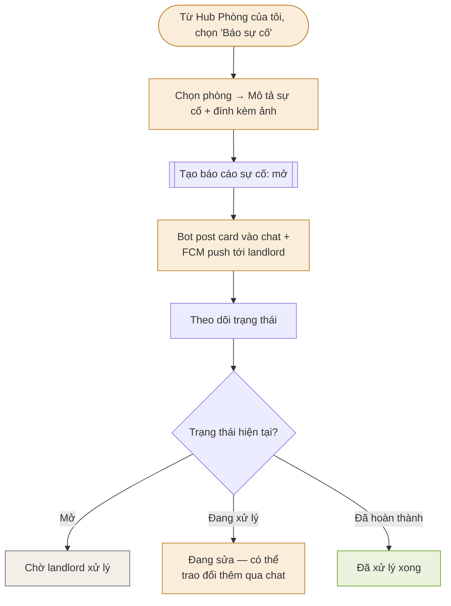

**Nhánh Passive:** nếu tenant không dùng app, sự cố vẫn tồn tại vì landlord có thể tự tạo báo cáo sự cố thay — flow này chỉ mô tả nhánh Active, không có bước nào bị chặn nếu tenant vắng mặt.

---

## 5. BATCH 4 — Phần còn lại

### Sub-Flow 15: Hồ sơ cá nhân & cài đặt

### Sub-Flow 16: Thông báo FCM → deep link

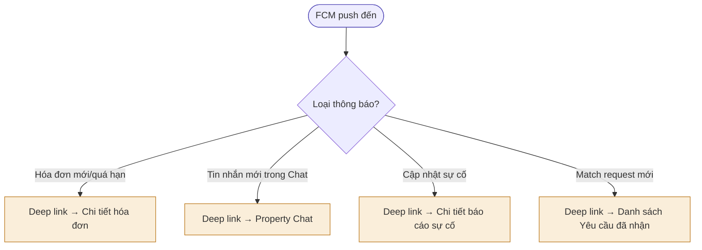

---

## 6. Bảng tổng hợp toàn bộ màn hình (screen inventory)

| # | Màn hình | Batch | Cần login? |
| -- | -- | -- | -- |
| 1 | Bản đồ + Filter | 1 | Không |
| 2 | Danh sách kết quả phòng | 1 | Không |
| 3 | Chi tiết phòng | 1 | Không |
| 4 | Popup đăng nhập (Email + Mật khẩu) | 1 | — |
| 5 | Danh sách phòng đã lưu | 1 | Có |
| 6 | Feed ghép bạn | 2 | Không |
| 7 | Chi tiết 1 hồ sơ roommate | 2 | Không |
| 8 | Tạo/sửa hồ sơ cá nhân | 2 | Có |
| 9 | Danh sách Yêu cầu đã gửi/đã nhận | 2 | Có |
| 10 | Màn Match thành công | 2 | Có |
| 11 | Danh sách hợp đồng | 3 | Có |
| 12 | Hub Phòng của tôi | 3 | Có |
| 13 | Xem hợp đồng | 3 | Có |
| 14 | Danh sách thành viên | 3 | Có |
| 15 | Danh sách hóa đơn | 3 | Có |
| 16 | Chi tiết hóa đơn + breakdown (điện/nước/phí định kỳ) + thanh toán | 3 | Có |
| 17 | Property Chat riêng phòng | 3 | Có |
| 18 | Property Chat chung tòa | 3 | Có |
| 19 | Form tạo sự cố | 3 | Có |
| 20 | Chi tiết/theo dõi sự cố | 3 | Có |
| 21 | Hồ sơ cá nhân / cài đặt | 4 | Có |
| 22 | Cài đặt thông báo | 4 | Có |

---
