# Tenant User Flow — PBL6

> **Mục đích:** tài liệu user flow đầy đủ, chi tiết cho phía **Tenant**, dùng để designer triển khai UI/UX.
>
> **Quy ước đọc sơ đồ:** xem Legend ở mục 0 trước khi đọc bất kỳ flow nào bên dưới.

---

## 0. Legend — quy tắc ký hiệu dùng xuyên suốt tài liệu

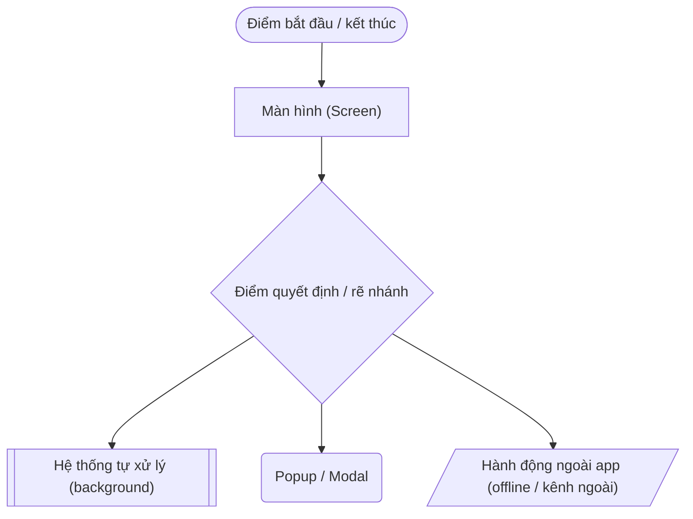

| Ký hiệu | Ý nghĩa |
| -- | -- |
| Stadium `(...)` | Điểm bắt đầu/kết thúc 1 flow |
| Rectangle `[...]` | 1 màn hình cụ thể trong app |
| Diamond `{...}` | Điểm rẽ nhánh — luôn có ≥2 nhánh output |
| Subroutine `[[...]]` | Hệ thống tự xử lý ngầm, không phải màn hình (vd: auto chia đều, matching filter) |
| Rounded `(...)` | Popup/Modal nổi lên trên màn hình hiện tại, không chuyển trang |
| Parallelogram `[/.../]` | Hành động xảy ra **ngoài app** (SĐT, giấy, tiền mặt, gặp trực tiếp) |
| Màu xanh dương | Guest xem được, không cần login |
| Màu cam | Cần đăng nhập mới thao tác được |
| Màu xanh lá | Trạng thái hoàn tất / thành công |
| Màu xám | Trung tính / hệ thống nền |

---

## 1. Tổng quan Tenant trong hệ thống

### 1.1 Tenant là ai trong vòng đời sản phẩm

Tenant là 1 trong 2 phía chính của nền tảng, nhưng khác với landlord, **tenant không bắt buộc phải dùng app** — landlord vẫn có thể vận hành toàn bộ vòng đời thuê phòng một mình nếu tenant không tham gia. Vì vậy toàn bộ user flow tenant phải được thiết kế với tinh thần:

> **App tenant là lớp trải nghiệm CỘNG THÊM, không phải điều kiện bắt buộc để vòng đời thuê phòng vận hành.**

Mỗi tenant thực tế rơi vào 1 hoặc nhiều trong các trạng thái sau tại bất kỳ thời điểm nào:

| Trạng thái | Mô tả | Có tài khoản? |
| -- | -- | -- |
| **Khách vãng lai (Guest)** | Chưa từng thuê, đang tìm phòng/tìm bạn ở ghép | Không |
| **Đang tìm bạn ở ghép** | Đã có hồ sơ, đang match, chưa chốt phòng nào | Có |
| **Tenant chính thức (Active)** | Đã là thành viên chính thức của ≥1 hợp đồng đang hiệu lực, dùng app | Có |
| **Tenant thụ động (Passive)** | Đã là thành viên hợp đồng nhưng không dùng app — mọi thứ landlord xử lý thay qua kênh ngoài | Có thể không |
| **Cựu tenant** | Hợp đồng đã kết thúc, còn lịch sử trong app | Có |

Một tài khoản có thể **đi qua nhiều trạng thái cùng lúc hoặc nối tiếp nhau** (ví dụ: vừa là cựu tenant ở phòng A, vừa đang match tìm bạn cho phòng B).

### 1.2 Nguyên tắc thiết kế bắt buộc (áp dụng cho MỌI flow bên dưới)

1. **Guest-first cho phần khám phá:** xem phòng, xem chi tiết, xem feed ghép bạn — không cần login. Chỉ hành động (lưu, gửi match, chat, thanh toán, đăng bài, quản lý) mới gate bằng popup đăng nhập tại chỗ — không có giao diện riêng cho guest/đã login.
2. **Tenant không tự tạo hoặc tự sửa hợp đồng/thành viên** — mọi thao tác pháp lý/hợp đồng đều do landlord thực hiện. App tenant ở các màn liên quan chỉ **hiển thị (read-only)**.
3. **Ghép bạn tách biệt hoàn toàn khỏi việc chọn phòng** — không áp ràng buộc landlord (max người/giới tính/ngân sách) trong giai đoạn tìm bạn; ràng buộc đó chỉ có tác dụng ở bước landlord tạo hợp đồng sau này.
4. **Property Chat chỉ tồn tại sau khi có hợp đồng active** — trước đó, mọi liên hệ với landlord là qua thông tin liên hệ tĩnh (SĐT).
5. **Mọi hóa đơn/thanh toán đều có song song 2 kênh:** online (QR/VNPay/MoMo) và tiền mặt (landlord xác nhận thủ công) — không có màn hình nào chỉ có 1 lựa chọn duy nhất.

### 1.3 Kiến trúc điều hướng tổng thể

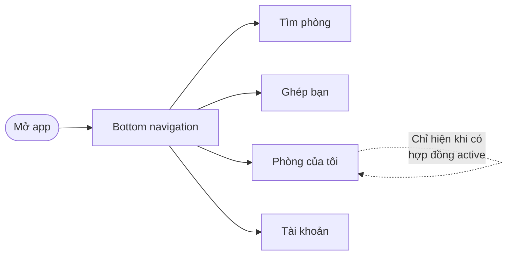

| Tab | Nội dung chính | Cần login? |
| -- | -- | -- |
| **Tìm phòng** | Bản đồ, filter, chi tiết phòng | Xem: không · Lưu/liên hệ: có |
| **Ghép bạn** | Feed hồ sơ roommate, quản lý match | Xem feed: không · Gửi match: có |
| **Phòng của tôi** | Hub hợp đồng / thành viên / hóa đơn / chat / sự cố — ẩn nếu chưa có hợp đồng nào | Có |
| **Tài khoản** | Hồ sơ, lịch sử uy tín + consent, cài đặt | Có |

---

## 2. BATCH 1 — Khám phá (Guest-first)

### Flow 1.1 — Tìm phòng & xem chi tiết (Guest)

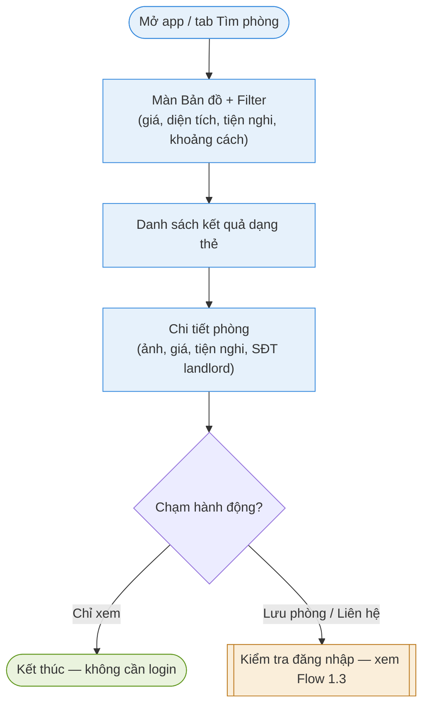

| Màn hình | Nội dung | Ghi chú thiết kế |
| -- | -- | -- |
| Bản đồ + Filter | Pin trên bản đồ theo vị trí thật; filter giá/diện tích/tiện nghi/khoảng cách | Toggle giữa view bản đồ ↔ view danh sách |
| Danh sách kết quả | Card: ảnh đại diện, giá, khu vực, số phòng trống | Có thể thêm sort (gần nhất/giá thấp-cao) |
| Chi tiết phòng | Gallery ảnh, mô tả, tiện nghi, giá, ràng buộc phòng (nếu có, hiện dạng badge — ví dụ "Chỉ nhận nữ", "Tối đa 3 người"), SĐT/liên hệ landlord tĩnh | Ràng buộc landlord hiện ở đây chỉ mang tính **thông tin**, chưa liên quan matching |

### Flow 1.2 — Lưu phòng (hành động cần login)

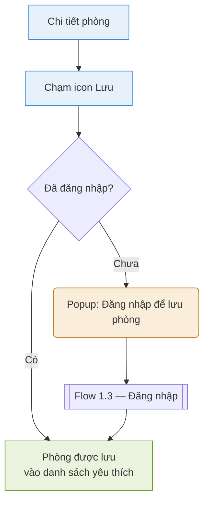

### Flow 1.3 — Đăng nhập & tự động liên kết hợp đồng

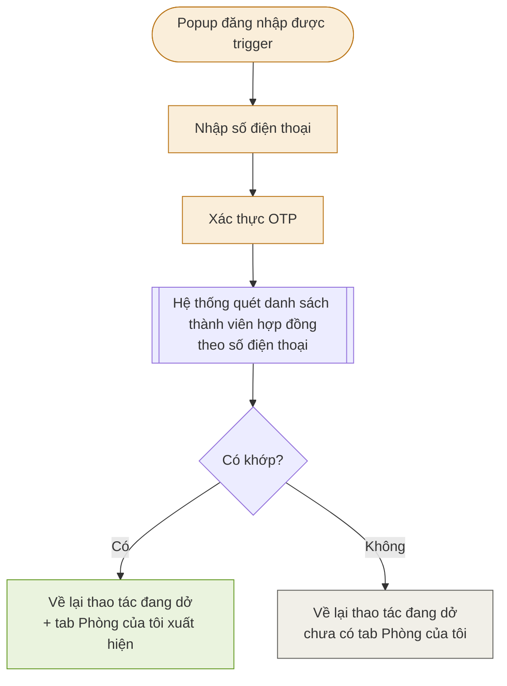

**Lưu ý thiết kế quan trọng:** bước "Quét danh sách thành viên" **không chỉ chạy 1 lần lúc đăng ký** — chạy lại mỗi khi landlord thêm/sửa số điện thoại của thành viên. App cần có cơ chế re-check nền (mở app / pull-to-refresh) để tự chuyển trạng thái "Không → Có" mà không bắt đăng nhập lại.

---

## 3. BATCH 2 — Ghép bạn (Roommate matching)

> Nguyên tắc cốt lõi: đây là **feed độc lập, xảy ra TRƯỚC khi chọn phòng**. Không áp ràng buộc landlord ở giai đoạn này.

### Flow 2.1 — Xem feed & tạo hồ sơ

| Màn hình | Nội dung | Ghi chú |
| -- | -- | -- |
| Feed | Card cuộn dọc: ảnh, tên hiển thị, mô tả ngắn, ngân sách, khu vực mong muốn, badge tuổi/giới tính | Không có like/share/comment, không thuật toán ranking — chỉ list theo mới nhất/gần khu vực |
| Tạo hồ sơ | Ảnh đại diện, mô tả lối sống, ngân sách, khu vực mong muốn, thời điểm cần dọn vào | 1 tài khoản = 1 hồ sơ; có thể ẩn/hiện bài đăng bất kỳ lúc nào |

### Flow 2.2 — Gửi/nhận match request (2 chiều)

| Màn hình | Nội dung |
| -- | -- |
| Danh sách match | 2 tab: "Đã gửi" (chờ/từ chối) và "Đã nhận" (chờ mình phản hồi) |
| Match thành công | Card chúc mừng + nút "Xem thông tin liên hệ" |

### Flow 2.3 — Sau match: lộ liên hệ → thành thành viên chính thức

**Không có màn hình app nào cho bước "Outside" và "Report"** — đây là hành động ngoài hệ thống theo thiết kế. App chỉ cần đảm bảo bước cuối "Appear" hoạt động đúng (dựa vào Flow 1.3 — auto liên kết theo SĐT).

---

## 4. BATCH 3 — "Phòng của tôi" (Hub sau khi có hợp đồng active)

### Flow 3.1 — Vào hub & chuyển đổi giữa nhiều hợp đồng (nếu có)

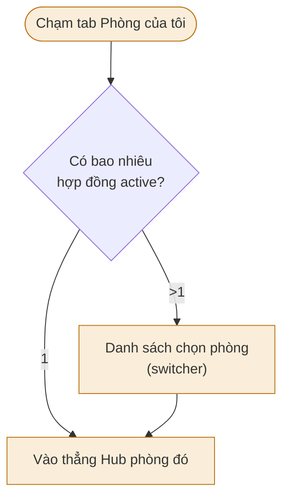

### Flow 3.2 — Cấu trúc Hub (tổng quan các mục con)

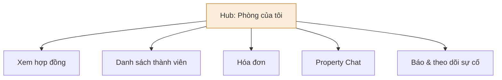

### Flow 3.3 — Xem hợp đồng (read-only)

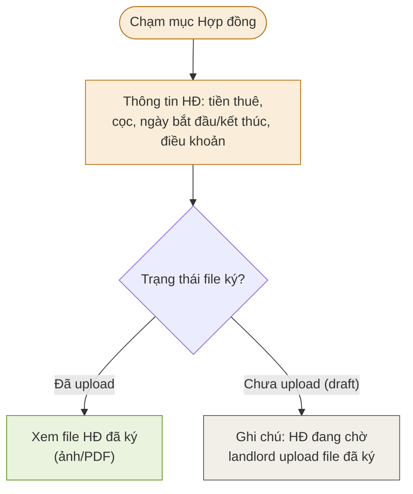

**Không có nút ký nào ở đây** — hệ thống không có cơ chế ký điện tử, toàn bộ màn hình này chỉ để tenant tra cứu thông tin.

### Flow 3.4 — Danh sách thành viên & phần góp

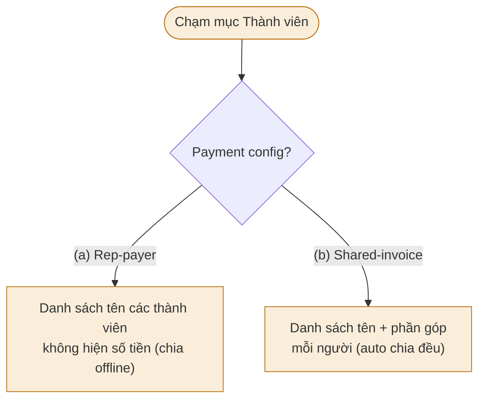

**Read-only tuyệt đối** — không có nút thêm/xóa thành viên ở đây, kể cả với lead tenant.

### Flow 3.5 — Hóa đơn (rẽ nhánh theo payment config)

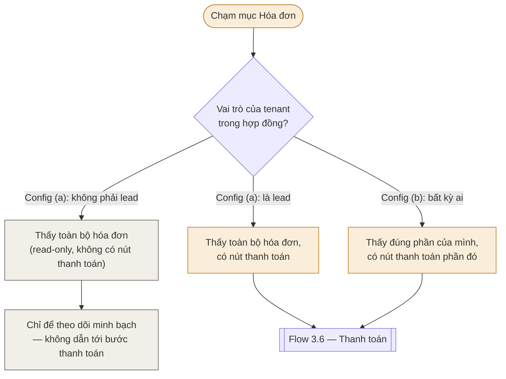

**Lưu ý quan trọng cho thiết kế:** ở config (a), **mọi thành viên đều nhìn thấy hóa đơn** (số tiền, kỳ, hạn thanh toán, chi tiết điện/nước) — chỉ khác ở chỗ **thành viên không phải lead không có nút thanh toán/chuyển khoản** trên màn hình đó (vì tiền vẫn chia offline giữa các thành viên, chỉ lead là người thực sự giao dịch với landlord). Đây là khác biệt về **quyền thao tác**, không phải khác biệt về **quyền xem**.

### Flow 3.6 — Thanh toán hóa đơn (online / tiền mặt)

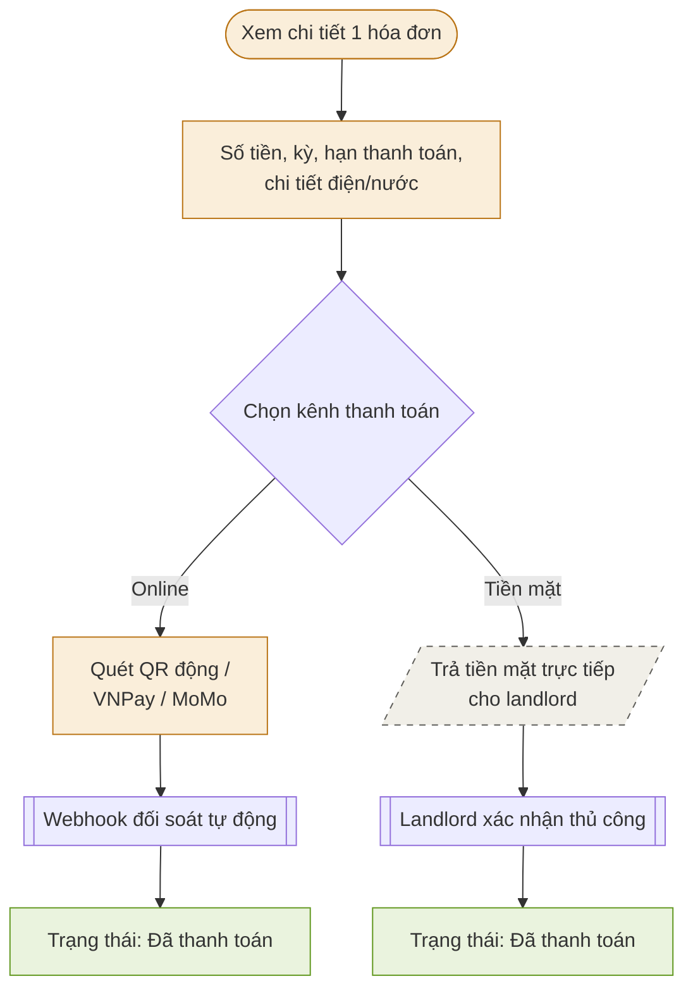

**Nhắc quá hạn:** nếu hóa đơn quá hạn, bot tự động post card nhắc vào Property Chat riêng phòng (xem Flow 3.7) — không có màn hình riêng cho việc này, chỉ là 1 loại card trong chat.

### Flow 3.7 — Property Chat riêng phòng

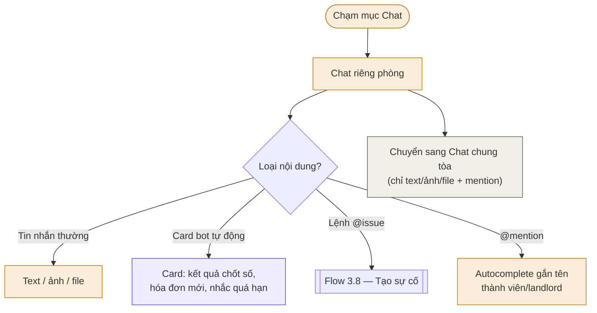

### Flow 3.8 — Báo & theo dõi sự cố

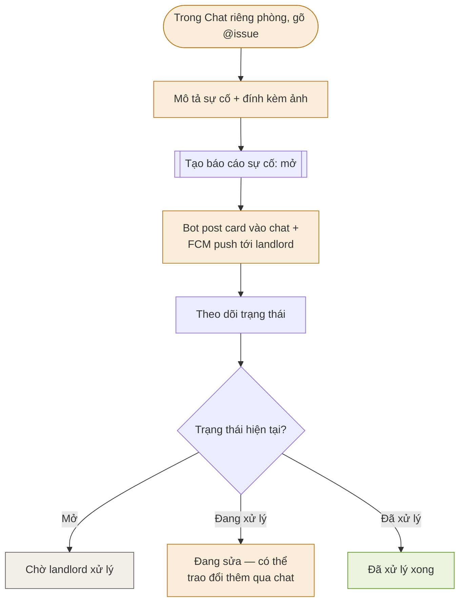

**Nhánh Passive:** nếu tenant không dùng app, sự cố vẫn tồn tại vì landlord có thể tự tạo báo cáo sự cố thay — flow này chỉ mô tả nhánh Active, không có bước nào bị chặn nếu tenant vắng mặt.

---

## 5. BATCH 4 — Phần còn lại

### Flow 4.1 — Lịch sử uy tín & consent toggle

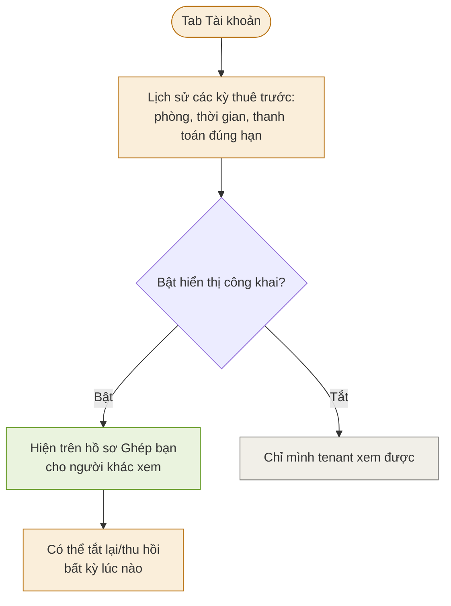

**Nguyên tắc bắt buộc:** mặc định **Tắt** (opt-in, không phải opt-out) — im lặng không phải là đồng ý.

### Flow 4.2 — Hồ sơ cá nhân & cài đặt

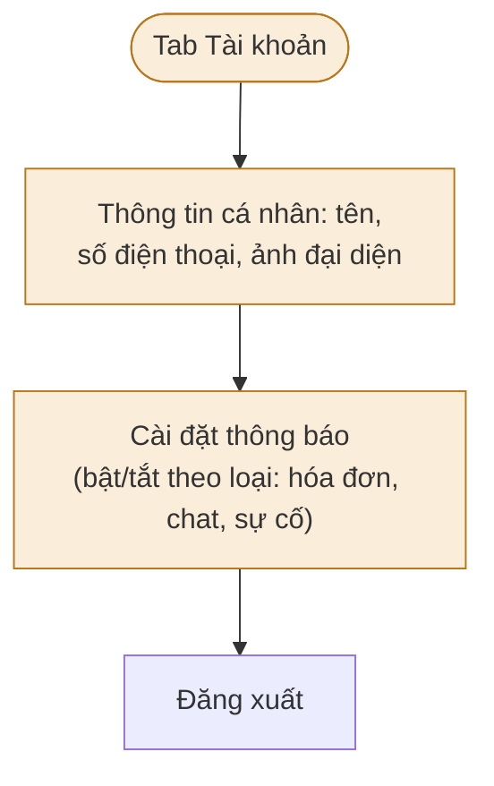

### Flow 4.3 — Thông báo FCM → deep link

---

## 6. Bảng tổng hợp toàn bộ màn hình (screen inventory)

| # | Màn hình | Batch | Cần login? |
| -- | -- | -- | -- |
| 1 | Bản đồ + Filter | 1 | Không |
| 2 | Danh sách kết quả phòng | 1 | Không |
| 3 | Chi tiết phòng | 1 | Không |
| 4 | Popup đăng nhập (SĐT + OTP) | 1 | — |
| 5 | Danh sách phòng đã lưu | 1 | Có |
| 6 | Feed ghép bạn | 2 | Không |
| 7 | Chi tiết 1 hồ sơ roommate | 2 | Không |
| 8 | Tạo/sửa hồ sơ cá nhân | 2 | Có |
| 9 | Danh sách Yêu cầu đã gửi/đã nhận | 2 | Có |
| 10 | Màn Match thành công | 2 | Có |
| 11 | Switcher chọn hợp đồng (nếu >1) | 3 | Có |
| 12 | Hub Phòng của tôi | 3 | Có |
| 13 | Xem hợp đồng | 3 | Có |
| 14 | Danh sách thành viên + phần góp | 3 | Có |
| 15 | Danh sách hóa đơn | 3 | Có |
| 16 | Chi tiết hóa đơn + thanh toán | 3 | Có |
| 17 | Property Chat riêng phòng | 3 | Có |
| 18 | Property Chat chung tòa | 3 | Có |
| 19 | Form tạo sự cố (@issue) | 3 | Có |
| 20 | Chi tiết/theo dõi sự cố | 3 | Có |
| 21 | Lịch sử uy tín + consent toggle | 4 | Có |
| 22 | Hồ sơ cá nhân / cài đặt | 4 | Có |
| 23 | Cài đặt thông báo | 4 | Có |

---
