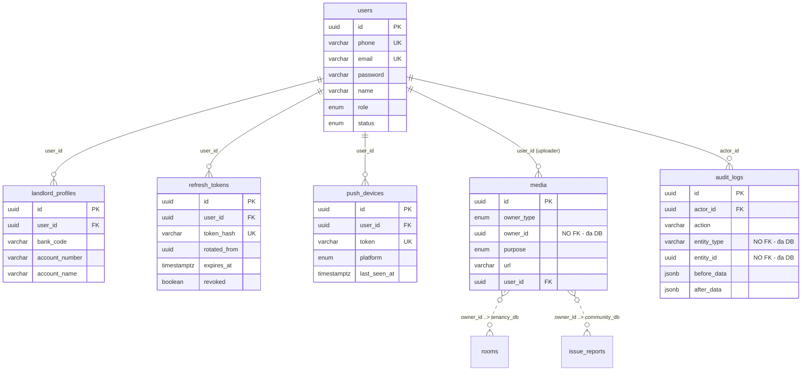
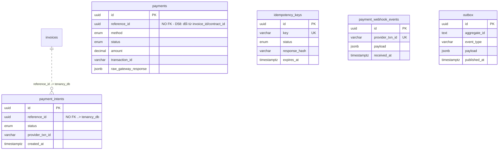
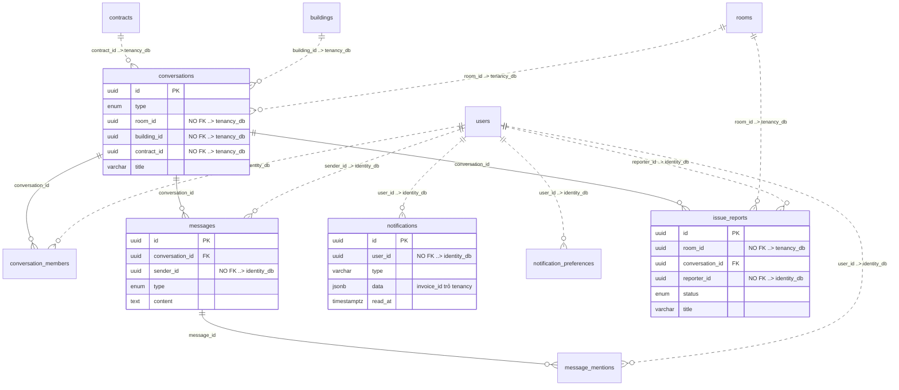

# PBL6 — Ranh giới dữ liệu theo service (hiện thực hoá D53)

| | |
|---|---|
| **Issue** | [P3-03](../issues/P3-03-database-per-service-design.md) |
| **Tác giả** | BE Lead |
| **Reviewer** | PM |
| **Ngày** | 2026-10-05 |
| **Trạng thái** | 🟡 Draft — hiện thực hoá **D53** (đang 🟡 Proposed). Chưa được phép dùng làm schema để code. |
| **Phase** | 3 — Scaffolding & First Vertical Slice (W7–W8) |
| **Quyết định nguồn** | D52 (4 service) · **D53 (database-per-service)** · D55 (gateway) · D57 (Saga) · D58 (1 repo / service) |
| **Báo cáo cha** | [`microservices-architecture.md`](microservices-architecture.md) §3, §6 |

---

## 0. Vì sao tài liệu này tồn tại

D53 đã chốt *database-per-service* nhưng mới chỉ nêu **kết luận**, chưa nêu **cơ chế**. Hệ quả nó
tự đặt ra trong `decisions.md:66` vẫn chưa ai làm:

> *"database-design.md needs a `service` column on all 25 entities and an explicit statement of which
> tables must not carry foreign keys. The existing ERD is a single-schema diagram and will have to be
> split into four."*

Tài liệu này làm đúng ba việc đó, cộng thêm hai việc mà D53 chưa nghĩ tới và sẽ gây sự cố khi
scaffold (§2 và §7.3):

1. Gán **service sở hữu** cho từng entity/bảng, kèm bảng tra cứu ngược.
2. Liệt kê **từng cột FK chéo phải bỏ** — không phải nguyên tắc chung, mà từng cột một.
3. Tách ERD thành **4 ERD theo service**.
4. Ma trận **Postgres role + grant** — kèm bước bắt buộc mà thiếu sẽ khiến cả cơ chế trở nên vô nghĩa.
5. Layout **migration** cho 5 repo, và **register nhân bản dữ liệu**.

### 0.1 Phạm vi — không làm gì ở đây

| Không làm | Vì sao |
|-----------|--------|
| Không vẽ DDL / không viết migration | Chưa có code; D52–D58 chưa duyệt |
| Không quyết lại ranh giới 4 service | Thuộc D52, đã chốt |
| Không sửa `api-spec.md` | Thuộc D58, cần PM review |
| Không đụng `api-docs/` | Thuộc D58, sẽ là task riêng |

---

## 1. Bốn database

Một Postgres instance, **4 database**, **4 role ứng dụng riêng** + 4 role owner cho migration.

| Database | Service | Port | Nhóm module | Bảng |
|----------|---------|------|-------------|------|
| `identity_db` | `identity-service` | 3001 | Auth · User · PushDevice · Media · AuditLog | `users`, `landlord_profiles`, `refresh_tokens`ᶰ, `push_devices`, `media`, `audit_logs` |
| `tenancy_db` | `tenancy-service` | 3002 | Building · Room · FavoriteRoom · RoommateProfile · MatchRequest · RatePolicy · BillingSetting · ContractTemplate · Contract · ContractMember · MeterReading · Invoice · Dashboard | `buildings`, `rooms`, `favorite_rooms`, `roommate_profiles`, `match_requests`, `rate_policies`, `billing_settings`, `contract_templates`ᶰ, `contracts`, `contract_members`, `meter_readings`, `invoices`, `billing_read_models`ᶰ, `outbox`ᶰ |
| `payment_db` | `payment-service` | 3003 | Payment | `payments`, `payment_intents`ᶰ, `idempotency_keys`ᶰ, `payment_webhook_events`ᶰ |
| `community_db` | `community-service` | 3004 | Conversation · Message · IssueReport · Notification · NotificationPreference | `conversations`, `conversation_members`, `messages`, `message_mentions`, `issue_reports`, `notifications`, `notification_preferences` |
| *(cột `identity_db` của gateway)* | `api-gateway` | 3000 | — | `service_registry` (§7.3) |

ᶰ = bảng **chưa tồn tại** trong `database-design.md`, do P3-02 sinh ra. Chi tiết ở §2.

> **Lưu ý về `service_registry`.** D55 provision nó trong `identity_db`, nhưng bảng này **không**
> thuộc service nào. Đã chốt: **chỉ gateway đọc/ghi**; cả 4 service `POST /internal/heartbeat` lên
> gateway và **không** có `CONNECT` tới `identity_db`. Lý do và DDL ở §5.3 — đọc §5.3 trước khi
> đụng tới bảng này, vì cách hiểu ngược lại sẽ mở lại đường tới database của service khác.

### 1.1 Nguyên tắc: một entity thuộc trọn vẹn một service

Không entity nào bị chia đôi, không cột nào "chung hai bên". Hệ quả trực tiếp: **không tồn tại bảng
nào có FK chéo** — đó là điều kiện cần để cơ chế ở §5 hoạt động.

Trong 24 entity đã có ở `database-design.md`:

| Service | Số entity | Entity |
|---------|-----------|--------|
| `identity` | 5 | User · LandlordProfile · PushDevice · AuditLog · Media |
| `tenancy` | 11 | FavoriteRoom · Building · Room · Contract · ContractMember · RatePolicy · BillingSetting · MeterReading · Invoice · RoommateProfile · MatchRequest |
| `payment` | 1 | Payment |
| `community` | 7 | IssueReport · Conversation · ConversationMember · Message · MessageMention · Notification · NotificationPreference |
| **Tổng** | **24** | khớp đúng số heading `### 2.1`–`### 2.25` đang có (thiếu `### 2.6`, xem §2.1) |

---

## 2. Gap: `database-design.md` chưa mô tả hết những gì D53 đòi

Đây là phần D53 không nhắm tới, và là phần sẽ gây lỗi khi BE bắt đầu migration mà không biết.

### 2.1 `### 2.6` không tồn tại trong `database-design.md`

Doc nhảy thẳng `### 2.5 Room` → `### 2.7 Contract`. Đếm heading thực tế: **24**, không phải 25 như
`microservices-architecture.md:859` và P2-04 ghi. Theo thứ tự đặc tả, entity thứ 6 nằm giữa Room và
Contract, và `microservices-architecture.md:75` liệt kê `contract_templates` ở đúng vị trí đó.

**Chưa kết luận `### 2.6` là gì.** Nếu BE đoán sai và tạo `contract_templates` ở service khác, hoặc
quên mất nó, thì `tenancy_db` lệch với `microservices-architecture.md` §3.1. → **PM + BE xác nhận
trước khi scaffold.**

### 2.2 Bảng mới do P3-02 sinh ra, chưa có trong SoT schema

| Bảng | DB | Bắt buộc vì | Ghi chú |
|------|-----|-------------|---------|
| `refresh_tokens` | `identity_db` | D55 §5.4.1 — *"lưu refresh token hash vào DB"*, phát hiện tái sử dụng → thu hồi toàn bộ phiên | Chỉ lưu **hash**, không lưu token. Cần `rotated_from` để phát hiện tái sử dụng |
| `contract_templates` | `tenancy_db` | §3.2 dòng 96 — module `ContractTemplate` | Có thể chính là `### 2.6` (§2.1) |
| `billing_read_models` | `tenancy_db` | §3.2 dòng 108 — module `Dashboard` | **Projection, không phải nguồn sự thật.** Xem §7.3 |
| `outbox` | `tenancy_db` + `payment_db` | D54 + D57 — không mất event khi broker chết | Một bảng cho mỗi DB có producer. Xem §7.3 |
| `payment_intents` | `payment_db` | D57 bước 2 — state của Saga ở phía payment | `Idempotency-Key = invoiceId` |
| `idempotency_keys` | `payment_db` | `api-conventions.md` §13 + D57 | `key` UNIQUE, `status`, `response_hash`, hạn sử dụng |
| `payment_webhook_events` | `payment_db` | `api-spec.md:211` — chống webhook trùng | Khoá theo `providerTxnId` |

> **Đây là 7 bảng chưa có SoT.** Tổng số bảng thực tế: 24 (đã có) + 7 (mới) = **31 bảng trên 4 database**.

---

## 3. Register FK chéo — 24 cột phải bỏ

Đây là phần cốt lõi của D53. Mỗi dòng là **một cột cụ thể** phải đổi từ `REFERENCES` thành `uuid` trần.

### 3.1 Cách đọc bảng

| Cột bị bỏ | Nằm ở DB | Trỏ tới | Thay bằng | Ghi chú |
|-----------|----------|---------|-----------|---------|
| **`tenancy_db` — 12 cột, đều trỏ `identity_db.users`** | | | | |
| `buildings.landlord_id` | `tenancy_db` | `users` | HTTP `identity` + cache | Đọc nhiều → cache Redis, TTL 5 phút |
| `buildings.reviewed_by` | `tenancy_db` | `users` | HTTP `identity` | Admin duyệt toà nhà; hiếm, không cache |
| `rooms.landlord_id` | `tenancy_db` | `users` | HTTP `identity` + cache | **Không được mất:** `D25` bắt buộc 1 chủ/phòng |
| `contracts.landlord_id` | `tenancy_db` | `users` | HTTP `identity` + cache | |
| `contracts.tenant_id` | `tenancy_db` | `users` | HTTP `identity` | Còn snapshot `tenant_name`/`tenant_phone` cho D29 |
| `contract_members.tenant_id` | `tenancy_db` | `users` | HTTP `identity` | Nguồn đếm `head_count` cho `per_head` — **phải** đúng, xem §7.4 |
| `rate_policies.landlord_id` | `tenancy_db` | `users` | HTTP `identity` + cache | |
| `billing_settings.landlord_id` | `tenancy_db` | `users` | HTTP `identity` + cache | |
| `favorite_rooms.tenant_id` | `tenancy_db` | `users` | HTTP `identity` | `tenant_id` = **user**, nên vẫn trong `tenancy` |
| `roommate_profiles.tenant_id` | `tenancy_db` | `users` | HTTP `identity` | |
| `match_requests.requester_id` | `tenancy_db` | `users` | HTTP `identity` | |
| `match_requests.target_id` | `tenancy_db` | `users` | HTTP `identity` | UNIQUE `(requester_id, target_id)` giữ nguyên — chỉ cần uuid |
| **`payment_db` — 2 cột, đều trỏ `tenancy_db`** | | | | |
| `payments.invoice_id` | `payment_db` | `invoices` | **Đổi tên `reference_id`** + event | D58: tên `invoiceId` là rò nghiệp vụ PBL6 |
| `payments.contract_id` | `payment_db` | `contracts` | **Gộp vào `reference_id`** | `invoice_id` null ⇒ trả cọc theo HĐ → 1 cột đủ |
| **`community_db` — 10 cột: 5 trỏ tenancy, 5 trỏ identity** | | | | |
| `conversations.room_id` | `community_db` | `rooms` | HTTP `tenancy` | Xem cảnh báo CHECK ở §3.2 |
| `conversations.building_id` | `community_db` | `buildings` | HTTP `tenancy` | |
| `conversations.contract_id` | `community_db` | `contracts` | HTTP `tenancy` | UNIQUE `contract_id` giữ nguyên |
| `issue_reports.room_id` | `community_db` | `rooms` | HTTP `tenancy` | |
| `conversation_members.user_id` | `community_db` | `users` | HTTP `identity` | |
| `messages.sender_id` | `community_db` | `users` | HTTP `identity` | `null` = bot |
| `message_mentions.user_id` | `community_db` | `users` | HTTP `identity` | |
| `notifications.user_id` | `community_db` | `users` | HTTP `identity` | |
| `notification_preferences.user_id` | `community_db` | `users` | HTTP `identity` | |
| `issue_reports.reporter_id` | `community_db` | `users` | HTTP `identity` | `null` = landlord tự tạo (D29) |

**Tổng: 24 cột FK chéo bị bỏ.**

### 3.2 Bốn chỗ bỏ FK làm mất toàn vẹn tham chiếu thật — phải bù bằng code

Bỏ FK ở 24 cột trên chấp nhận được vì đó là ranh giới service hợp lệ. Nhưng 4 chỗ sau mất cả ràng
buộc cấp **dưới**, mà không chỉ ràng buộc cấp trên — và (d) là chỗ nguy hiểm nhất vì liên quan tiền.

**a) `Conversation.type` CHECK — mất điều kiện "trỏ tới hợp đồng thật".**
CHECK hiện tại ràng buộc *cột nào được phép non-null theo `type`*. CHECK đó vẫn đúng sau khi bỏ FK
(nó không kiểm tra referential integrity). Nhưng `"conversation.contract_id trỏ tới một hợp
đồng có thật"` thì không còn ai bảo chứng. → Mỗi lần tạo conversation phải gọi `tenancy` xác minh
trước khi commit.

**b) `contract_members` là nguồn đếm `head_count` cho phí `per_head`.**
`utility-billing-calculations.md` cần số thành viên có hiệu lực trong kỳ để tính tiền nước. Nếu
`tenant_id` không còn được ràng buộc, một `contract_member` trỏ tới user đã bị xoá vẫn được tính.
→ `tenancy` phải đối soát `contract_members` với `identity` theo chu kỳ, **không** được tin bản
denormalize.

**c) `Media.owner_id` — tham chiếu đa hình, nay đa DB.**
Đã không có FK thật từ đầu (chủ đích, `database-design.md:417`), nhưng validation từng chạy được
vì mọi bảng nằm cùng schema. Nay `owner_type` trỏ tới `room`/`building`/`contract`/`contract_member`/
`meter_reading` (**tenancy**) và `issue_report`/`message` (**community**). → Phải tra cứu chủ sở hữu
qua HTTP; `identity` phải từ chối đọc media nếu không xác minh được quyền ở service cha. Đây chính là
lý do §4.3 của báo cáo cha chọn giữ Media trong `identity` — tách riêng sẽ nhân đôi số hop trên
đường nóng.

**d) `payments.reference_id` — tiền có thể ghi vào hoá đơn không tồn tại.**
D58 đổi `payments.invoice_id` → `reference_id` và bỏ FK. Hệ quả: `payment-service` không còn
database nào để hỏi "invoice này có thật không, còn `issued` không". Một payment `success` có thể
trỏ tới invoice đã `void`, hoặc tới uuid không tồn tại. `utility-billing-calculations.md` (EC16) và
`database-design.md:261` đã cảnh báo đúng chỗ này với cờ `needs_review`.

→ Ba quy tắc bắt buộc cho `payment-service`:

1. Mọi đường ghi `success` — kể cả webhook của cổng thanh toán — **phải** `GET` lại invoice qua
   `tenancy` và xác nhận còn hợp lệ **trước** khi ghi. Ghi rồi hỏi sau là mất tiền thật.
2. Invoice ở trạng thái `void` mà vẫn nhận webhook → **giữ nguyên bản ghi** và gắn cờ
   `needs_review`; tuyệt đối không tự chuyển thành `paid`.
3. `reference_id` phải kèm loại đích (`invoice` | `contract`) trong payload, vì `payment` không tự
   phân biệt được hai loại id này khi không có FK để ràng buộc.

### 3.3 Tham chiếu chéo không phải FK — không được "sửa" thành FK

| Trường jsonb / cột | Chứa gì | Không được làm gì |
|---------------------|---------|-------------------|
| `notifications.data` | `"invoice_id"` (uuid của tenancy) | Không tạo FK, không thêm cột riêng. Resolve hiển thị qua HTTP `tenancy` |
| `audit_logs.entity_type` / `entity_id` | mọi loại entity của **cả 4** DB | Không FK. Append-only, không cần toàn vẹn tham chiếu |
| `media.owner_id` | id thuộc tenancy hoặc community | Không FK |
| `payment_intents.reference_id` | id của invoice/contract | Không FK — đó là cả ý nghĩa của D58 |
| `contracts.tenant_name` / `tenant_phone` | snapshot D29 | **Không xoá.** Xem §7.5 |

---

## 4. Bốn ERD theo service

Quy ước: `--` là **FK thật trong cùng database**. `..>` là **logical reference — không FK**, phải
resolve qua HTTP/event.

### 4.1 `identity_db` — `identity-service`



**6 bảng (5 đã biết + `refresh_tokens`), 0 FK chéo.** Đây là service duy nhất có FK `users` hợp lệ — mọi `*_id → users` ở service
khác đều phải bỏ.

### 4.2 `tenancy_db` — `tenancy-service` (Saga orchestrator)

```mermaid
erDiagram
    users ||..o{ buildings : "landlord_id ..> identity_db"
    users ||..o{ buildings : "reviewed_by ..> identity_db"
    users ||..o{ rooms : "landlord_id ..> identity_db"
    users ||..o{ contracts : "landlord_id, tenant_id ..> identity_db"
    users ||..o{ contract_members : "tenant_id ..> identity_db"
    users ||..o{ rate_policies : "landlord_id ..> identity_db"
    users ||..o{ billing_settings : "landlord_id ..> identity_db"
    users ||..o{ favorite_rooms : "tenant_id ..> identity_db"
    users ||..o{ roommate_profiles : "tenant_id ..> identity_db"
    users ||..o{ match_requests : "requester_id, target_id ..> identity_db"
    invoices ||..o{ payments : "reference_id ..> payment_db"

    buildings ||--o{ rooms : "building_id"
    buildings ||--o{ rate_policies : "building_id"
    buildings ||--o{ billing_settings : "building_id"
    rooms ||--o{ favorite_rooms : "room_id"
    rooms ||--o{ contracts : "room_id"
rooms ||--o{ rate_policies : "room_id"
rooms ||--o{ billing_settings : "room_id"
    rooms ||--o{ meter_readings : "room_id"
    contract_templates ..> contracts : "template_id - CỘT CHƯA TỒN TẠI trong SoT, chờ §9 #1"
    contracts ||--o{ contract_members : "contract_id"
    contracts ||--o{ invoices : "contract_id"
    invoices ||--o{ invoices : "voided_invoice_id"
    invoices ..> billing_read_models : "projected - KHÔNG FK"
    contracts ..> outbox : "aggregate_id (text) - KHÔNG FK"
```

**14 bảng: 11 đã biết + 3 mới (`contract_templates`, `billing_read_models`, `outbox`).**
12 mũi tên `..>` ở trên, đại diện **13 cột** — 12 cột trỏ `identity_db` và 1 cột `invoices.reference_id`
trỏ `payment_db`. Cộng 2 cột của `payment_db` và 10 cột của `community_db` (vẽ ở §4.4) là đủ 24 cột
của register §3. Không cái nào trong số đó có FK thật — đó là toàn bộ cơ chế.
Chuỗi ACID giữ nguyên như §4.5 báo cáo cha yêu cầu:
`Room → Contract → MeterReading → Invoice` nằm chung một database.

### 4.3 `payment_db` — `payment-service`



**5 bảng, 0 FK thật ra ngoài DB.** Đây là service đáng để đọc code nhất: không có một FK nào trỏ
tới nơi khác, nên nó đứng được một cách thật sự — không cần database bên ngoài để tồn tại.

### 4.4 `community_db` — `community-service`



**7 bảng, 10 cột `..>`** — nhiều nhất, và đúng như báo cáo cha dự đoán: đây là service cần gọi ra
nhiều nhất khi kiểm tra quyền.

### 4.5 Quan hệ với ERD của Phase 2

P2-04 (`phase-2/issues/P2-04-erd.md`) còn 🟡 **Open**, output `discovery/erd-v1.md` **chưa tồn tại**,
và mô tả ERD **một schema**. Để không có hai ERD cạnh tranh:

- Nếu `erd-v1.md` được tạo **sau** tài liệu này → phải ghi rõ nó là **logical view toàn cục** và trỏ
  tới đây cho ranh giới vật lý.
- Nếu PM muốn một ERD duy nhất → sáp 4 ERD ở §4 vào `erd-v1.md`, đánh số lại §1 của `database-design.md`
  cho khớp.

---

## 5. Ma trận Postgres role & grant

Đây là phần làm cho "Service Autonomy" thành **cơ chế** thay vì quy ước miệng. Nếu làm sai, cả
tài liệu này trở thành văn bản trang trí.

### 5.1 Tám role

| Role | Loại | Dùng để | Quyền |
|------|------|----------|-------|
| `identity_owner` | `NOLOGIN` | Chủ sở hữu `identity_db` + schema | Full trong DB của nó |
| `tenancy_owner` | `NOLOGIN` | Chủ sở hữu `tenancy_db` | Full trong DB của nó |
| `payment_owner` | `NOLOGIN` | Chủ sở hữu `payment_db` | Full trong DB của nó |
| `community_owner` | `NOLOGIN` | Chủ sở hữu `community_db` | Full trong DB của nó |
| `role_identity` | `LOGIN` | App `identity-service` | **Chỉ** `identity_db` |
| `role_tenancy` | `LOGIN` | App `tenancy-service` | **Chỉ** `tenancy_db` |
| `role_payment` | `LOGIN` | App `payment-service` | **Chỉ** `payment_db` |
| `role_community` | `LOGIN` | App `community-service` | **Chỉ** `community_db` |

Tách *owner* khỏi *app login* là để migration không phải chạy bằng đúng quyền mà app dùng — nếu app
login cũng là owner, một `DROP TABLE` nhầm trong code ứng dụng sẽ không gặp rào chắn nào.

> **Cơ chế để `NOLOGIN` chạy được** (bắt buộc, nếu không §6 không thực hiện được): tạo một role
> `pbl6_migrator` `LOGIN`, rồi cho nó **thành viên** của cả 4 owner. Migration kết nối bằng
> `pbl6_migrator` và `SET ROLE tenancy_owner;` trước khi chạy DDL. Không cấp mật khẩu cho `*_owner`,
> không cho `*_owner` `SUPERUSER`.

### 5.2 Script bootstrap (chạy 1 lần, bởi `pbl6-infra`)

> **Cách chạy:** script dưới đây **không phải SQL thuần** — nó dùng `\c` (chuyển database) của
> `psql`. Vì vậy:
>
> 1. Chạy bằng `psql`, và **phải truyền `-v` cho từng biến mật khẩu** — script dùng dạng `:'var'`,
>    thiếu `-v` thì `psql` dừng ngay với `variable not set`. Lấy từ file môi trường, không ghi cứng:
>
>    ```bash
>    set -a; . ./.env; set +a
>    psql -h "$PGHOST" -U "$PG_SUPERUSER" -d postgres \
>      -v identity_db_password="$IDENTITY_DB_PASSWORD" \
>      -v tenancy_db_password="$TENANCY_DB_PASSWORD" \
>      -v payment_db_password="$PAYMENT_DB_PASSWORD" \
>      -v community_db_password="$COMMUNITY_DB_PASSWORD" \
>      -v migrator_password="$MIGRATOR_PASSWORD" \
>      -v gateway_db_password="$GATEWAY_DB_PASSWORD" \
>      -f db/00-bootstrap.sql
>    ```
>
>    Tương tự cho `db/20-registry.sql` (`-d identity_db`, cần `gateway_db_password`).
> 2. **Không** cho service tự chạy file này. Service chỉ chạy migration của database mình sở hữu
>    (§6), và migration chạy bằng `pbl6_migrator` + `SET ROLE`, không dùng file này.
> 3. Nếu hạ tầng đổi sang công cụ không có `psql` (Alembic, Flyway…), phải **tách** file theo đúng
>    ranh giới comment `-- FILE:` bên dưới, rồi chạy từng file với `-d <database>` tương ứng.

```sql
-- FILE: db/00-bootstrap.sql  →  psql -d postgres
-- 1. Role owner (NOLOGIN) — phải tạo TRƯỚC database vì làm chủ sở hữu.
CREATE ROLE identity_owner  NOLOGIN;
CREATE ROLE tenancy_owner   NOLOGIN;
CREATE ROLE payment_owner   NOLOGIN;
CREATE ROLE community_owner NOLOGIN;

-- 2. Database — chỉ tạo được sau bước 1.
CREATE DATABASE identity_db   OWNER identity_owner;
CREATE DATABASE tenancy_db    OWNER tenancy_owner;
CREATE DATABASE payment_db    OWNER payment_owner;
CREATE DATABASE community_db  OWNER community_owner;

-- 3. Role ứng dụng (LOGIN) — mật khẩu lấy từ biến môi trường, không hardcode.
CREATE ROLE role_identity  LOGIN PASSWORD :'identity_db_password';
CREATE ROLE role_tenancy   LOGIN PASSWORD :'tenancy_db_password';
CREATE ROLE role_payment   LOGIN PASSWORD :'payment_db_password';
CREATE ROLE role_community LOGIN PASSWORD :'community_db_password';

-- 4. Role migration (LOGIN) — thành viên của cả 4 owner, dùng SET ROLE khi chạy DDL.
CREATE ROLE pbl6_migrator LOGIN PASSWORD :'migrator_password';
GRANT identity_owner, tenancy_owner, payment_owner, community_owner TO pbl6_migrator;

-- 5. Rút quyền CONNECT mặc định khỏi PUBLIC.
--    Bỏ dòng này thì cơ chế "4 role riêng" chỉ là hình vẽ: mọi role đều CONNECT
--    được vào cả 4 database, nên một JOIN xuyên service vẫn chạy trót.
REVOKE ALL ON DATABASE identity_db, tenancy_db, payment_db, community_db FROM PUBLIC;
GRANT CONNECT ON DATABASE identity_db   TO role_identity, pbl6_migrator;
GRANT CONNECT ON DATABASE tenancy_db    TO role_tenancy,  pbl6_migrator;
GRANT CONNECT ON DATABASE payment_db    TO role_payment,  pbl6_migrator;
GRANT CONNECT ON DATABASE community_db  TO role_community, pbl6_migrator;

-- 6. KHÔNG cấp CREATE trên database cho role ứng dụng.
--    Đây là hàng rào chống lách: CREATE EXTENSION cần CREATE trên database, nên
--    role_tenancy không thể tự cài postgres_fdw/dblink để mở đường tới DB khác.
--    Kiểm tra hàng rào này định kỳ — xem câu (5) ở §5.4.
```

```sql
-- FILE: db/10-grants-identity.sql  →  psql -d identity_db
REVOKE ALL ON SCHEMA public FROM PUBLIC;
GRANT  USAGE, CREATE ON SCHEMA public TO identity_owner;
GRANT  USAGE            ON SCHEMA public TO role_identity;
GRANT  SELECT, INSERT, UPDATE, DELETE ON ALL TABLES    IN SCHEMA public TO role_identity;
GRANT  USAGE, SELECT                  ON ALL SEQUENCES IN SCHEMA public TO role_identity;
ALTER  DEFAULT PRIVILEGES FOR ROLE identity_owner
       GRANT SELECT, INSERT, UPDATE, DELETE ON TABLES    TO role_identity;
ALTER  DEFAULT PRIVILEGES FOR ROLE identity_owner
       GRANT USAGE, SELECT                ON SEQUENCES TO role_identity;
```

```sql
-- FILE: db/11-grants-tenancy.sql  →  psql -d tenancy_db
REVOKE ALL ON SCHEMA public FROM PUBLIC;
GRANT  USAGE, CREATE ON SCHEMA public TO tenancy_owner;
GRANT  USAGE            ON SCHEMA public TO role_tenancy;
GRANT  SELECT, INSERT, UPDATE, DELETE ON ALL TABLES    IN SCHEMA public TO role_tenancy;
GRANT  USAGE, SELECT                  ON ALL SEQUENCES IN SCHEMA public TO role_tenancy;
ALTER  DEFAULT PRIVILEGES FOR ROLE tenancy_owner
       GRANT SELECT, INSERT, UPDATE, DELETE ON TABLES    TO role_tenancy;
ALTER  DEFAULT PRIVILEGES FOR ROLE tenancy_owner
       GRANT USAGE, SELECT                ON SEQUENCES TO role_tenancy;
```

```sql
-- FILE: db/12-grants-payment.sql  →  psql -d payment_db
REVOKE ALL ON SCHEMA public FROM PUBLIC;
GRANT  USAGE, CREATE ON SCHEMA public TO payment_owner;
GRANT  USAGE            ON SCHEMA public TO role_payment;
GRANT  SELECT, INSERT, UPDATE, DELETE ON ALL TABLES    IN SCHEMA public TO role_payment;
GRANT  USAGE, SELECT                  ON ALL SEQUENCES IN SCHEMA public TO role_payment;
ALTER  DEFAULT PRIVILEGES FOR ROLE payment_owner
       GRANT SELECT, INSERT, UPDATE, DELETE ON TABLES    TO role_payment;
ALTER  DEFAULT PRIVILEGES FOR ROLE payment_owner
       GRANT USAGE, SELECT                ON SEQUENCES TO role_payment;
```

```sql
-- FILE: db/13-grants-community.sql  →  psql -d community_db
REVOKE ALL ON SCHEMA public FROM PUBLIC;
GRANT  USAGE, CREATE ON SCHEMA public TO community_owner;
GRANT  USAGE            ON SCHEMA public TO role_community;
GRANT  SELECT, INSERT, UPDATE, DELETE ON ALL TABLES    IN SCHEMA public TO role_community;
GRANT  USAGE, SELECT                  ON ALL SEQUENCES IN SCHEMA public TO role_community;
ALTER  DEFAULT PRIVILEGES FOR ROLE community_owner
       GRANT SELECT, INSERT, UPDATE, DELETE ON TABLES    TO role_community;
ALTER  DEFAULT PRIVILEGES FOR ROLE community_owner
       GRANT USAGE, SELECT                ON SEQUENCES TO role_community;
```

> **`ALTER DEFAULT PRIVILEGES` bắt buộc, không phải tuỳ chọn.** Bảng tạo sau này (kể cả `outbox`,
> `refresh_tokens`) sẽ không có grant nếu thiếu dòng này, và app sẽ fail ở giữa Phase 4 với lỗi
> `permission denied` trên đúng bảng vừa thêm. Dòng `SEQUENCES` đi kèm vì nếu sau này có bảng dùng
> `serial`/`identity`, `INSERT` sẽ fail `permission denied for sequence`.

### 5.3 Ngoại lệ: `service_registry`

`service_registry` không thuộc service nào. D55 còn bỏ ngỏ câu hỏi "database thứ 5 hay nằm trong
`identity_db`". Ở đây chọn **phương án (b): nằm trong `identity_db`, nhưng chỉ gateway được chạm.**

Lý do chọn thế này: nếu cho 4 service `INSERT` heartbeat trực tiếp thì phải `GRANT CONNECT` cho cả
4 role vào `identity_db` — khi đó tuyên bố "role ứng dụng không chạm được DB của service khác" ở §5.2
sụp đổ. Cho quyền trên bảng mà không có `CONNECT` cũng vô nghĩa: heartbeat sẽ fail
`permission denied for database identity_db`.

→ Vì vậy service **không** ghi vào database. Service `POST /internal/heartbeat` (nội bộ, chỉ mạng
Docker) lên gateway; gateway là bên duy nhất đọc/ghi bảng.

```sql
-- FILE: db/20-registry.sql  →  psql -d identity_db
CREATE TABLE service_registry (
    service_name    text PRIMARY KEY,   -- 'identity' | 'tenancy' | 'payment' | 'community'
    instance_id     uuid NOT NULL,
    instance_url    text NOT NULL,
    status          text NOT NULL DEFAULT 'UP',   -- UP | DOWN | DRAINING
    last_beat_at    timestamptz NOT NULL,
    version         text NOT NULL,                 -- git sha, để gateway không cache sai bản
    updated_at      timestamptz NOT NULL DEFAULT now()
);

-- Bảng hạ tầng, không thuộc identity-service: owner phải là identity_owner như mọi
-- bảng khác trong identity_db, để pbl6_migrator SET ROLE identity_owner quản lý được.
ALTER TABLE service_registry OWNER TO identity_owner;

CREATE ROLE role_gateway LOGIN PASSWORD :'gateway_db_password';
GRANT CONNECT ON DATABASE identity_db TO role_gateway;
GRANT USAGE ON SCHEMA public TO role_gateway;
GRANT SELECT, INSERT, UPDATE ON TABLE service_registry TO role_gateway;
```

`role_tenancy`, `role_payment`, `role_community` **không** có bất kỳ quyền nào trên `identity_db` —
không `CONNECT`, không grant bảng. Giữ nguyên lời cam kết ở §5.2.

> **Sửa một lỗi thiết kế sẵn có.** `microservices-architecture.md` §7.3 và D55 hiện viết heartbeat
> mỗi **6s** nhưng TTL chỉ **2s**, rồi gọi đó là "đệm chịu jitter". Ngược chiều: instance sẽ chết
> `6 − 2 = 4s` trong mỗi chu kỳ 6s, và gateway quét mỗi 1s sẽ thấy trạng thái **flapping** liên tục
> — đúng thứ mà TTL nhằm để tránh. Lease đúng là **TTL > chu kỳ beat**: đề xuất `beat 6s / TTL 18s`.
> Xem §9 #6 — cần sửa D55 và báo cáo cha trước khi code.

### 5.4 Bằng chứng rằng cơ chế hoạt động

Chạy các truy vấn này sau khi bootstrap, **dán kết quả thật** vào báo cáo W9. Đây là câu trả lời
sẵn cho câu hỏi "làm sao biết chắc service không đọc chéo?" — không trả lời bằng lời, trả lời bằng lỗi.

Cơ chế chặn là **hai tầng độc lập**, và cần nói đúng tầng nào ra tầng nào:

| Tầng | Chặn cái gì | Lỗi Postgres trả về |
|------|------------|---------------------|
| 1 | Mở kết nối tới database của service khác | `FATAL: permission denied for database ...` |
| 2 | Truy vấn bảng của service khác từ database hiện tại | `ERROR: relation "..." does not exist` |

> ⚠️ Tầng 2 **không** phải "permission denied". Không có `dblink`/`postgres_fdw` thì bảng của database
> khác **không nằm trong catalog** của database này — Postgres không có khái niệm "thấy nhưng bị
> chặn". Ai viết bằng chứng là `permission denied for table` thì đang mô tả sai và sẽ bị GV bắt.

```sql
-- (1) Kết nối được vào database của chính mình — kết nối bằng role_tenancy
SELECT current_database(), current_user;   -- → tenancy_db | role_tenancy

-- (2) TẦNG 1 — thử mở kết nối tới identity_db bằng role_tenancy
--     LỖI ĐỢI:  FATAL:  permission denied for database identity_db
\connect identity_db

-- (3) TẦNG 2 — vẫn ở tenancy_db, hỏi bảng của identity_db
--     LỖI ĐỢI:  ERROR:  relation "users" does not exist
SELECT count(*) FROM users;

-- (4) TẦNG 2 — truy vấn chéo service mà trước D53 chạy trót, trả về số điện thoại chủ trọ
--     LỖI ĐỢI:  ERROR:  relation "users" does not exist
--     (Postgres báo thiếu bảng `users` trước khi tới bước phân giải `c.landlord_id`)
SELECT u.phone FROM contracts c JOIN users u ON u.id = c.landlord_id;

-- (5) Hàng rào thứ hai: role ứng dụng KHÔNG được CREATE trên database.
--     Nếu có `datacl` chứa 'C' cho role_tenancy thì đã lỏng — vì CREATE EXTENSION
--     (postgres_fdw, dblink) cần đúng quyền này để mở đường tới DB khác.
SELECT datname, datacl FROM pg_database
 WHERE datname IN ('identity_db','tenancy_db','payment_db','community_db');
```

Truy vấn (4) là **bằng chứng DDD rõ nhất**: trong schema đơn, nó chạy được và trả về số điện thoại của
chủ trọ — tức là code đã phụ thuộc vào bảng của service khác mà không hề có cảnh báo. Sau D53 nó
**fail**, và đó là tính năng, không phải bug.

Truy vấn (5) là phần dễ bỏ sót nhất: chặn `CONNECT` là tầng 1, nhưng nếu ai đó sau này cấp `CREATE`
trên database thì tầng 1 vẫn đứng vững còn đường lách qua `postgres_fdw` thì mở. Phải kiểm (5) mỗi
kỳ thay vì tin rằng §5.2 đã đủ.

---

## 6. Layout migration theo D58

D58 cấm `libs/` dùng chung. Hệ quả trực tiếp cho migration: **không có thư mục migration chung**,
và không service nào được biết về migration của service khác.

| Repo | Migration của nó | Chạy khi nào |
|------|------------------|--------------|
| `pbl6-infra` | `db/00-bootstrap.sql` + `db/1{0,1,2,3}-grants-*.sql` + `db/20-registry.sql` (§5.2, §5.3) | 1 lần, trước mọi service, bằng `psql` với quyền superuser |
| `pbl6-identity-service` | `migrations/` — `users`, `landlord_profiles`, `refresh_tokens`, `push_devices`, `media`, `audit_logs` | Khi container khởi động |
| `pbl6-tenancy-service` | `migrations/` — 11 bảng tenancy đã có + `contract_templates` + `outbox`; `billing_read_models` **tạo sau, khi nào chọn phương án (B)** ở §7.3 | Khi container khởi động |
| `pbl6-payment-service` | `migrations/` — `payments`, `payment_intents`, `idempotency_keys`, `payment_webhook_events`, `outbox` | Khi container khởi động |
| `pbl6-community-service` | `migrations/` — 7 bảng community | Khi container khởi động |

**Quy tắc:**

1. Migration chạy bằng **role `pbl6_migrator`** rồi `SET ROLE tenancy_owner;` — không phải role ứng
   dụng, và không phải `*_owner` trực tiếp (`NOLOGIN` không login được). Xem cơ chế ở §5.1.
2. Mỗi service tự migrate database của nó khi boot. Không có bước "migrate tất cả" ở trung tâm,
   vì bước đó chính là thứ biến 4 service thành 1 monolith lúc deploy.
3. Không có migration đặt `FOREIGN KEY` sang database khác. Không ngoại lệ.
4. Mỗi repo có `README.md` nêu service này sở hữu bảng nào — D58 yêu cầu, và §1 là danh sách đó.

---

## 7. Register nhân bản dữ liệu

### 7.1 Quy tắc

Theo D53: chỉ nhân bản dữ liệu **hiển thị**; **không bao giờ** nhân bản dữ liệu **quyết định**.

| Loại | Ví dụ | Được nhân bản? |
|------|-------|---------------|
| **Hiển thị** | tên hiển thị, avatar, tên tòa nhà, tên phòng | ✅ Có — bằng event |
| **Quyết định** | `users.role`, `users.status`, số dư công nợ, trạng thái quyền, số dư `RatePolicy` đang chạy | ❌ Không — luôn hỏi chủ sở hữu |

### 7.2 Register nhân bản (giữ hẹp — càng nhiều bản sao, càng dễ nói dối)

| Bản sao | Cột cần **thêm** | Nguồn | Đồng bộ bằng | TTL/điều kiện |
|---------|------------------|-------|--------------|--------------|
| Tên hiển thị chủ trọ | `tenancy_db.rooms.landlord_display_name` | `identity_db.users.name` | `user.registered` · `user.updated` | Có version, bỏ qua bản cũ |
| Tên hiển thị người gửi | `community_db.messages.sender_display_name` | `identity_db.users.name` | `user.updated` | Có version |

Hai cột này **không có sẵn** trong `database-design.md` — bảng đã cần migration thêm. Nêu tên cột ở
đây để BE không phải đoán; ai thấy con số bảng ở §8 lệch thì đây là lý do.

Không nhân bản `role` hay `status` của user. `community` cần biết người gửi có còn `active` không thì
**gọi `identity`** — nhưng phải **cache 5 phút** giống hệt `landlord_profile` ở §6.2 của báo cáo cha.
Không có cache thì mỗi tin nhắn là một HTTP hop lên đường nóng; có cache ở một chỗ mà không có ở
chỗ kia thì việc kiểm tra quyền trở nên không xác định.

### 7.3 `billing_read_models` — Dashboard: composition hay projection

`Dashboard` (`api-spec.md` §25) tổng hợp doanh thu và công nợ từ `Invoice` + `Payment` + `Contract`.
`Invoice`/`Contract` ở `tenancy_db`, `Payment` ở `payment_db`. Đúng một truy vấn là không còn
possibility:

> Trước D53 đây là một `JOIN` ba bảng, không tốn gì thêm. Sau D53, một request Dashboard phải vượt
> ranh giới service. Có **hai** cách làm việc đó, và tài liệu này không tự ý chọn:

| | (A) Composition đồng bộ | (B) Projection qua event |
|---|---|---|
| Cách làm | `tenancy` đọc local rồi gọi HTTP `payment`, tổng hợp trong RAM | `payment` phát event → consumer ghi `billing_read_models` → `tenancy` đọc bảng local |
| Máy mới | 0 | consumer, outbox relay, replay, backfill, đối soát lệch |
| Độ trễ | Số thật (đọc local là chính nó) | Eventual — chấp nhận lệch |
| Rủi ro | `payment` chậm/chết → Dashboard chậm/chết theo | Projection lệch → hiển thị sai số |
| Khi nào đúng | MVP, một chủ nhà trọ, lưu lượng thấp | Đọc chậm, hoặc số liệu phải gần thời gian thực |

**Đề xuất cho MVP: (A).** Lý do cụ thể chứ không phải "cho đỡ công cụ": ở (B), mọi sự lệch đều do
projection hỏng, và không có bộ đối soát nào được thiết kế sẵn để phát hiện — nghĩa là số tiền hiển
thị sai mà không ai biết. (A) cho số đúng bằng đọc trực tiếp, và hop HTTP đó là *một* request đã có
timeout sẵn ở §6.2 báo cáo cha. Đổi sang (B) khi có bằng chứng (A) chậm, **không** đổi trước chỉ vì
"projection nghe pro hơn".

`billing_read_models` (nếu chọn B) là **projection**, không phải bảng cache và không phải bảng nguồn.
Nguồn sự thật vẫn là `invoices` và `payments`. Sự kiện nuôi nó: `invoice.issued`,
`invoice.cancelled`, `payment.webhook_received`. Idempotent theo `eventId`.

> **Trạng thái Saga không khớp SoT — cần chốt trước khi code.** Saga ở D57 và §5.5 báo cáo cha dùng
> `PENDING_ISSUE` / `ACTIVE` / `CANCELLED`, còn enum thật trong `database-design.md:241` là
> `pending` / `issued` / `void`. Mapping dự kiến: `PENDING_ISSUE→pending`, `ACTIVE→issued`,
> `CANCELLED→void`. Nếu không chốt, scaffold sẽ sinh một enum không khớp SoT và event
> `invoice.activated` sẽ không map được vào cột `status`. Xem §9 #7.

### 7.4 Cạm bẫy: không được denormalize `head_count`

`contract_members` là nguồn đếm người ở cho `rate_kind='per_head'`. Có vẻ hợp lý là nhân bản
`số thành viên` vào `invoices` để khỏi gọi. **Không được.** Số này quyết định tiền: đếm sai một
người là tính sai cả kỳ hoá đơn. Phải đếm trực tiếp trong transaction phát hành, và đối soát
`tenant_id` với `identity` (§3.2b).

### 7.5 Cạm bẫy: phân biệt business snapshot với denormalization

Ba trường sau **không** phải denormalization và **không được xoá** vì D53:

| Trường | Lý do giữ |
|--------|-----------|
| `contracts.tenant_name` · `contracts.tenant_phone` | **D29** — tenant chưa có account; đây là dữ liệu duy nhất |
| `contract_members.tenant_name` · `tenant_phone` | D29, tương tự |
| `invoices.breakdown` | **D39** — snapshot bất biến của đơn giá tại thời điểm phát hành; sửa giá sau không được đổi lịch sử |

Khác với denormalization ở §7.2: những trường này được ghi **một lần, vĩnh viễn, vì lý do nghiệp
vụ**, không phải để đọc nhanh. Xoá chúng là mất khả năng chạy hệ thống khi tenant không login.

---

## 8. Số liệu tóm tắt

| Số | Giá trị |
|----|---------|
| Database | 4 |
| Postgres role | 4 ứng dụng (`LOGIN`) + 4 owner (`NOLOGIN`) + 1 `role_gateway` + 1 `pbl6_migrator` = **10** |
| Bảng tổng | **32 instance** = 31 tên bảng. (`outbox` nằm ở **cả** `tenancy_db` và `payment_db` nên 1 tên = 2 instance.) 24 đã có + 7 tên mới. Riêng §7.2 thêm **2 cột**, không tính vào số bảng |
| Cột FK chéo phải bỏ | **24** — đã đối chiếu khớp từng cột với `database-design.md`, không thừa không thiếu |
| Cột `..>` trong ERD | 24 FK + 3 tham chiếu đa hình (`media.owner_id`, `audit_logs.entity_id`, `notifications.data`) |
| Bảng có FK thật sang DB khác | **0** |
| Thay đổi SoT schema | +1 section ở `database-design.md` §1 · +24 marker `Service` |

---

## 9. Cần PM / GV trả lời

| # | Câu hỏi | Chặn gì | Người trả lời |
|---|---------|---------|--------------|
| 1 | **`### 2.6` trong `database-design.md` là entity nào?** Có phải `contract_templates` không? | Scaffold `tenancy_db` — thiếu thì lệch §3.1 | PM + BE |
| 2 | D52–D58 có được duyệt không? Tài liệu này chỉ có giá trị sau khi D53 chuyển 🟡 Proposed → ✅ Accepted | Toàn bộ | PM + GV SOA |
| 3 | **§12 Q1 của báo cáo cha:** GV có tính API Gateway vào "4 service" không? Nếu có → 5 service, 5 database | Số database cuối cùng | GV SOA |
| 4 | `record-cash-payment` nhận `referenceId` — nhưng BE cần biết mình đang thu tiền cho hoá đơn nào để đối soát. Chấp nhận tra cứu `tenancy` mỗi lần, hay để tenancy đẩy `context` xuống? | Hợp đồng `payment-service` | BE + PM |
| 5 | Có cần trigger kiểm tra "không có FK chéo" trong CI không? (dò FK trong migration, fail nếu trỏ sang DB khác) | Độ chắc của cơ chế §5 | BE |
| 6 | **TTL heartbeat đang ngược chiều.** `microservices-architecture.md` §7.3 và D55 đặt beat `6s` / TTL `2s` — nghĩa là instance chết 4s trong mỗi chu kỳ 6s và gateway thấy flapping, đúng thứ TTL sinh ra để tránh. Duyệt `beat 6s / TTL 18s` rồi sửa D55 + báo cáo cha? | Health check sẽ báo động giả liên tục; cần sửa **trước khi** code `service_registry` | PM + BE |
| 7 | **Enum trạng thái invoice lệch giữa SoT và Saga.** SoT: `pending`/`issued`/`void`; Saga (D57 §5.5.2): `PENDING_ISSUE`/`ACTIVE`/`CANCELLED`. Duyệt mapping ở §7.3, hay đổi SoT theo Saga? | Enum mismatch → scaffold sinh sai, event không map được vào cột | PM + BE |
| 8 | **Tên cột trong CHECK constraint không khớp SoT.** `database-design.md:146` dùng `tenant_user_id`, `contract_status`, `invoice_status` trong khi cột thật là `tenant_id`, `status`. CHECK sẽ fail lúc tạo bảng. Sửa ở Phase 1 hay để P3-03 mang về? | Migration `tenancy_db` fail ngay lần đầu chạy | PM + BE |
| 9 | Hai cột nhân bản §7.2 chưa có trong SoT (`rooms.landlord_display_name`, `messages.sender_display_name`). Cho phép thêm vào Phase 1, hay BE tự thêm trong migration của service? | Lệch số bảng/cột giữa SoT và thực tế | PM + BE |

---

## Phụ lục — Truy vết

| Nguồn | Dùng để |
|-------|---------|
| `phase-1/discovery/database-design.md` | 24 entity, tên cột, FK hiện có, business snapshot |
| `phase-3/discovery/decisions.md` D53 | Quyết định database-per-service; hệ quả cần thực hiện |
| `phase-3/discovery/decisions.md` D52 · D57 · D58 | Ranh giới service · Saga/outbox · 1 repo mỗi service |
| `phase-3/discovery/microservices-architecture.md` §3.1, §6.1 | Phân bổ bảng · sơ đồ 4 DB + 4 role |
| `phase-3/discovery/microservices-architecture.md` §5.3 | Ma trận giao tiếp (timeout, cách xác thực) |
| `phase-1/discovery/utility-billing-calculations.md` | Vì sao `head_count` phải đếm trực tiếp (§7.4) |
| `phase-2/discovery/api-conventions.md` §12, §13 | Soft delete · `Idempotency-Key` |
| `pm/requirement.md` D29 | Tenant không login → phải giữ business snapshot |