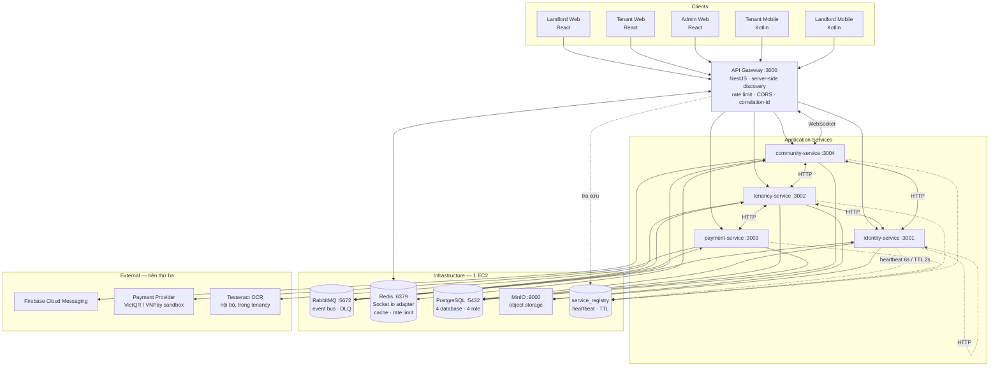
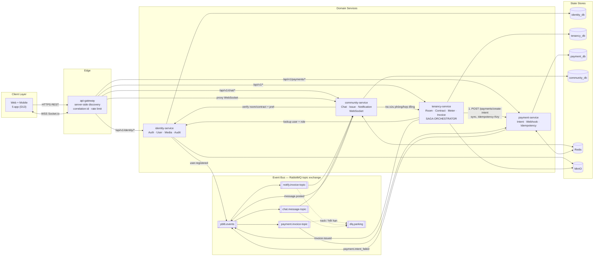
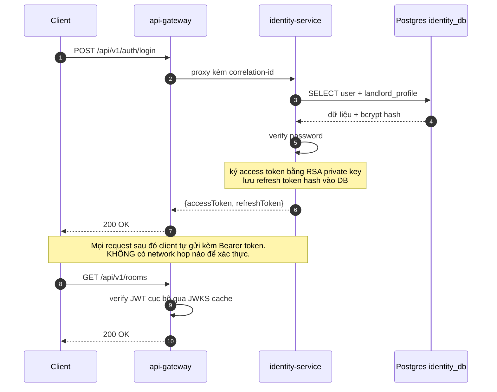
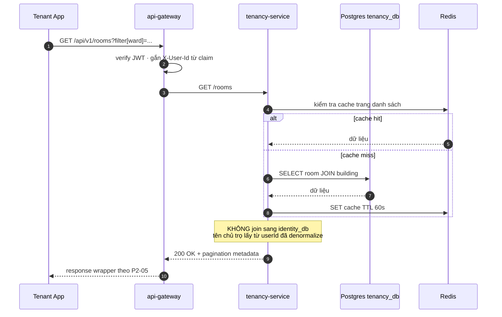
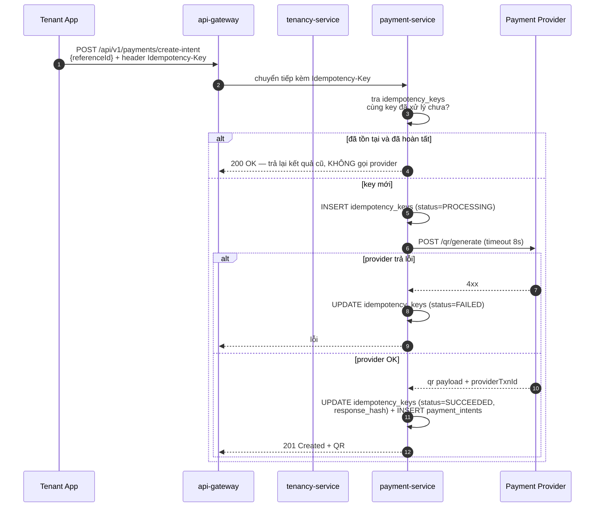
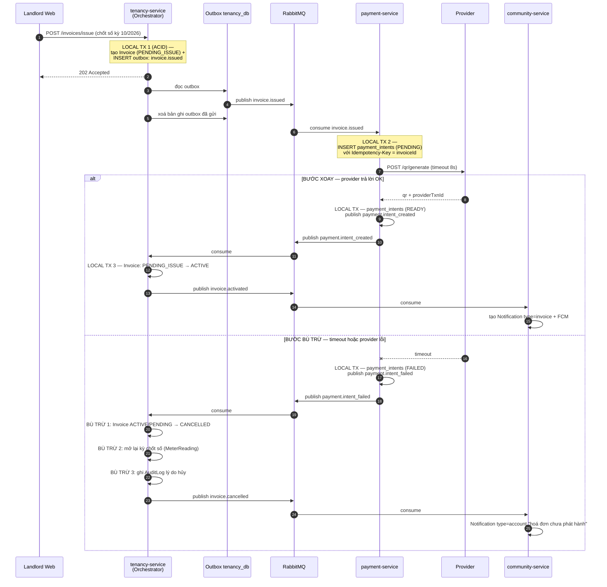
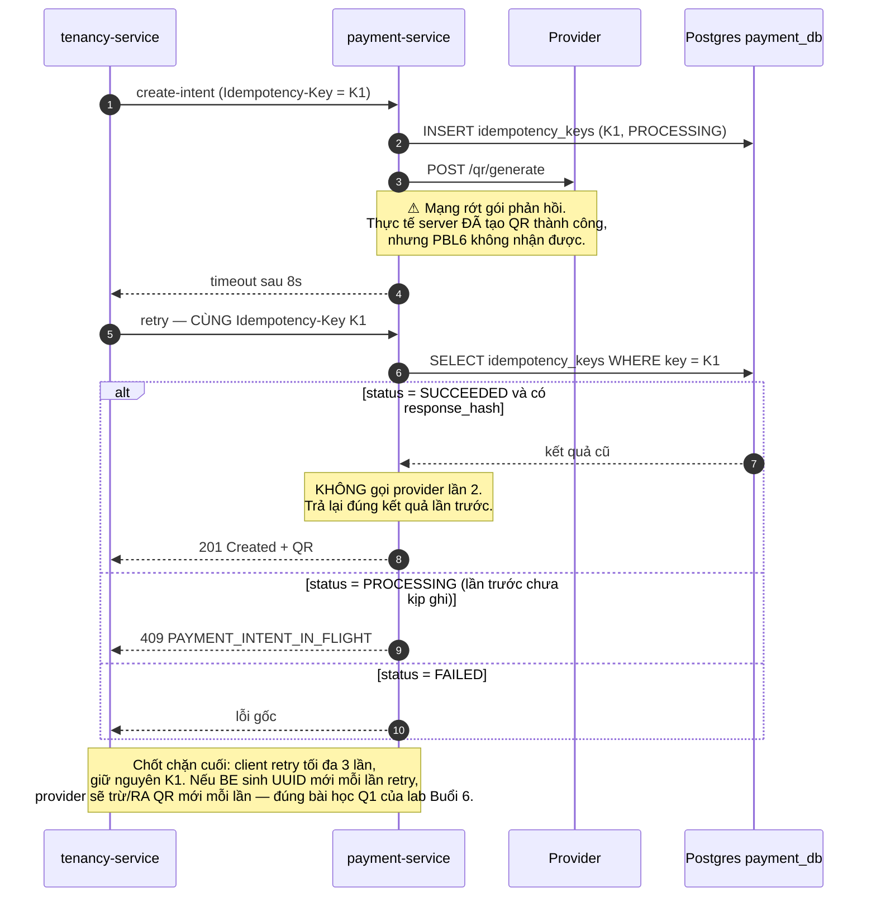
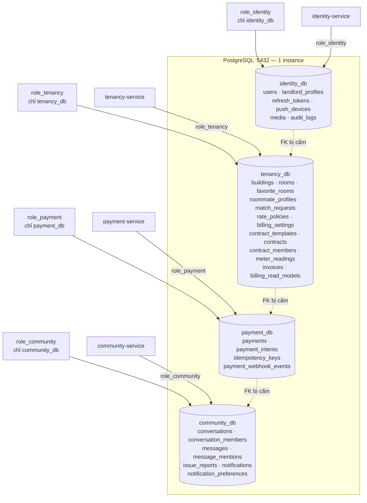
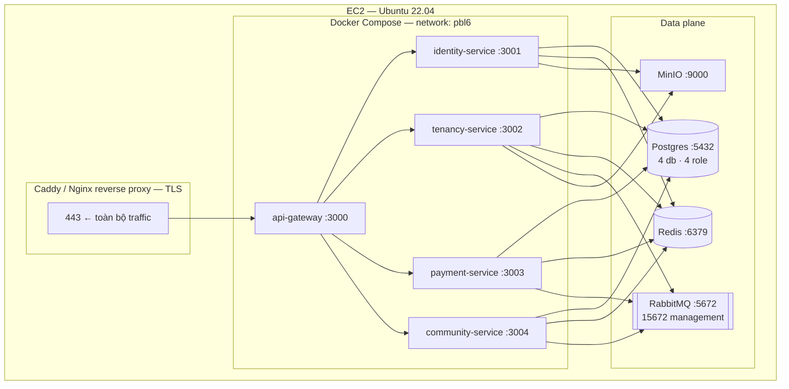

# PBL6 — Kiến trúc Microservice (4 service) — Báo cáo nghiên cứu P3-02

| | |
|---|---|
| **Issue** | [P3-02](../issues/P3-02-microservices-architecture-research.md) |
| **Tác giả** | BE Lead |
| **Reviewer** | PM |
| **Ngày** | 2026-09-29 |
| **Trạng thái** | 🟡 Draft — chờ PM review + 3 mục cần GV/PM xác nhận (xem §12) |
| **Phase** | 3 — Scaffolding & First Vertical Slice (W7–W8) |
| **Bối cảnh phát sinh** | Yêu cầu môn Kiến trúc hướng dịch vụ: **tối thiểu 4 service** |

---

## 1. Executive Summary & Verdict

**Verdict: chốt 4 service.**

| # | Service | Nhóm module | Vai trò |
|---|---------|-------------|--------|
| 1 | `identity-service` | 5 / 24 | Xác thực, danh tính, media, nhật ký kiểm toán |
| 2 | `tenancy-service` | 13 / 24 | Lõi nghiệp vụ: phòng, hợp đồng, hoá đơn, thống kê |
| 3 | `payment-service` | 1 / 24 | Hợp đồng với nhà cung cấp thanh toán bên ngoài |
| 4 | `community-service` | 5 / 24 | Chat realtime, sự cố, thông báo |

Hạ tầng đi kèm: **API Gateway** (server-side discovery) · **Service Registry** (heartbeat) · **RabbitMQ** (event bus) · **Redis** (Socket.io adapter + cache) · **PostgreSQL** (4 database, 4 role riêng) · **MinIO** (object storage cho media) · FCM · Payment Provider sandbox. Tất cả chạy trên **1 EC2** bằng Docker Compose.

**Điều kiện để phương án này đúng:**

1. Số module thuộc `payment-service` chỉ là 1, nhưng đó là quyết định có chủ đích — số lượng module không đo được giá trị của một ranh giới service (§4.2).
2. `tenancy-service` là **đảo ngược có chủ đích**: gộp `property` + `billing` để giữ ACID cho vòng đời hợp đồng, đổi lại cắt bỏ ranh giới ít giá trị nhất (§4.5).
3. Phương án này chỉ khả thi nếu **4 service là 4 repo riêng**, không phải 4 thư mục trong một NestJS monorepo dùng chung `libs/` (§8).
4. **Cần GV xác nhận** API Gateway có được tính vào "4 service" hay không.

---

## 2. Bối cảnh & Ràng buộc

### 2.1 Vì sao chuyển sang microservice

| Động cơ | Chi tiết |
|---------|----------|
| **Bắt buộc** | Môn Kiến trúc hướng dịch vụ yêu cầu đồ án có **tối thiểu 4 service** |
| **Học tập** | Môn SOA đang học: 8 nguyên lý SOA, sync/async, Saga, ESB, service discovery, retry + idempotency. Muốn áp dụng lên đồ án thật |
| **Tình huống** | `phase-3` chưa scaffold dòng code nào → **chi phí tách thấp nhất**, không có gì phải migrate |

### 2.2 Ràng buộc phải tôn trọng

| Ràng buộc | Giá trị | Ảnh hưởng lên thiết kế |
|-----------|---------|------------------------|
| Thời gian | 13–14 tuần, học 2 tuần/lần lên trường | Không thể dựng hạ tầng nặng (K8s, service mesh) |
| Nhân sự BE | **1 người** | 4 service NestJS = 1 người ôm; đây là rủi ro lớn nhất |
| Hạ tầng | **1 EC2** | Không có hạ tầng discovery quản lý → tự xây registry đơn giản |
| Chất lượng | Demo-grade, không CI gate | Không cần production-grade; nhưng demo **không được chết** giữa chừng |
| **D29** | Hệ thống phải chạy được khi **tenant không login**, chủ trọ làm một mình | Mọi thiết kế phải có đường chạy khi bên thứ ba chết |
| Ngôn ngữ | NestJS (TypeScript) đã được GV chấp nhận cho môn SOA | Không chuyển sang Spring Boot |

### 2.3 Thay đổi scope: bỏ AI

`PROJECT_PLAN.md:13` đang xếp **Auto-Description là MVP**. Team đã thống nhất dẹp AI vì chưa chốt được feature cụ thể. Hệ quả trực tiếp lên kiến trúc:

- Mất `pbl6-ai` → số service lấy từ domain PBL6 thuần, không còn service Python.
- **Tính năng OCR chốt số điện nước** (`requirement.md:27`, F5) mất chỗ đứng. Đề xuất: chạy Tesseract ngay trong `tenancy-service` vì ảnh hoá đơn điện nước nhỏ, xử lý tại chỗ được. **Trạng thái: chờ PM chốt** (xem §12).
- `requirement.md:10` chỉ ghi *"Khuyến khích: thêm AI"* → bỏ được, nhưng phải cập nhật `requirement.md` + `PROJECT_PLAN.md` để SoT không còn mâu thuẫn.

---

## 3. Kiến trúc 4 service (đã chốt)

### 3.1 Danh sách service

| # | Service | Port | Tech | Nhóm module | Bảng dữ liệu sở hữu |
|---|---------|------|------|-------------|----------------------|
| 1 | `identity-service` | 3001 | NestJS | Auth, User, PushDevice, Media, AuditLog | `users`, `landlord_profiles`, `refresh_tokens`, `push_devices`, `media`, `audit_logs` |
| 2 | `tenancy-service` | 3002 | NestJS | Building, Room, FavoriteRoom, RoommateProfile, MatchRequest, RatePolicy, BillingSetting, ContractTemplate, Contract, ContractMember, MeterReading, Invoice, Dashboard | `buildings`, `rooms`, `favorite_rooms`, `roommate_profiles`, `match_requests`, `rate_policies`, `billing_settings`, `contract_templates`, `contracts`, `contract_members`, `meter_readings`, `invoices`, `billing_read_models` |
| 3 | `payment-service` | 3003 | NestJS | Payment | `payments`, `payment_intents`, `idempotency_keys`, `payment_webhook_events` |
| 4 | `community-service` | 3004 | NestJS | Conversation, Message, IssueReport, Notification, NotificationPreference | `conversations`, `conversation_members`, `messages`, `message_mentions`, `issue_reports`, `notifications`, `notification_preferences` |

Đếm: 5 + 13 + 1 + 5 = **24/24 nhóm module**. Không nhóm nào bị bỏ sót.

### 3.2 Ma trận mapping đủ 24 nhóm module

| # | Nhóm module | Service | Lý do xếp vào đây |
|---|-------------|---------|-------------------|
| §2 | Auth | `identity` | Nơi duy nhất phát hành JWT; mọi service còn lại chỉ verify |
| §3 | User | `identity` | Dữ liệu danh tính, cross-platform role (D13) |
| §4 | PushDevice | `identity` | Thuộc về thiết bị của một người dùng |
| §5 | Media | `identity` | **Không tách** — quyền kế thừa qua `ownerType`/`ownerId` (§4.3) |
| §6 | Building | `tenancy` | Gộp property+billing (§4.5) |
| §7 | Room | `tenancy` | Gộp property+billing |
| §8 | FavoriteRoom | `tenancy` | Gộp property+billing |
| §9 | RoommateProfile | `tenancy` | Thuộc marketplace tìm bạn ở ghép, gắn với phòng |
| §10 | MatchRequest | `tenancy` | Gộp property+billing |
| §11 | RatePolicy | `tenancy` | Cấu hình đơn giá/kỳ, dùng khi tính hoá đơn → để cùng chỗ để tính hoá đơn không gọi chéo |
| §12 | BillingSetting | `tenancy` | Cùng lý do `RatePolicy` |
| §13 | ContractTemplate | `tenancy` | Mẫu hợp đồng sinh file, gắn chặt vòng đời hợp đồng |
| §14 | Contract | `tenancy` | Lõi nghiệp vụ, cần ACID với ContractMember |
| §15 | ContractMember | `tenancy` | Bảng con của Contract, cùng transaction |
| §16 | MeterReading | `tenancy` | Chốt số điện nước, đầu vào của hoá đơn |
| §17 | Invoice | `tenancy` | MVP crown jewel, cùng transaction với Contract |
| §18 | Payment | **`payment`** | **Tách riêng** — hợp đồng bên thứ ba + idempotency (§4.2) |
| §19 | IssueReport | `community` | Sinh ra từ `@issue` trong chat, cùng vòng đời hội thoại |
| §20 | Conversation | `community` | Giao thức WebSocket, khác hẳn REST |
| §21 | Message | `community` | Giao thức WebSocket |
| §22 | Notification | `community` | Event-driven, cùng hình dạng với chat (§4.4) |
| §23 | NotificationPreference | `community` | Không tách khỏi Notification, cùng tên bảng |
| §24 | AuditLog | `identity` | Nhật ký hệ thống xuyên service, cần chỗ tập trung |
| §25 | Dashboard | `tenancy` | Tổng hợp doanh thu/công nợ từ Invoice + Payment + Contract → cùng service để không phải join xuyên |

### 3.3 Sơ đồ container tổng thể



**Đọc sơ đồ:** mũi tên đặc = gọi đồng bộ. Mũi tên nét đứt = heartbeat/khác. Mũi tên hai chiều qua `RMQ` = phát & nhận event bất đồng bộ.

---

## 4. Lý do cách tách

### 4.1 Năm tiêu chí vẽ ranh giới

Được áp dụng theo thứ tự ưu tiên. Ranh giới chỉ được vẽ khi **ít nhất một** tiêu chí mạnh đạt.

| # | Tiêu chí | Câu hỏi đặt ra | Ví dụ trong PBL6 |
|---|----------|----------------|------------------|
| **C1** | **Hợp đồng bên thứ ba** | Service này có phải đại diện cho một hệ thống bên ngoài mà ta không kiểm soát hợp đồng không? | `payment-service` ↔ provider thanh toán |
| **C2** | **Tách protocol** | Service này có dùng giao thức khác REST không? | `community-service` dùng WebSocket/Socket.io |
| **C3** | **Profile tài nguyên** | Tải, độ trễ, hay vòng đời khác hẳn phần còn lại không? | FCM fan-out bùng nổ so với ghi dữ liệu nghiệp vụ |
| **C4** | **Liên kết transaction** | Hai phần có cần cùng một transaction ACID không? | `contract` + `contract_member` |
| **C5** | **Chi phí team** | Ranh giới này có đáng sống tiền công vận hành với 1 BE không? | Loại mọi ranh giới chỉ "nghe hay" |

> **C5 là tiêu chí loại, không phải tiêu chí tạo.** Nhiều ranh giới trong kiến trúc phổ biến chỉ đạt C4 hoặc ngôn ngữ nghiệp vụ — đó là ranh giới *đọc được trên giấy*, không tạo ra giá trị phân tán nào.

### 4.2 Vì sao `payment` **phải** tách riêng

Đây là ranh giới mạnh nhất, dựa trên **ba bằng chứng độc lập** trong tài liệu đã chốt:

**Bằng chứng 1 — Nó phá vỡ convention toàn hệ thống.**

`api-spec.md:211`, endpoint `POST /payments/webhooks/{provider}`, ghi rõ: *"phản hồi xác nhận theo hợp đồng provider và **không dùng JSON wrapper**"*.

Nhưng `api-conventions.md` §1 bắt buộc mọi response dùng wrapper `{ statusCode, code, data }`. Đây là **anomaly duy nhất trong 109 endpoint**, và lý do rất rõ: đó là endpoint duy nhất có bên thứ ba áp đặt hợp đồng phản hồi.

> Một chỗ phải phá vỡ convention toàn cục chính là một **ranh giới hợp đồng** — đúng thứ mà ranh giới service sinh ra để chứa. Nếu để trong `tenancy-service`, anomaly bị chôn vùi và không còn ai biết nó tồn tại.

**Bằng chứng 2 — Nó đã mang sẵn yêu cầu lũy đẳng.**

`api-spec.md:209` và `:210` — cả `create-intent` và `record-cash-payment` đều **bắt buộc `Idempotency-Key`**. Đây chính là bài toán "Retry + Idempotency Key = Effectively-Once Execution" của môn SOA. Cơ chế này chỉ có ý nghĩa ở ranh giới có **bên thứ ba không tin cậy** — ta không retry DB nội bộ, ta retry provider.

**Bằng chứng 3 — Design doc đã yêu cầu sẵn.**

`tech-feasibility.md:172`: *"kiến trúc code nên tách interface `PaymentGateway` (strategy pattern) để thêm MoMo sau này không phải sửa core logic"*. Đó là mô tả một **seam** (đường cắt) — và seam là thứ định nghĩa ranh giới service.

**Áp dụng tiêu chí:** C1 đạt mạnh (provider bên ngoài) · C3 đạt (timeout, retry, xác thực chữ ký khác hẳn) · C4 **không đạt** — nhưng đó chính là điểm: đây là chỗ ta **cố ý đánh đổi** ACID để đổi lấy bài học Saga. Giữ nó chung với `Invoice` sẽ né đúng thứ môn SOA muốn dạy.

### 4.3 Vì sao `media` **không** tách

Ban đầu có vẻ hợp lý để tách: `api-spec.md:55` mô tả `GET /media/{mediaId}` là *"Đọc hoặc **stream** một tệp"* — profile tài nguyên khác hẳn (binary, băng thông) so với JSON. Và `api-spec.md:56` cho biết media hợp đồng đã ký phải **giữ lại làm chứng cứ pháp lý**.

Nhưng có một ràng buộc kỹ thuật trong chính spec chặn lại:

> `api-spec.md:55` — *"Cột quyền để trống có chủ ý: quyền **kế thừa từ tài nguyên cha** qua `ownerType`/`ownerId`."*

Media được trỏ tới `room`, `contract`, `issue_report`, `message` — tức bảng thuộc **cả 4 service**. Nếu tách Media thành service riêng, mỗi lần load avatar, ảnh phòng, ảnh hợp đồng, ảnh sự cố đều phải:

1. Gọi `media-service`
2. `media-service` phải gọi ngược lại service sở hữu tài nguyên cha để hỏi "người gọi có quyền không"
3. Nhận về kết quả mới stream tệp

Đó là **1–3 network hop trên đúng đường nóng hiển thị**, và là đường nóng vì avatar xuất hiện ở mọi màn hình.

**Kết luận:** Media giữ trong `identity-service` — service sở hữu cơ chế thẩm quyền. Đây là ví dụ việc **tiêu chí C3 bị C4/C5 phủ quyết**: profile tài nguyên đẹp, nhưng ràng buộc ủy quyền nghiêm trọng hơn.

### 4.4 Vì sao gộp `notification` vào `community-service`

Tách Notification ra là **ứng viên mạnh thứ hai** — mạnh về mặt lý thuyết:

- 5 loại notification trong spec (`invoice`, `chat`, `issue`, `match`, `account`) phát ra từ **4 service khác nhau** → đúng ví dụ `NotificationService` / `SendGridNotificationService` dùng để dạy **Service Reusability (nguyên lý SOA số 4)**.
- `D43` đã cho `POST /invoices/send-reminder` trả `queued[]` / `failed[]` — **ngữ nghĩa hàng đợi bất đồng bộ đã nằm sẵn trong spec** từ Phase 2, chỉ là chưa có chỗ để chạy.

Nhưng không tách, vì tiêu chí C5:

- Notification **không có** hợp đồng bên thứ ba riêng (FCM là dịch vụ của Google, ai cũng gọi được).
- Với RabbitMQ nó trở thành service thuần event-consumer: không cần ACID, không cần rollback, không cần API công khai ra ngoài.
- Tách ra sẽ **không dạy được bài mới nào** so với việc nằm chung, nhưng tốn thêm 1 process, 1 database, 1 repo, 1 chu kỳ deploy.

Nó có cùng hình dạng event-driven với chat, cùng phụ thuộc `NotificationPreference`, cùng người đọc → gộp vào `community-service` là tự nhiên.

### 4.5 Vì sao gộp `property` + `billing` thành `tenancy-service`

Đây là quyết định giữ số service ở mức 4.

`property` (Building, Room, FavoriteRoom) và `billing` (RatePolicy, BillingSetting, Contract*, MeterReading, Invoice) trông như hai bounded context riêng, nhưng:

| Đánh giá | Kết quả |
|----------|---------|
| C1 — hợp đồng bên thứ ba | ❌ Cả hai đều là CRUD thuần, không đại diện cho hệ thống ngoài |
| C2 — tách protocol | ❌ Cả hai đều REST/JSON |
| C3 — profile tài nguyên | ❌ Cả hai tải đọc/ghi thông thường |
| C4 — liên kết transaction | ✅ **Room → Contract → MeterReading → Invoice** là một chuỗi, cần ACID |
| C5 — chi phí team | ❌ Tách ra = thêm 1 network hop, **không dạy được bài gì** |

Tách nó ra là hòn đảo CRUD thuần chảy qua wire. Giữ chung ta được: vòng đời hợp đồng + chốt số + phát hành hoá đơn **nằm trong một local transaction**, và `tenancy-service` trở thành **Saga orchestrator** một cách tự nhiên.

**Đánh đổi được gì:** `tenancy-service` có 13/24 nhóm module — lớn nhất hệ thống. Đây là đảo ngược có chủ đích, được chấp nhận và ghi rõ để không ai hiểu nhầm là sơ suất.

### 4.6 Các phương án bị loại

| Phương án | Vì sao loại |
|-----------|-------------|
| **Giữ modular monolith (1 service)** | Không thoả yêu cầu min 4 service của môn SOA |
| **5 service** — tách `notification` riêng | Đạt thêm 1 bài Service Reusability, nhưng tốn ~1 tuần của 1 BE mà không đổi ranh giới nào quan trọng. Giữ lại như đường nâng cấp nếu còn thời gian |
| **6 service** — tách thêm `media` | Vỡ tiêu chí C5 ở §4.3, thêm 1–3 hop trên đường nóng |
| **7 service** — tách identity/property/chat/billing/payment/notification/media | Vượt sức 1 BE. 6 chỗ giao tiếp chéo service sinh ra 30 cặp event, sai lệch kiến trúc sẽ tăng theo bình phương |
| **4 service nhưng 4 module trong 1 NestJS monorepo dùng chung `libs/`** | Trông giống microservice nhưng **không tách ra khỏi workspace được** — vi phạm chính tiêu chí tại §1. Xem §8 |

---

## 5. Sơ đồ giao tiếp giữa các service

### 5.1 Kiểm kê hạ tầng

| Thành phần | Công nghệ | Vai trò | Bắt buộc? |
|-----------|-----------|---------|-----------|
| **API Gateway** | NestJS `:3000` | Điểm vào duy nhất của client · rate limit · CORS · phát `correlation-id` · **server-side discovery** | ✅ Có |
| **Service Registry** | Bảng `service_registry` trong Postgres | Ghi heartbeat 6s, TTL 2s · gateway tra cứu instance còn sống | ✅ Có (xem ghi chú) |
| **Message Broker** | RabbitMQ `:5672` | Event bus nội bộ · topic exchange · DLQ | ✅ Có |
| **Redis** | Redis `:6379` | Socket.io adapter (chat nhiều instance) · cache đọc nhiều · đếm rate limit | ✅ Có |
| **Cơ sở dữ liệu** | PostgreSQL `:5432` | 1 instance, **4 database**, **4 role riêng** | ✅ Có |
| **Object Storage** | MinIO `:9000` | Media presign upload (D40) · file hợp đồng đã ký | ✅ Có |
| **FCM** | Google | Push offline (D24′) | ✅ Có |
| **Payment Provider** | VietQR / VNPay sandbox | QR động · webhook thanh toán | ✅ Có (sandbox) |
| **OCR** | Tesseract, chạy trong `tenancy-service` | Chốt số điện nước từ ảnh | ⏳ Chờ PM chốt |
| **Observability** | Structured log + `correlation-id` | Truy vết xuyên service | ✅ Có |

> **Ghi chú về Service Registry:** trên Docker Compose, service name đã là định chỉ tĩnh và Docker tự lo health check. Vậy registry để làm gì? Ba lý do thật:
> 1. **Đáp ứng yêu cầu môn học** — lab 5 hỏi đúng câu này: client-side hay server-side discovery, heartbeat/TTL, xử lý instance chết.
> 2. **Gateway vẫn cần nó** để không gọi vào instance đang `unhealthy` — khi đó trả `503` kèm `Retry-After` thay vì treo request cho hết timeout.
> 3. **Nếu sau này tách service ra máy khác**, đổi registry là đổi được, không phải sửa code.

### 5.2 Sơ đồ thành phần giao tiếp (chi tiết luồng)



### 5.3 Ma trận giao tiếp

| Từ | Đến | Chế độ | Giao thức | Mục đích | Timeout | Xác thực |
|----|-----|--------|-----------|----------|---------|----------|
| Client | `api-gateway` | Sync | HTTPS REST | Mọi lưu lượng người dùng | 15s | JWT bearer |
| Client | `api-gateway` | Realtime | WSS Socket.io | Chat, sự cố, trạng thái hoá đơn | — | JWT trong `handshake` |
| `api-gateway` | service bất kỳ | Sync | HTTP/JSON | Định tuyến | 5s | Chuyển tiếp JWT + `X-Service-Token` |
| `api-gateway` | `service_registry` | Sync | SQL | Chọn instance healthy | 1s | — |
| `tenancy` | `identity` | Sync | HTTP/JSON | Lấy user/role/landlord profile | 3s | Service token nội bộ |
| `tenancy` | `payment` | Sync | HTTP/JSON | `create-intent`, `record-cash-payment` | **8s** (chờ provider) | Service token nội bộ |
| `community` | `identity` | Sync | HTTP/JSON | Xác thực thành viên, đọc notification preference | 3s | Service token nội bộ |
| `community` | `tenancy` | Sync | HTTP/JSON | Kiểm tra quyền theo phòng/hợp đồng, `@issue` tạo IssueReport | 3s | Service token nội bộ |
| `tenancy` | RabbitMQ | Async | AMQP | Phát `invoice.issued`, `contract.signed` | — | Credentials riêng theo service |
| `payment` | RabbitMQ | Async | AMQP | Nhận `invoice.issued`, phát `payment.intent_created/failed` | — | idem |
| `community` | RabbitMQ | Async | AMQP | Nhận mọi event để đẩy notification | — | idem |
| `identity` | RabbitMQ | Async | AMQP | Nhận event để ghi audit log | — | idem |
| `payment` | Provider | Sync | HTTPS | Tạo QR / intent | 8s | API key + chữ ký |
| Provider | `payment` | Async | HTTPS webhook | Xác nhận thanh toán | — | **Kiểm chữ ký provider** |
| `community` | FCM | Async | HTTPS | Push offline | 5s | Service account key |
| Service | MinIO | Sync | HTTPS | Presign upload / đọc tệp | 10s | Presigned URL |

**Quy tắc bất di bất dịch:** lời gọi **đọc** dùng sync; lời gọi **ghi** dùng async event. Không có lời gọi sync nào mang tính quyết định tài chính mà không cần idempotency key.

### 5.4 Luồng đồng bộ

#### 5.4.1 Đăng nhập & xác thực (Service Statelessness)



**Điểm mấu chốt (nguyên lý SOA số 6 — Service Statelessness):** gateway và mọi service **verify token cục bộ** bằng public key tải từ `/.well-known/jwks.json` và cache. Không service nào gọi `identity-service` để hỏi "token này hợp lệ không" — nếu không, mỗi request sẽ thêm 1 network hop và hệ thống mất tính stateless.

#### 5.4.2 Tenant xem danh sách phòng (cross-service read)



**Quyết định thiết kế:** `tenancy-service` **không gọi `identity-service`** khi list phòng, dù DTO có thể hiện tên chủ trọ. Lý do: đường nóng đọc được cache và gọi chéo ở mỗi request là công thức chậm. Thay vào đó denormalize tên hiển thị vào `rooms` và **đồng bộ lại bằng event** `user.registered` / `user.updated` (§5.7).

#### 5.4.3 Tạo ý định thanh toán (idempotency)



**Áp dụng `api-spec.md:209`:** `Idempotency-Key` là **bắt buộc**, thiếu là `422 VALIDATION FAILED`. Cơ chế lưu vết nằm ở `payment-service` vì đó là nơi có thể gặp timeout từ bên ngoài.

### 5.5 Luồng bất đồng bộ & Saga

#### 5.5.1 Chọn Orchestration hay Choreography

Theo tiêu chí `lab_4.docx` §3.3 — quy trình **2–3 service thì Choreography**, **5+ service thì Orchestration**. Saga của PBL6 chạm **2 service** (`tenancy` ↔ `payment`), nên về lý thuyết Choreography hợp lý hơn.

**Ta chọn Orchestration, có lý do riêng:**

1. `tenancy-service` **đã phải nắm trạng thái saga** — nó sở hữu `invoices` và là nơi quyết định hoá đơn có hợp lệ hay không. Choreography sẽ bắt nó phải *nghe* `payment.intent_failed` rồi tự suy ra phải huỷ hoá đơn → logic nghiệp vụ nằm rải rác ở subscriber, đúng nhược điểm "không có trạng thái trung tâm" mà tài liệu môn nêu.
2. Cần **bù trừ nhiều bước** (huỷ hoá đơn + mở lại kỳ chốt số + ghi audit log). Orchestration cho một chỗ duy nhất quyết định thứ tự bù trừ.
3. Bài học cần nộp cho môn SOA nhắm rõ ưu điểm "dễ theo dõi, dễ debug, dễ mở rộng" của orchestration.

**Orchestrator:** `tenancy-service`. **Participant:** `payment-service`.

#### 5.5.2 Saga phát hành hoá đơn



**Ba điểm phải nói rõ khi bảo vệ trước GV:**

| Điểm | Giải thích |
|------|------------|
| **Vì sao không 2PC?** | 2PC bị vô hiệu hóa khi các bên ở trạng thái commit độc lập; `payment-service` và `tenancy-service` không cùng một Postgres transaction. Đây là lý do Saga tồn tại — khớp `lab_4.docx` §3 và `HUONG_DAN_THUC_HANH.md` Q2. |
| **Vì sao dùng Outbox?** | Nếu `tenancy` commit xong rồi chết trước khi publish, event mất vĩnh viễn → hoá đơn treo. Outbox ghi event **cùng transaction** với nghiệp vụ, một tiến trình riêng đọc và publish. Đây là mẫu chuẩn để đạt **at-least-once**. |
| **Có trùng event không?** | Có — at-least-once nghĩa là có thể nhận trùng. Mọi consumer **phải** idempotent: dùng `eventId` làm khoá, hoặc kiểm tra trạng thái hiện tại trước khi chuyển (ví dụ đã `ACTIVE` thì bỏ qua). |

#### 5.5.3 Provider timeout — retry và lũy đẳng



#### 5.5.4 Ràng buộc D29 — đường nào vẫn sống khi provider chết

`requirement.md:40` (D29) bắt buộc: hệ thống phải vận hành khi tenant **không login**, chủ trọ làm một mình.

| Kịch bản | Provider chết? | Hệ thống |
|----------|----------------|----------|
| Chủ trọ tự ghi nhận tiền mặt | Không quan trọng | ✅ `POST /payments/record-cash-payment` (`api-spec.md:210`) chạy độc lập, **không chạm provider** |
| Chủ trọ phát hành hoá đơn | Có | ⚠️ Saga chạy nhánh bù trừ → `Invoice CANCELLED`, nhưng **số liệu chốt số vẫn được lưu** để thử lại sau |
| Chat + báo sự cố | Không quan trọng | ✅ Không phụ thuộc provider |
| Dashboard doanh thu | Không quan trọng | ✅ Đọc từ `tenancy_db` |

**Thiết kế bắt buộc:** `record-cash-payment` nằm trong `payment-service` nhưng **không gọi provider**, nên khi provider chết thì service này vẫn hoạt động. Phải có **circuit breaker** để khi provider lỗi liên tục thì `payment-service` fail-fast trong 200ms thay vì chờ 8s, giữ cho luồng chủ trọ không bị nghẽn.

### 5.6 Chọn message broker

| Tiêu chí | **RabbitMQ** | MQTT | Kafka | Redis Streams |
|----------|--------------|------|-------|---------------|
| Mô hình | Exchange → Queue | Topic publish/subscribe | Log phân kỳ | Stream + consumer group |
| **Dead-letter queue** | ✅ Có sẵn (DLX) | ❌ Không có khái niệm DLQ | ⚠️ Phải tự xây | ❌ Phải tự xây |
| **Consumer group** | ✅ Hàng đợi là đơn vị chia sẻ | ⚠️ MQTT 5 shared subscription, MQTT 3 không có | ✅ Có native | ✅ Có native |
| **Xác nhận & retry** | ✅ ack/nack + prefetch | ⚠️ QoS 1 là at-least-once, không có nack | ✅ offset | ✅ XACK |
| **Độ trễ** | Rất thấp (µs–ms) | Rất thấp | Thấp nhưng tốn disk | Thấp |
| **Routing** | direct/topic/fanout/headers | Chỉ topic wildcard | Theo partition | Theo stream |
| **Tin nhắn trùng lặp** | Có thể xảy ra → phải idempotent | Có thể | Ít hơn (offset commit) | Có thể |
| **Vận hành trên 1 EC2 t3.small** | ✅ ~80MB RAM | ✅ Nhẹ nhất | ❌ Cần JVM + disk, nặng | ⚠️ Đã dùng Redis, dùng chung instance |
| **Đúng tài liệu môn** | ✅ `lab_4.docx` nêu đích danh | ⚠️ Không có trong tài liệu môn | ✅ Có nêu | ❌ Không nêu |

**Quyết định: RabbitMQ.**

Lý do quyết định, không phải lý do phụ:

1. **Dead-letter queue là bắt buộc, không phải tuỳ chọn.** Saga của PBL6 có nhánh bù trừ; nếu `payment.intent_failed` không xử lý được thì phải có chỗ để nó nằm chờ thay vì mất. MQTT không có khái niệm này.
2. **Consumer group.** Một sự kiện `invoice.issued` chỉ nên do **một** instance `payment-service` xử lý, còn `invoice.activated` có thể cho cả `community-service` lẫn `identity-service` cùng nghe. RabbitMQ diễn tả bằng queue-per-consumer; MQTT 3 không làm được.
3. **Không tốn thêm hạ tầng.** Kafka cần JVM + disk, t3.small không chịu nổi. Redis Streams sẽ dùng chung instance Redis đang phục vụ Socket.io → tranh chấp tài nguyên khi chat bùng nổ.

**Vì sao không MQTT — nói thẳng để không bị hỏi lúc bảo vệ:**

MQTT rất hợp với **thiết bị biên**: pin khẩu, băng thông thấp, mạng không ổn định — ví dụ đồng hồ đo nước tự đẩy chỉ số. PBL6 **không có thiết bị biên nào**: `F5` đã chốt OCR thay cho API tiện ích, và `D9` giới hạn cho thuê dài hạn. Nên MQTT ở đây sẽ là bỏ công cụ đúng vào chỗ không có gì để dùng.

> Nếu sau này mở rộng sang đồng hồ đo thông minh, đây là điểm chuyển đổi sang MQTT đã được ghi nhận.

### 5.7 Catalogue event

| Event | Producer | Consumer | Payload tối thiểu | Delivery | Xử lý trùng |
|-------|----------|----------|-------------------|-----------|--------------|
| `invoice.issued` | `tenancy` | `payment` | `eventId`, `invoiceId`, `amount`, `tenantId`, `period` | at-least-once | `Idempotency-Key = invoiceId` |
| `payment.intent_created` | `payment` | `tenancy` | `eventId`, `invoiceId`, `qrPayload`, `providerTxnId` | at-least-once | Bỏ qua nếu invoice đã `ACTIVE` |
| `payment.intent_failed` | `payment` | `tenancy` | `eventId`, `invoiceId`, `reason` | at-least-once | Bỏ qua nếu invoice đã `CANCELLED` |
| `payment.webhook_received` | `payment` | `tenancy`, `community` | `eventId`, `invoiceId`, `status`, `amount` | at-least-once | Khoá theo `providerTxnId` |
| `invoice.activated` | `tenancy` | `community` | `eventId`, `invoiceId`, `tenantId`, `amount` | at-least-once | Khoá theo `eventId` |
| `invoice.cancelled` | `tenancy` | `community` | `eventId`, `invoiceId`, `reason` | at-least-once | idem |
| `contract.signed` | `tenancy` | `community`, `identity` | `eventId`, `contractId`, `roomId` | at-least-once | khoá `eventId` |
| `message.posted` | `community` | (chính nó, qua Socket.io) | `eventId`, `conversationId`, `senderId` | best-effort | khoá `messageId` |
| `issue.created` | `community` | `tenancy`, `identity` | `eventId`, `issueId`, `roomId`, `reporterId` | at-least-once | khoá `issueId` |
| `user.registered` | `identity` | `tenancy` | `eventId`, `userId`, `displayName` | at-least-once | `UPSERT` theo `userId` |
| `user.updated` | `identity` | `tenancy` | `eventId`, `userId`, `displayName` | at-least-once | so sánh phiên bản |

**Quy ước bắt buộc cho mọi event:** có `eventId` (UUID), `occurredAt`, `schemaVersion`, `correlationId` (nối từ HTTP request ban đầu).

### 5.8 Cross-cutting concerns

| Cơ chế | Vấn đề giải quyết | Áp dụng cụ thể trong PBL6 |
|--------|-------------------|----------------------------|
| **JWKS + RS256** | Xác thực mà không tạo network hop | `identity` giữ private key; gateway và 3 service còn lại chỉ giữ public key, cache 5 phút. Refresh token lưu dạng hash, phát hiện tái sử dụng → thu hồi toàn bộ phiên |
| **`correlation-id`** | Debug hệ phân tán — log của service nào lỗi | Gateway sinh UUID nếu client không gửi; truyền qua header HTTP **và** qua mọi event; `payment-service` log ra `correlationId` để PM lần ngược từ màn hình lỗi về log |
| **Outbox pattern** | Không mất event khi broker chết | Bảng `outbox` trong chính DB của service, một tiến trình đọc và publish, xoá sau khi publish thành công |
| **DLQ + retry backoff** | Message hỏng không làm tắc hàng đợi | Retry 3 lần với backoff luỹ thừa 1s/4s/16s, hết số lần thì đẩy `dlq.parking`; dashboard admin đọc DLQ để không có message chết âm thầm |
| **Circuit breaker** | Provider chết không làm nghẽn hệ thống | `payment-service` ngắt circuit sau 5 lỗi liên tiếp, mở lại sau 30s. Giữ cho luồng chủ trọ chạy được (D29) |
| **Rate limit** | Chặn lạm dụng, bảo vệ provider | Gateway giới hạn theo user + IP; giới hạn riêng cho endpoint payment nghiêm hơn |
| **Soft delete + cascade** | Không phá dữ liệu đã đối soát | Giữ nguyên `api-conventions.md` §12; xoá tòa nhà cascade mềm xuống phòng nhưng **giữ** hợp đồng, hoá đơn, thanh toán |

---

## 6. Kiến trúc dữ liệu

### 6.1 Bốn database, bốn role



**Cách chứng minh Service Autonomy không chỉ trên giấy:** mỗi service dùng **Postgres role riêng** chỉ có quyền trên database của nó. Nếu ai đó vô tình viết `JOIN` xuyên service, truy vấn sẽ **fail với lỗi permission** chứ không âm thầm chạy được. Đây là bảo đảm cơ học, không phải quy ước miệng.

### 6.2 Dữ liệu đi qua ranh giới bằng gì

| Dữ liệu | Chủ sở hữu | Người cần | Đi bằng | Lý do không nhân bản |
|----------|-----------|----------|---------|---------------------|
| Tên/role người dùng | `identity` | `tenancy`, `community` | Event `user.updated` | Cần luôn mới; sự kiện rẻ, đọc nhiều |
| Cấu hình nhận tiền (D49) | `identity` (`landlord_profiles`) | `payment` | HTTP + cache Redis | Nhạy cảm, đọc không nhiều, cache 5 phút |
| Thông tin phòng / hợp đồng | `tenancy` | `community` | HTTP | Cần luôn chính xác để kiểm tra quyền chat |
| Số tiền hoá đơn | `tenancy` | `payment` | Event `invoice.issued` | Ghi 1 chiều, không cần ngược |
| Media | `identity` | Tất cả | HTTP + presigned URL | Không nhân bản tệp |

**Quy tắc:** chỉ nhân bản dữ liệu **hiển thị** (tên, ảnh) để tải nhanh; **không bao giờ** nhân bản dữ liệu **quyết định** (trạng thái, số dư, quyền) — cái đó luôn phải hỏi chủ sở hữu.

---

## 7. Triển khai trên 1 EC2

### 7.1 Topology



**Chỉ một cổng ra ngoài: 443.** Các service khác **không** expose cổng ra internet — chỉ gateway nhận traffic từ ngoài. Đây là yêu cầu bảo mật: giả định mọi service khác đều đứng sau tường lửa.

### 7.2 Sizing

| Cỡ máy | RAM | Đánh giá |
|--------|-----|----------|
| `t3.micro` | 1 GB | ❌ **Không đủ.** Postgres + RabbitMQ + Redis + MinIO + 5 tiến trình Node vừa chạm trần. Demo sẽ OOM giữa chừng — rủi ro lớn nhất khi bảo vệ. |
| `t3.small` | 2 GB | ⚠️ Tối thiểu chấp nhận được. Dùng thêm `swap` 2GB làm lưới an toàn. |
| `t3.medium` | 4 GB | ✅ **Khuyến nghị.** Còn dư để chạy thêm 1 instance service để demo load balancing. |

Bộ nhớ ước tính: Postgres ~400MB · RabbitMQ ~150MB · Redis ~50MB · MinIO ~100MB · mỗi service Node ~120–180MB.

**Nên mua trước 2 tuần bảo vệ**, không phải sát ngày — nếu EC2 chết giữa buổi demo thì mất trắng toàn bộ điểm.

### 7.3 Health check & heartbeat

Mỗi service expose `GET /health` (không xác thực) trả:

```json
{ "service": "payment-service", "status": "ok", "db": "ok", "broker": "ok", "uptimeSec": 3600 }
```

| Tham số | Giá trị | Căn cứ |
|---------|---------|--------|
| Chu kỳ heartbeat | **6 giây** | `lab_5.docx` hỏi "vì sao 6s > 2s?" — đặt gấp 2–3 lần TTL để chịu được jitter mạng và GC pause |
| TTL lease | **2 giây** | Instance ngừng heartbeat 2s coi như chết, gateway ngừng gọi |
| Chu kỳ kiểm tra của gateway | 1 giây | Đọc registry trước khi định tuyến |
| Hành vi khi không có instance healthy | `503` + `Retry-After` | Nhanh hơn là để request treo hết timeout |

**Chống "flapping":** nếu đặt heartbeat = TTL = 2s, chỉ cần mạng trễ 1ms là instance bị gỡ khỏi registry rồi đăng ký lại liên tục — danh sách instance nhấp nháy, gateway phải xử lý danh sách IP không ổn định. Khoảng cách 6s/2s tạo "vùng đệm" chịu độ trễ.

---

## 8. Portability — mang service sang đồ án khác

Mục tiêu: `payment-service` phải chạy được trong một dự án khác mà không sửa code.

### 8.1 Bốn nguyên tắc

| # | Nguyên tắc | Nếu vi phạm thì sao |
|---|-----------|---------------------|
| 1 | **Mỗi service là một repo Git riêng** | Tách repo là việc cơ học; tách trong monorepo dùng chung `libs/` là viết lại |
| 2 | **Cấm thư viện dùng chung** | `import { PaymentDto } from '@app/libs/contracts'` là ẩn dụ cho "không tách được". Dùng lặp lại file hợp đồng, chấp nhận trùng lặp |
| 3 | **Mọi URL của service khác đến từ env var** | Hardcode `http://tenancy:3002` khiến service gắn cứng vào hạ tầng PBL6 |
| 4 | **Hợp đồng không chứa từ vựng nghiệp vụ của hệ thống khác** | Nhìn thấy `invoiceId` là biết service này sinh ra để phục vụ PBL6 |

### 8.2 Cấu trúc repo đề xuất

```text
pbl6-backend-services/
├── pbl6-api-gateway/          # riêng
├── pbl6-identity-service/     # riêng — KHÔNG có libs/
├── pbl6-tenancy-service/      # riêng
├── pbl6-payment-service/      # riêng — ứng viên tái dùng cao nhất
├── pbl6-community-service/    # riêng
└── pbl6-infra/                # docker-compose, nginx, .env.example
```

Mỗi repo có đủ: `Dockerfile` riêng · migrations riêng · `README.md` riêng nêu service này làm gì và cách chạy độc lập.

### 8.3 Sửa hợp đồng `payment-service` để không rò nghiệp vụ PBL6

Đây là phần cụ thể nhất, dựa trên spec hiện tại:

| Mã | Hiện tại | Vấn đề | Sửa thành |
|----|----------|--------|-----------|
| `api-spec.md:209` | `create-intent` nhận `invoiceId` | Service không được biết "invoice" là gì | nhận `referenceId: string` + `amount` + `metadata` |
| `api-spec.md:210` | `record-cash-payment` nhận `receiptMediaId` | Lệ thuộc media của hệ thống khác | nhận `referenceId` + `amount` + `transactionId` |
| `api-spec.md:208` | `GET /payments` tự lọc `landlordId` qua `Invoice → Contract → Room` | **Join xuyên 3 service** — service không đứng độc lập được | **Chuyển endpoint này sang `tenancy-service`**, caller truyền `landlordId` |
| `api-spec.md:207` | `GET /me/payments` lấy qua Invoice → Contract | Phụ thuộc cấu trúc hợp đồng | Giữ ở `payment`, nhưng lọc theo `referenceId` do caller cung cấp |
| `api-spec.md:211` | webhook `{provider}` | Chấp nhận — đây là bản chất của ranh giới C1 | Giữ nguyên; chỉ đổi sang ghi rõ provider nào qua config |

Đổi lại, luồng trở thành: `tenancy-service` xác thực invoice tồn tại rồi mới gọi `payment-service`. Đây chính là ranh giới Orchestration mà §5.5.1 mô tả.

---

## 9. Ảnh hưởng lên artifacts hiện có

| Artifact | Cần sửa gì | Mức độ |
|----------|-----------|--------|
| `api-docs/` | Tách 1 OpenAPI spec thành **4 spec** theo service + 1 spec gateway. `src/` hiện chia theo **loại artifact** (`paths/`, `requests/`, `responses/`, `schemas/`, `common/`, `parameters/`), trong đó `paths/` + `requests/` chia theo **resource** còn `schemas/` chia theo **domain** (`property/`, `billing/`, `contract/`, `matching/`, `chat/`, `notification/`, `user/`, …). Cả hai cách chia đều phải đổi lại theo **service** để mỗi bundle chỉ chứa schema của nó | 🔴 Lớn |
| Apidog | Sync 4 spec thay vì 1. Mobile/FE vẫn chỉ cần trỏ gateway, nên **không đổi** workflow Apidog Mock của P3-01 | 🟡 Vừa |
| `pm/phase-1/discovery/database-design.md` | Bổ sung cột `service` cho 25 entity; ghi rõ bảng nào không được FK chéo | 🟡 Vừa |
| `pm/PROJECT_PLAN.md:118` | Đổi "Railway/Fly.io + Vercel" → "1 EC2 + Docker Compose" | 🟡 Vừa |
| `pm/phase-0/discovery/tech-feasibility.md:257` | Mục 6 chốt combo Render + Neon + Vercel — **mất hiệu lực**, thay bằng EC2 | 🟡 Vừa |
| `pm/phase-3/README.md:13` | Tương tự `PROJECT_PLAN.md:118` | 🟢 Nhỏ |
| `pm/requirement.md:10` | Không cần sửa — ghi *"Khuyến khích: thêm AI"* nên bỏ AI vẫn hợp lệ | ⚪ Không |
| `pm/PROJECT_PLAN.md:13` | **Sửa** — đang xếp Auto-Description là MVP, mâu thuẫn với quyết định bỏ AI | 🔴 Bắt buộc |
| `pm/phase-2/discovery/api-spec.md` | Ghi chú phân nhóm endpoint theo service (không sửa nội dung endpoint) | 🟡 Vừa |

---

## 10. Rủi ro & biện pháp

| # | Rủi ro | Mức | Biện pháp |
|---|--------|-----|-----------|
| R1 | **1 BE ôm 4 service** | 🔴 Cao | Chốt 4 repo riêng để chia tải theo người chứ không theo service; giữ nguyên kế hoạch W7–W8 chỉ scaffold 2 service (`identity`, `tenancy`), W9–W10 mới tách `payment` và `community` |
| R2 | **EC2 t3.micro OOM giữa buổi demo** | 🔴 Cao | Chốt `t3.medium`; thêm health check container; **mua trước 2 tuần bảo vệ** |
| R3 | Contract drift giữa 4 spec Apidog | 🟠 TB | Mỗi service có CI nhỏ chạy `npm run bundle && npm run lint`; breaking change phải qua review PM |
| R4 | Debug khó khi lỗi nằm ở ranh giới service | 🟠 TB | `correlation-id` xuyên HTTP + event; ghi log có cấu trúc; dựng dashboard tổng hợp log trước W9 |
| R5 | Event trùng gây tiền bị trừ 2 lần | 🔴 Cao | `Idempotency-Key` bắt buộc ở **mọi** consumer; test kịch bản gửi trùng event trước M4 |
| R6 | Provider sandbox không ổn định | 🟠 TB | Circuit breaker + `record-cash-payment` chạy độc lập → luồng chủ trọ vẫn demo được (D29) |
| R7 | Tách quá sớm, chưa có code để tách | 🟢 Thấp | Đây là **thuận lợi** — phase-3 chưa scaffold gì, nên tách lúc này rẻ nhất |
| R8 | GV SOA không chấp nhận 4 service NestJS | 🟠 TB | Xác nhận **trước khi code** — xem §12 câu hỏi mở 1 |

---

## 11. Decision đề xuất

| ID | Nội dung | Trạng thái |
|----|----------|-----------|
| **D51** | Bỏ AI khỏi scope MVP. OCR chốt số điện nước chuyển thành Tesseract chạy trong `tenancy-service` | ⏳ Cần PM chốt |
| **D52** | Backend tách thành 4 service theo bounded context: `identity`, `tenancy`, `payment`, `community` | 🟡 Đề xuất |
| **D53** | Database-per-service trên 1 Postgres instance: 4 database, 4 Postgres role riêng, cấm FK chéo | 🟡 Đề xuất |
| **D54** | RabbitMQ làm message broker; giao thức nội bộ HTTP/JSON + AMQP cho event | 🟡 Đề xuất |
| **D55** | API Gateway kiểu **server-side discovery**, service registry với heartbeat 6s / TTL 2s | 🟡 Đề xuất |
| **D56** | Triển khai toàn bộ trên **1 EC2** bằng Docker Compose, thay cho Render + Neon + Vercel | 🟡 Đề xuất |
| **D57** | Saga **Orchestration**, `tenancy-service` làm orchestrator cho luồng phát hành hoá đơn | 🟡 Đề xuất |
| **D58** | 4 service = 4 repo Git riêng, cấm thư viện dùng chung; mọi URL cấu hình qua env var | 🟡 Đề xuất |

---

## 12. Câu hỏi mở — cần ai trả lời

| # | Câu hỏi | Cần ai | Vì sao chặn |
|---|---------|--------|------------|
| 1 | GV SOA có chấp nhận **4 service NestJS + 1 API Gateway** không? Gateway có được tính vào con số "4" không? Nếu GV yêu cầu tính cả gateway thì cần nâng lên 5 service | GV môn SOA | 🔴 Chặn — quyết định số service cuối cùng |
| 2 | Bỏ AI có được GV PBL6 chấp nhận không? `PROJECT_PLAN.md:13` đang xếp Auto-Description là MVP | GV PBL6 + PM | 🔴 Chặn — SoT đang mâu thuẫn nội tại |
| 3 | OCR đặt ở `tenancy-service` (Tesseract) có được không, hay để Phase 1+? | PM | 🟠 Ảnh hưởng ảnh/file phụ thuộc |
| 4 | 1 BE ôm 4 service có khả thi không, hay cần phân công lại? Nếu giữ nguyên, có chấp nhận cắt bớt endpoint để đủ mốc W9/W11 không? | PM | 🟠 Ảnh hưởng tiến độ Phase 3–4 |
| 5 | Ngân sách EC2: `t3.small` hay `t3.medium`? Ai phụ trách thanh toán? | PM | 🟠 Ảnh hưởng an toàn buổi bảo vệ |
| 6 | `api-docs/` tách 4 spec — Mobile/FE có chịu đổi workflow Apidog không, hay giữ 1 spec hợp nhất ở tầng gateway? | BE + Mobile + FE | 🟢 Có thể quyết sau |

---

## Phụ lục — Tham chiếu

| Nguồn | Dùng để |
|-------|---------|
| `pm/phase-2/discovery/api-spec.md` | 109 endpoint, 24 nhóm module; trích dẫn dòng cho quyết định tách |
| `pm/phase-2/discovery/api-conventions.md` | §1 response wrapper, §13 Idempotency-Key, §12 soft delete |
| `pm/phase-1/discovery/database-design.md` | 25 entity, phân bổ bảng |
| `pm/phase-2/discovery/decisions.md` | D40 media 2 bước · D43 bulk + queued[] · D49 payout trên landlord profile |
| `pm/requirement.md` | D9 long-term-only · D24′ Property Chat · D29 landlord-solo resilience · F5 OCR |
| `pm/phase-0/discovery/tech-feasibility.md` | §6 deployment · `PaymentGateway` strategy pattern |
| Tài liệu môn SOA | `lab_4.docx` communication patterns + orchestration/choreography · `lab_5.docx` discovery + heartbeat 6s/2s · `Buoi6/HUONG_DAN_THUC_HANH.md` Saga + idempotency · `report.docx` 8 nguyên lý SOA |
